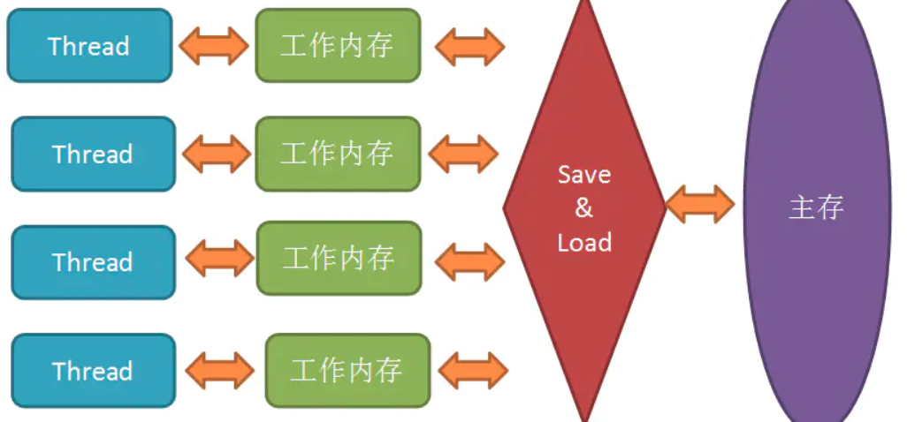

# Java内存模型(JMM)与Volatile关键字

参考：https://zhuanlan.zhihu.com/p/29881777

## 1、JMM

> Java内存模型（Java Memory Model ,JMM）就是一种符合内存模型规范的，屏蔽了各种硬件和操作系统的访问差异的，保证了Java程序在各种平台下对内存的访问都能得到一致效果的机制及规范。<font color='gree' size=4>***目的是解决由于多线程==通过共享内存进行通信==时，存在的原子性、可见性（缓存一致性）以及有序性问题。***</font>
>




**<font color='red'>在线程执行时，首先会从主存中read变量值，再load到工作内存中的副本中，然后再传给处理器执行，执行完毕后再给工作内存中的副本赋值，随后工作内存再把值传回给主存，主存中的值才更新。</font>**


> JMM主要就是围绕着如何在并发过程中如何处理==**原子性、可见性（缓存一致性）和有序性**==这3个特征来建立的，通过解决这三个问题，可以解除缓存不一致的问题。***<font color='red'>而volatile跟可见性和有序性都有关，但不保证原子性。</font>***

> <font color='purple' size=4>***Java内存模型规定了所有的变量都存储在主内存中，每条线程还有自己的工作内存，线程的工作内存中保存了该线程中是用到的变量的主内存副本拷贝，线程对变量的所有操作都必须在工作内存中进行，而不能直接读写主内存。不同的线程之间也无法直接访问对方工作内存中的变量，线程间变量的传递均需要自己的工作内存和主存之间进行数据同步进行。***</font>

------


## 2、JMM围绕的三大特性

### **1 . 原子性(Atomicity)：**

> <font color='gree' size=4>**线程是CPU调度的基本单位。CPU有时间片的概念，会根据不同的调度算法进行线程调度。**</font>所以在多线程场景下，就会发生原子性问题。因为线程在执行一个读改写操作时，在执行完读改之后，时间片耗完，就会被要求放弃CPU，并等待重新调度。这种情况下，读改写就不是一个原子操作。即存在原子性问题。

Java中，对基本数据类型的读取和赋值操作是原子性操作，所谓原子性操作就是指这些操作是不可中断的，要做一定做完，要么就没有执行。 比如：

```java
i = 2;
j = i;
i++;
i = i + 1；
```

面4个操作中，`i=2`是读取操作，必定是原子性操作，**<font color='red'>`j=i`你以为是原子性操作，其实吧，分为两步，一是读取i的值，然后再赋值给j,这就是2步操作了，称不上原子操作，</font>**`i++`和`i = i + 1`其实是等效的，读取i的值，加1，再写回主存，那就是3步操作了。所以上面的举例中，最后的值可能出现多种情况，就是因为满足不了原子性。

这么说来，只有简单的读取，赋值是原子操作，还只能是用数字赋值，用变量的话还多了一步读取变量值的操作。有个例外是，虚拟机规范中允许对64位数据类型(long和double)，分为2次32为的操作来处理，但是最新JDK实现还是实现了原子操作的。

JMM只实现了基本的原子性，==像上面`i++`那样的操作，必须借助于`synchronized`和`Lock`来保证整块代码的原子性了==。线程在释放锁之前，必然会把`i`的值刷回到主存的。

------


### **2 . 可见性(Visibility)（缓存一致性）：**

说到可见性，Java就是利用volatile来提供可见性的。 ==当一个变量被volatile修饰时，那么对它的修改会立刻刷新到主存，当其它线程需要读取该变量时，会去内存中读取新值==。而普通变量则不能保证这一点。

==其实通过synchronized和Lock也能够保证可见性，线程在释放锁之前，会把共享变量值都刷回主存，但是synchronized和Lock的开销都更大。==

------


### **3 . 有序性（Ordering）**

> 除了引入了时间片以外，由于处理器优化和指令重排等，CPU还可能对输入代码进行乱序执行，比如load->add->save 有可能被优化成load->save->add 。这就是有序性问题。

JMM是允许编译器和处理器对指令重排序的，<font color='red'>但是规定了as-if-serial语义，即不管怎么重排序，程序的执行结果不能改变。比如下面的程序段：</font>

```java
double pi = 3.14;    //A
double r = 1;        //B
double s= pi * r * r;//C
```

上面的语句，可以按照`A->B->C`执行，结果为3.14,但是也可以按照`B->A->C`的顺序执行，因为A、B是两句独立的语句，而C则依赖于A、B，所以A、B可以重排序，==***但是C却不能排到A、B的前面。JMM保证了重排序不会影响到单线程的执行，但是在多线程中却容易出问题。***==

------

> <font color='gree' size=4>***多CPU多级缓存导致的一致性(可见性)问题、CPU时间片机制导致的原子性问题、以及处理器优化和指令重排导致的有序性问题等，都硬件的不断升级导致的。那么，有没有什么机制可以很好的解决上面的这些问题呢？---------Java内存模型JMM规范***</font>

------


## 3、volatile关键字

**1 . 保证了不同线程对该变量操作的内存可见性;**

**2 . 禁止指令重排序**


参考：https://juejin.im/post/5a2b53b7f265da432a7b821c#heading-4


## 4、关于volatile的一些问题

### 1）volatile可以保证<font color='red'>数组/对象</font>的<font color='red'>元素/成员变量</font>的可见性吗？

理论上是不能。实验结果是能，但还存疑。ConcurrentHashMap中对volatile数组的操作做了特殊处理，看起来是因为volatile数组无法保证元素的可见性。

http://www.liuhaihua.cn/archives/564823.html

### 2）<font color='red' size=5>***线程读取volatile变量时，会触发对所有变量的主内存读取。***</font>


## 5、**happens before：**

> <font color='red'>**在JMM中，如果一个操作执行的结果需要对另一个操作可见（两个操作既可以是在一个线程之内，也可以是在不同线程之间）**，那么这两个操作之间必须要存在happens-before关系：</font>

- 程序顺序规则：一个线程中的每个操作，happens-before于该线程中的任意后续操作。
- 监视器锁规则：==对一个锁的解锁，happens-before于随后对这个锁的加锁。==
- volatile变量规则：==对一个volatile域的写，happens-before于任意后续对这个volatile域的读。==
- 传递性：如果A happens-before B，且B happens-before C，那么A happens-before C。

------

## 6、synchronized可以解决三种特性

> - **monitorenter和monitorexit解决原子性**
> - **可见性：进入同步块前清空工作内存，退出前刷新主内存**
> - **有序性：==加锁==。因为同时只有一个线程执行。**

------

## 7、总结

> **Java内存模型，其实是保证了Java程序在各种平台下对内存的访问都能够得到一致效果的机制及规范。目的是解决由于多线程通过共享内存进行通信时，存在的原子性、可见性（缓存一致性）以及有序性问题。**
>
> ==**除此之外，Java内存模型还提供了一系列原语，封装了底层实现后，供开发者直接使用。如我们常用的一些关键字：synchronized、volatile以及并发包等。**==

