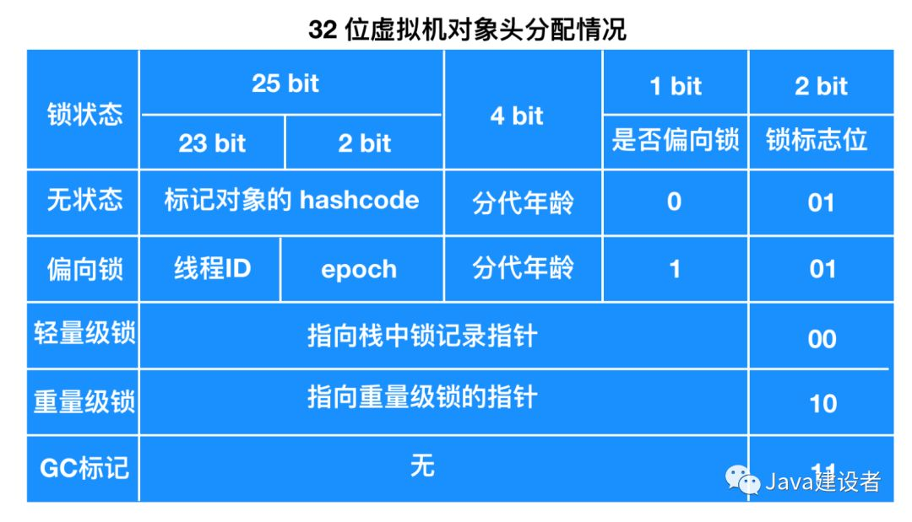
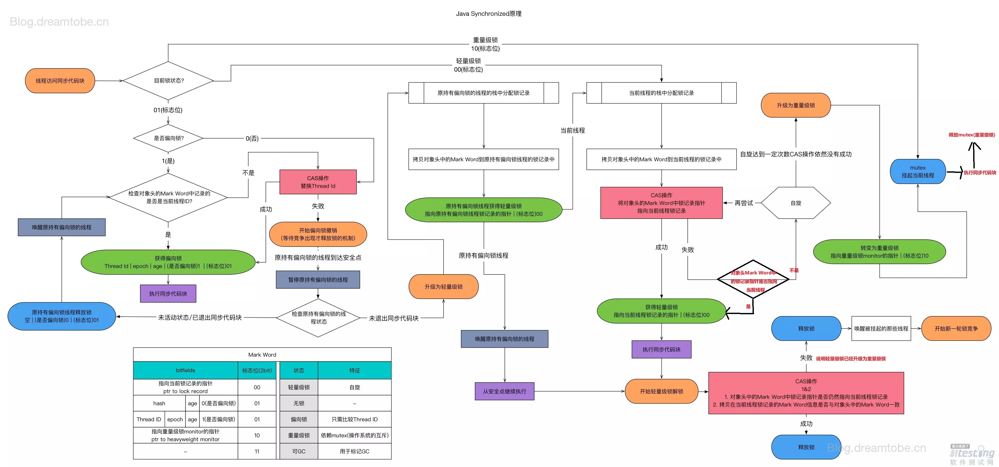

# Synchronized与四种锁状态

## 1、Synchronized简介

### 1）对象头

------

## 2）Monitor对象

什么是Monitor？我们可以把它理解为一个同步工具，也可以描述为一种同步机制，它通常被描述为一个对象。与一切皆对象一样，所有的Java对象是天生的Monitor，每一个Java对象都有成为Monitor的潜质，因为在Java的设计中，**每一个Java对象自打娘胎里出来就带了一把看不见的锁，它叫做内部锁或者Monitor锁。**

可以发现`synchronized`==***同步代码块***==是通过加==`monitorenter`==和==`monitorexit`==指令实现的。
 每个对象都有个监视器锁(monitor) ，当`monitor`被占用的时候就代表对象处于锁定状态，==而`monitorenter`指令的作用就是获取`monitor`的所有权，`monitorexit`的作用是释放`monitor`的所有权==，这两者的工作流程如下：

> - **monitorenter**：
>
> 1. 如果`monitor`的==进入数为0==，则线程进入到`monitor`，然后将进入数设置为`1`，该线程称为`monitor`的所有者。
> 2. 如果是线程已经拥有此`monitor`(即`monitor`进入数不为0)，然后该线程又重新进入`monitor`，则将`monitor`的进入数`+1`，这个即为**锁的重入**。
> 3. 如果其他线程已经占用了`monitor`，则该线程进入到**阻塞状态，知道`monitor`的进入数为0，该线程再去重新尝试获取`monitor`的所有权**。
>
> - **monitorexit**：
>
>   执行该指令的线程必须是`monitor`的所有者，指令执行时，`monitor`进入数`-1`，如果`-1`后进入数为`0`，那么线程退出`monitor`，不再是这个`monitor`的所有者。这个时候其它阻塞的线程可以尝试获取`monitor`的所有权。

------

加有`synchronized`关键字的==***方法***==，常量池中比普通的方法多了个==`ACC_SYNCHRONIZED`==标识，`JVM`就是根据这个标识来实现方法的同步。
 当调用方法的时候，调用指令会==检查方法是否有`ACC_SYNCHRONIZED`标识==，有的话**线程需要先获取`monitor`，获取成功才能继续执行方法，方法执行完毕之后，线程再释放`monitor`，同一个`monitor`同一时刻只能被一个线程拥有。**

## 3）四种锁状态

> 注意：
>
> - **偏向锁**：
>
>   引入偏向锁是为了在无多线程竞争的情况下尽量减少不必要的轻量级锁执行路径，**因为轻量级锁的获取及释放依赖多次CAS原子指令，而偏向锁只需要在==置换ThreadID==的时候依赖一次CAS原子指令即可。每次线程获取锁时都通过mark word字段中的线程ID是不是自己，如果是，则直接获取进入，无需cas操作。**
>
> - **轻量级锁**：==不阻塞==
>
>   1. 与偏向锁不同的就是，==***就算是同一线程重入，也要cas。***==
>   2. 若只有一个线程等待获取资源，那么==该线程自旋==，==自旋一定次数后还未获得锁则 &rArr; 重量级锁。==
>   3. 若已有一个线程在自旋等待，==此时又来一个线程，则 &rArr; 重量级锁。==
> - **重量级锁：**
>
>   获取失败要==阻塞==

锁膨胀过程：

https://juejin.im/post/5c936018f265da60ec281bcb

