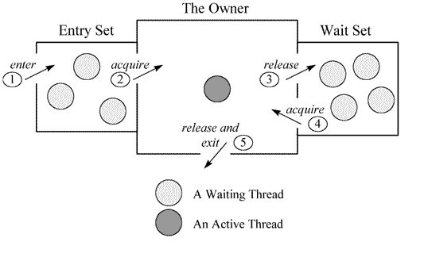
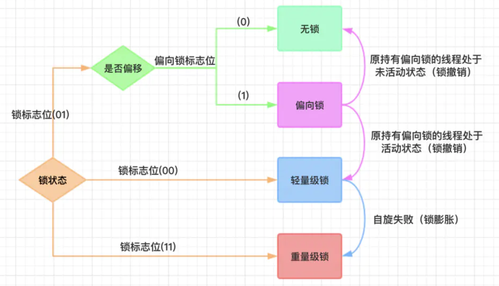

# Synchronized与四种锁状态与Java锁优化


## 1、Synchronized简介

### 1）对象头


------


## 2）Monitor对象（监视器锁）

监视器主要功能是监控一段代码，确保在同一时间只有一个线程在执行。

> <font color='#02C874'>***每个监视器都与一个对象相关联。当线程执行到监视器监视下的代码块中的第一条指令时，线程必须获取对被引用对象的锁定。在线程获取锁之前，他是无法执行这段代码的，一旦获得锁，线程便可以进入“被保护”的代码开始执行。当线程离开代码块的时候，无论如何离开，都会释放所关联对象的锁。***</font>

------

<font color='#02C874'>**基于Monitor对象，当多个线程同时访问一段同步代码时，首先会进入==Entry Set==，当有一个线程获取到对象的锁之后，才能进行==The Owner==区域，其他线程还会继续在Entry Set等待。并且当某个线程调用了wait方法后，会释放锁并进入==Wait Set==等待。**</font>



------

## 3）Synchronized同步方式（方法同步与代码块同步）

每个对象维护着一个记录着被锁次数的计数器。未被锁定的对象的该计数器为0，当一个线程获得锁（执行`monitorenter`）后，该计数器自增变为 1 ，当同一个线程再次获得该对象的锁的时候，计数器再次自增。当同一个线程释放锁（执行`monitorexit`指令）的时候，计数器再自减。当计数器为0的时候。锁将被释放，其他线程便可以获得锁。


> - ### 方法同步：JVM采用==`ACC_SYNCHRONIZED`==标记符来实现同步。
>
>   方法级的同步是隐式的。同步方法的常量池中会有一个`ACC_SYNCHRONIZED`标志。<font color='#02C874'>**当某个线程要访问某个方法的时候，会检查是否有`ACC_SYNCHRONIZED`，如果有设置，则需要先获得监视器锁，然后开始执行方法，方法执行之后再释放监视器锁。这时如果其他线程来请求执行方法，会因为无法获得监视器锁而被阻断住。**</font>值得注意的是，如果在方法执行过程中，发生了异常，并且方法内部并没有处理该异常，那么在异常被抛到方法外面之前监视器锁会被自动释放。
>
> - ### 代码块同步：同步代码块使用==`monitorenter`==和==`monitorexit`==两个指令实现
>
>   <font color='#02C874'>**可以把执行`monitorenter`指令理解为加锁，执行`monitorexit`理解为释放锁。 **</font>

------


## 4）四种锁状态




> 注意：
>
> - **偏向锁**：
>
>   引入偏向锁是为了在无多线程竞争的情况下尽量减少不必要的轻量级锁执行路径，**<font color='#02C874'>因为轻量级锁的获取及释放依赖多次CAS原子指令，而偏向锁只需要在==置换ThreadID==的时候依赖一次CAS原子指令即可。每次线程获取锁时都通过mark word字段中的线程ID是不是自己，如果是，则直接获取进入，无需cas操作。</font>**
>
> - **轻量级锁**：不阻塞
>
>   1. 与偏向锁不同的就是，==***就算是同一线程重入，也要cas。***==
>   2. 若只有一个线程等待获取资源，那么==该线程自旋==，==自旋一定次数后还未获得锁则 &rArr; 重量级锁。==
>   3. <font color='red'>若已有一个线程在自旋等待，==此时又来一个线程，则 &rArr; 重量级锁。==</font>
>   
> - **重量级锁：**
>
>   获取失败要阻塞

------

## 5）重量级锁为什么开销大？

> <font color='red' size=4>***Java的线程是映射到操作系统原生线程之上的，如果要==阻塞或唤醒(挂起或恢复)==一个线程就需要==操作系统的帮忙，这就要从用户态转换到内核态==，因此状态转换需要花费很多的处理器时间。***</font>

------

锁膨胀过程：

https://juejin.im/post/5c936018f265da60ec281bcb


------

## 6）锁消除

在动态编译同步块的时候，JIT编译器可以借助一种被称为==逃逸分析（Escape Analysis）==的技术来判断同步块所使用的锁对象是否只能够被一个线程访问而没有被发布到其他线程。

<font color='#02C874'>**如果同步块所使用的锁对象通过这种分析被证实只能够被一个线程访问，那么JIT编译器在编译这个同步块的时候就会取消对这部分代码的同步。**</font>

如以下代码：

```java
public void f() {
    Object obj = new Object();
    synchronized(obj) {
        System.out.println(obj);
    }
}
```

代码中对`obj`这个对象进行加锁，但是`obj`对象的生命周期只在`f()`方法中，并不会被其他线程所访问到，所以在JIT编译阶段就会被优化掉。优化成：

```java
public void f() {
    Object obj = new Object();
    System.out.println(obj);
}
```

> 这里，可能有读者会质疑了，代码是程序员自己写的，程序员难道没有能力判断要不要加锁吗？就像以上代码，完全没必要加锁，有经验的开发者一眼就能看的出来的。其实道理是这样，但是还是有可能有疏忽，<font color='red'>***比如我们经常在代码中使用`StringBuffer`作为局部变量，而`StringBuffer`中的`append`是线程安全的，有`synchronized`修饰的，这种情况开发者可能会忽略。这时候，JIT就可以帮忙优化，进行锁消除。***</font>

总之，在使用`synchronized`的时候，<font color='#02C874'>**如果JIT经过逃逸分析之后发现并无线程安全问题的话，就会做锁消除。**</font>

------

## 7）锁粗化

> ***如果在一段代码中连续的对同一个对象反复加锁解锁，其实是相对耗费资源的，这种情况可以适当放宽加锁的范围，减少性能消耗。***

<font color='#02C874'>**当JIT发现一系列连续的操作都对同一个对象反复加锁和解锁，甚至加锁操作出现在循环体中的时候，会将加锁同步的范围扩散（粗化）到整个操作序列的外部。**</font>

如以下代码：

```java
for(int i=0;i<100000;i++){  
    synchronized(this){  
        do();  
}  
```

会被粗化成：

```java
synchronized(this){  
    for(int i=0;i<100000;i++){  
        do();  
}  
```

<font color='#02C874'>**这其实和我们要求的减小锁粒度并不冲突。减小锁粒度强调的是不要在银行柜台前做准备工作以及和办理业务无关的事情。而锁粗化建议的是，*同一个人，要办理多个业务的时候，可以在同一个窗口一次性办完，而不是多次取号多次办理。***</font>

