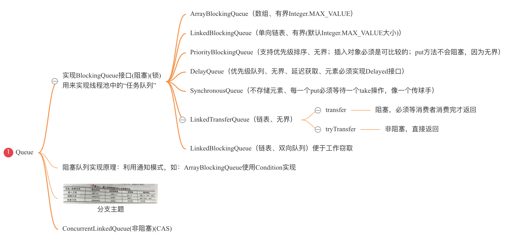
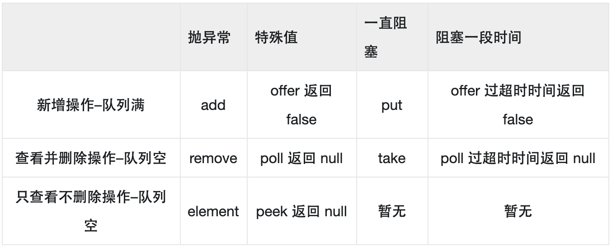
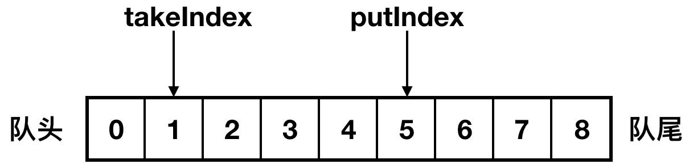
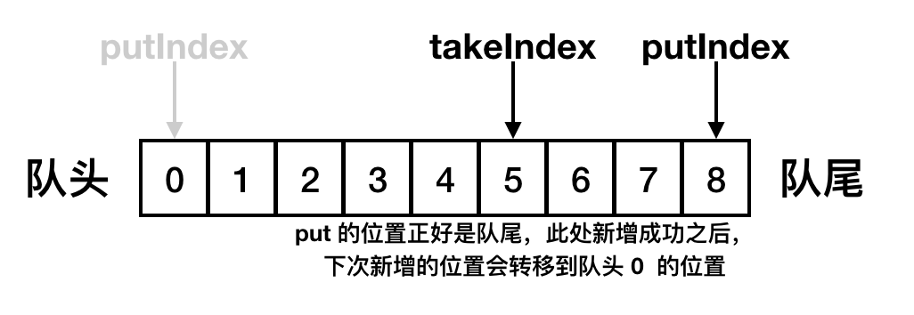
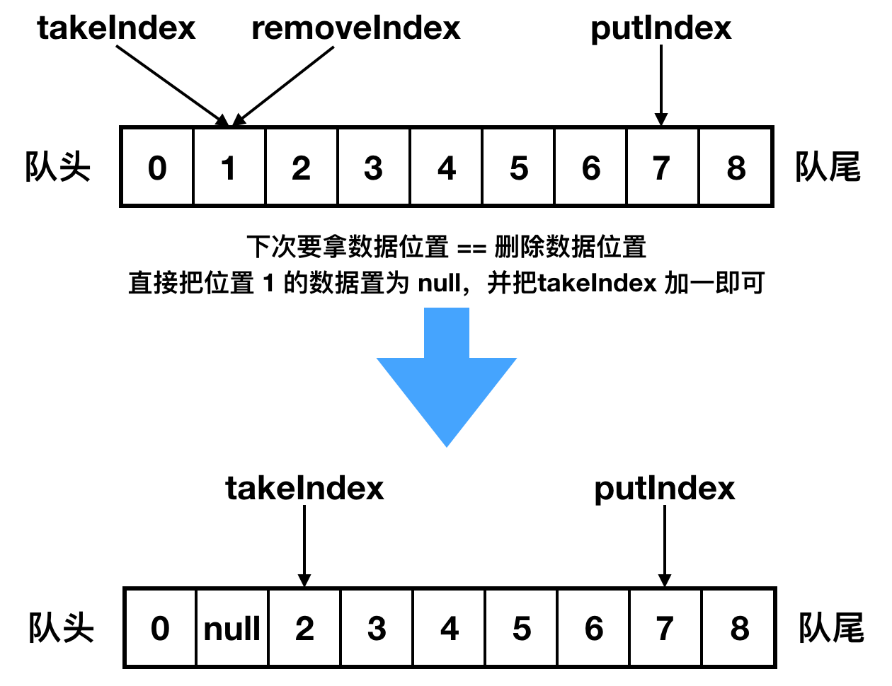
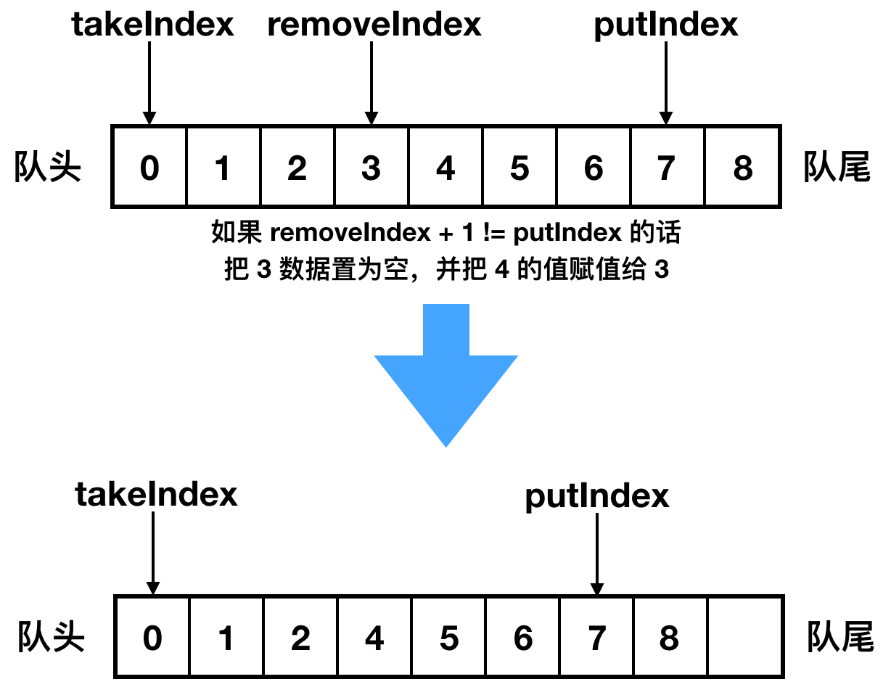
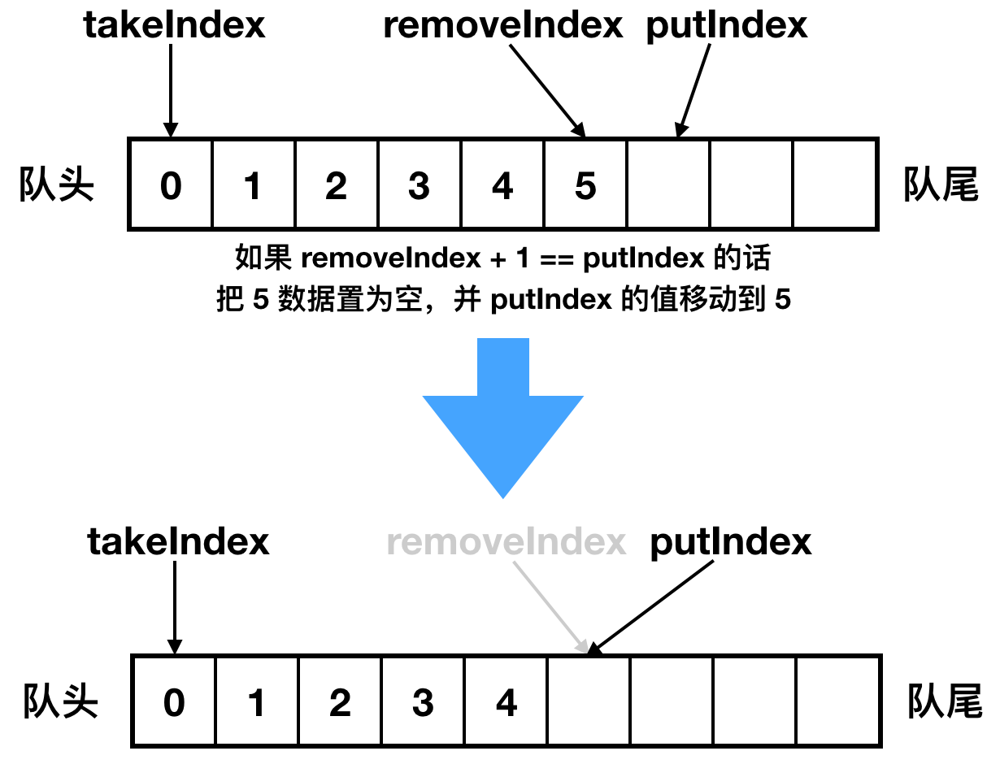

# 并发队列

## &sect; 分类与简介



------




## &sect; LinkedBlockingQueue

### &sect; 构成

> - 底层为链表
>
> - put锁和take锁
>
> - notEmpty条件和notFull条件，使线程在对应条件等待
>
>   ```java
>   private final Condition notEmpty = takeLock.newCondition();
>   private final ReentrantLock putLock = new ReentrantLock();
>   ```
>
>   <font color='red'>**锁有 take 锁和 put 锁，是为了保证队列操作时的线程安全，设计两种锁，是为了 take 和 put 两种操作可以同时进行，互不影响。**</font>

------

### &sect; 阻塞添加

新增有多种方法，如：add、put、offer，三者的区别上文有说。我们拿 put 方法为例，put 方法在碰到队列满的时候，会一直阻塞下去，直到队列不满时，并且自己被唤醒时，才会继续去执行，源码如下：

> 1. 往队列新增数据，**==第一步是上锁，所以新增数据是线程安全的；==**
> 2. 队列新增数据，简单的**==追加到链表的尾部==**即可；
> 3. 新增时，如果**==队列满了，当前线程是会被阻塞的==**，阻塞的底层使用是锁的能力，底层实现其它也和队列相关；
> 4. 新增数据成功后，在适当时机，会**==唤起 put 的等待线程（队列不满时），或者 take 的等待线程（队列不为空时）==**，这样保证队列一旦满足 put 或者 take 条件时，立马就能唤起阻塞线程，继续运行，保证了唤起的时机不被浪费。

------

### &sect; 阻塞删除

以take为例，整体流程和 put 很相似，都是先上锁，然后从队列的头部拿出数据，==如果队列为空，会一直阻塞到队列有值为止。==

------


## &sect; SynchronousQueue

参考：https://www.imooc.com/read/47/article/862

------


### &sect; 特点

> 1. 队列==不存储数据，所以没有大小==，也无法迭代；
> 2. 插入操作的返回<mark>**必须等待另一个线程完成对应数据的删除操作**</mark>，反之亦然；
> 3. 队列由两种数据结构组成，分别是后入先出的**==堆栈==**和先入先出的**==队列==**，==堆栈是非公平的，队列是公平的==。

------

### &sect; 结构

```java
 		// 堆栈和队列共同的接口
    // 负责执行 put or take
    abstract static class Transferer<E> {
        // e 为空的，会直接返回特殊值，不为空会传递给消费者
        // timed 为 true，说明会有超时时间
        abstract E transfer(E e, boolean timed, long nanos);
    }

    // 堆栈 后入先出 非公平
    // Scherer-Scott 算法
    static final class TransferStack<E> extends Transferer<E> {
    }

    // 队列 先入先出 公平
    static final class TransferQueue<E> extends Transferer<E> {
    }

    private transient volatile Transferer<E> transferer;

    // 无参构造器默认为非公平的
    public SynchronousQueue(boolean fair) {
        transferer = fair ? new TransferQueue<E>() : new TransferStack<E>();
    }
```

> 1. <mark>**堆栈和队列都有一个共同的接口，叫做 Transferer，该接口有个方法：transfer，该方法很神奇，会承担 take 和 put 的双重功能；**</mark>
> 2. 在我们初始化的时候，是可以选择是使用堆栈还是队列的，如果你不选择，默认的就是堆栈，类注释中也说明了这一点，堆栈的效率比队列更高。

------

#### &sect; 堆栈结构

栈元素：

```java
static final class SNode {
    // 栈的下一个，就是被当前栈压在下面的栈元素
    volatile SNode next;
    // 节点匹配，用来判断阻塞栈元素能被唤醒的时机
    // 比如我们先执行 take，此时队列中没有数据，take 被阻塞了，栈元素为 SNode1
    // 当有 put 操作时，会把当前 put 的栈元素赋值给 SNode1 的 match 属性，并唤醒 take 操作
    // 当 take 被唤醒，发现 SNode1 的 match 属性有值时，就能拿到 put 进来的数据，从而返回
    volatile SNode match;
    // 栈元素的阻塞是通过线程阻塞来实现的，waiter 为阻塞的线程
    volatile Thread waiter;
    // 未投递的消息，或者未消费的消息
    Object item;             
} 
```


------

##### &sect; 入栈和出栈过程

底层都是一个方法：transfer()

> 1. 判断是 put 方法还是 take 方法；
> 2. 判断栈头数据是否为空，如果为空或者栈头的操作和本次操作一致，是的话走 3，否则走 5；
> 3. 判断操作有无设置超时时间，如果设置了超时时间并且已经超时，返回 null，否则走 4；
> 4. 如果栈头为空，把当前操作设置成栈头，或者栈头不为空，但栈头的操作和本次操作相同，也把当前操作设置成栈头，并看看其它线程能否满足自己，不能满足则阻塞自己。比如当前操作是 take，但队列中没有数据，则阻塞自己；
> 5. 如果栈头已经是阻塞住的，需要别人唤醒的，判断当前操作能否唤醒栈头，可以唤醒走 6，否则走 4；
> 6. 把自己当作一个节点，赋值到栈头的 match 属性上，并唤醒栈头节点；
> 7. 栈头被唤醒后，拿到 match 属性，就是把自己唤醒的节点的信息，返回。

------

#### &sect; 队列结构

```java
/** 队列头 */
transient volatile QNode head;
/** 队列尾 */
transient volatile QNode tail;

// 队列的元素
static final class QNode {
    // 当前元素的下一个元素
    volatile QNode next;         
    // 当前元素的值，如果当前元素被阻塞住了，等其他线程来唤醒自己时，其他线程
    // 会把自己 set 到 item 里面
    volatile Object item;         // CAS'ed to or from null
    // 可以阻塞住的当前线程
    volatile Thread waiter;       // to control park/unpark
    // true 是 put，false 是 take
    final boolean isData;
}  
```

------

### &sect; 使用场景

> <mark>消息中间件</mark>中会用到，消息中间件为了保证消息可以快速的推送给消费者，一般会采用推拉两种模式，推就是服务端把消息推送给客户端，拉就是客户端主动的向服务端拉取数据，在拉的过程中，如果服务端没有数据，拉的请求会一直等待，一直等到服务端有数据后立马返回，这个拉的原理和 SynchronousQueue 就很相似

------


## &sect; DelayQueue

### &sect; 特点

> 1. <mark>**队列中元素将在过期时被执行，越靠近队头，越早过期；**</mark>
> 2. 未过期的元素不能够被 take；
> 3. 不允许空元素。

------

### &sect; 结构

 DelayQueue 类上是有泛型的，如下：

```java
public class DelayQueue<E extends Delayed> extends AbstractQueue<E>
    implements BlockingQueue<E> {
```

从泛型中可以看出，<font color='red'>**DelayQueue 中的元素必须是 Delayed 的子类，Delayed 是表达延迟能力的关键接口，其继承了 Comparable 接口，并定义了还剩多久过期的方法**</font>，如下：

```java
public interface Delayed extends Comparable<Delayed> {
    long getDelay(TimeUnit unit);
}
```

也就是说<font color='red'> **DelayQueue 队列中的元素必须是实现 Delayed 接口和 Comparable 接口的，并覆写了 getDelay 方法和 compareTo 的方法才行**</font>，不然在编译时，编译器就会提醒我们元素必须强制实现 Delayed 接口。

------

DelayQueue 还大量使用了<mark> PriorityQueue 队列</mark>的大量功能。<font color='red'>*作用就是可以根据过期时间做优先级排序，让先过期的可以先执行。*</font>

> 这里的复用的思想还是蛮重要的，我们在源码中经常会遇到这种思想，比如说<mark> ***LinkedHashMap 复用 HashMap 的能力，Set 复用 Map 的能力，还有此处的 DelayQueue 复用 PriorityQueue 的能力***</mark>。

------

### &sect; 放入和拿出数据

> - <font color='red'>**put数据要上锁**</font>
>
> - 底层使用 PriorityQueue 队列进行数据的put操作，并根据元素的 compareTo 方法进行排序，我们希望最终排序的结果是从小到大的，因为我们想让队头的都是过期的数据，我们需要在 compareTo 方法里面实现：通过每个元素的过期时间进行排序，如下：
>
>   ```java
>   (int) (this.getDelay(TimeUnit.MILLISECONDS) - o.getDelay(TimeUnit.MILLISECONDS));
>   ```
>
> - 取数据时（==不上锁==），如果发现有元素的过期时间到了，就能拿出数据来，如果没有过期元素，那么线程就会一直阻塞

------


## &sect; ArrayBlockingQueue

### &sect; 特点

> 1. <font color='red'>**有界的阻塞数组，容量一旦创建，后续大小无法修改；**</font>
> 2. <font color='red'>**元素是有顺序的，按照先入先出进行排序，从队尾插入数据数据，从队头拿数据；**</font>
> 3. 队列满时，往队列中 put 数据会被阻塞，队列空时，往队列中拿数据也会被阻塞。
>
> 从类注释上可以看出 ArrayBlockingQueue 和一般的数组结构的类不太一样，<font color='gree' size=5>***是不能够动态扩容的***</font>，如果队列满了或者空时，take 和 put ==**都会被阻塞。**==

------

### &sect; 结构

```java
// 队列存放在 object 的数组里面
// 数组大小必须在初始化的时候手动设置，没有默认大小
final Object[] items;

// 下次拿数据的时候的索引位置
int takeIndex;

// 下次放数据的索引位置
int putIndex;

// 当前已有元素的大小
int count;

// 可重入的锁
final ReentrantLock lock;

// take的队列
private final Condition notEmpty;

// put的队列
private final Condition notFull;
```

> 以上代码有两个关键的字段，<mark>***takeIndex 和 putIndex，分别表示下次拿数据和放数据的索引位置。所以说在新增数据和拿数据时，都无需计算，就能知道应该新增到什么位置，应该从什么位置拿数据。***</mark>

------

初始化时，有两个重要的参数：数组的大小、是否是公平，源码如下：

```java
public ArrayBlockingQueue(int capacity, boolean fair) {
    if (capacity <= 0)
        throw new IllegalArgumentException();
    this.items = new Object[capacity];
    lock = new ReentrantLock(fair);
    // 队列不为空 Condition，在 put 成功时使用
    notEmpty = lock.newCondition();
    // 队列不满 Condition，在 take 成功时使用
    notFull =  lock.newCondition();
}
```

从源码中我们可以看出，第二个参数是否公平，主要用于读写锁是否公平，如果是公平锁，那么在锁竞争时，就会按照先来先到的顺序，如果是非公平锁，锁竞争时随机的。

对于锁公平和非公平，我们举个例子：比如说现在队列是满的，还有很多线程执行 put 操作，必然会有很多线程阻塞等待，当有其它线程执行 take 时，会唤醒等待的线程，如果是公平锁，会按照阻塞等待的先后顺序，依次唤醒阻塞的线程，如果是非公平锁，会随机唤醒沉睡的线程。

<font color='red' size=5>***所以说队列满很多线程执行 put 操作时，如果是公平锁，数组元素新增的顺序就是阻塞线程被释放的先后顺序，是有顺序的，而非公平锁，由于阻塞线程被释放的顺序是随机的，所以元素插入到数组的顺序也就不会按照插入的顺序了。***</font>

------

### &sect; 新增数据

从源码中，我们可以看出，其实新增就两种情况：

1. 本次新增的位置居中，直接新增，下图演示的是 putIndex 在数组下标为 5 的位置，还不到队尾，那么可以直接新增，计算下次新增的位置应该是 6；

   


2. 新增的位置到队尾了，那么下次新增时就要从头开始了，示意图如下：

   

   <mark>可以看到当新增到队尾时，下次新增会重新从队头重新开始。</mark>

------

### &sect; 拿数据

> 每次拿数据的位置就是 takeIndex 的位置，在找到本次该拿的数据之后，会把 takeIndex 加 1，计算下次拿数据时的索引位置，有个特殊情况是，<mark>如果本次拿数据的位置已经是队尾了，那么下次拿数据的位置就要从头开始，就是从 0 开始了。</mark>

------

### &sect; 删除数据

一共有两种情况，第一种情况是 `takeIndex == removeIndex`，我们画个示意图来看下处理方式：



------

第二种情况又分两种：

1. 如果 `removeIndex + 1 != putIndex` 的话，就把下一个元素往前移动一位，示意图如下：

   

   ------

2. 如果 `removeIndex + 1 == putIndex` 的话，就把 putIndex 的值修改成删除的位置，示意图如下：

   

