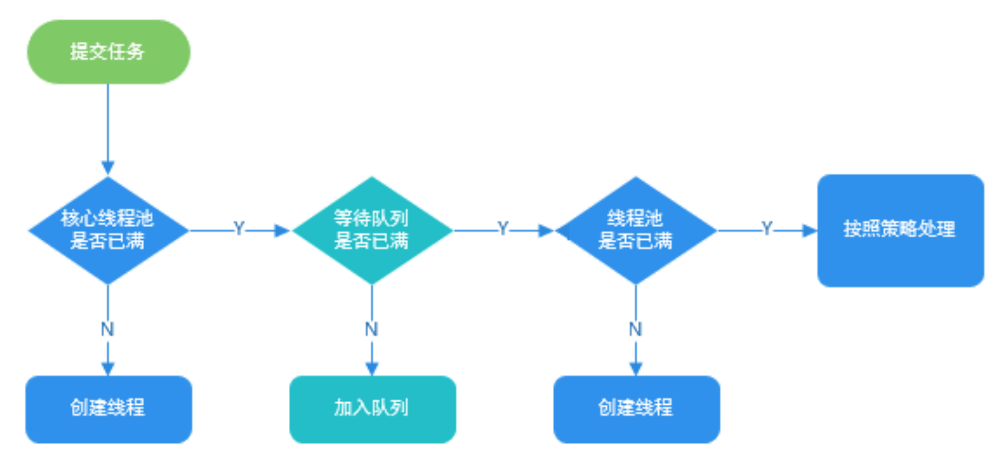
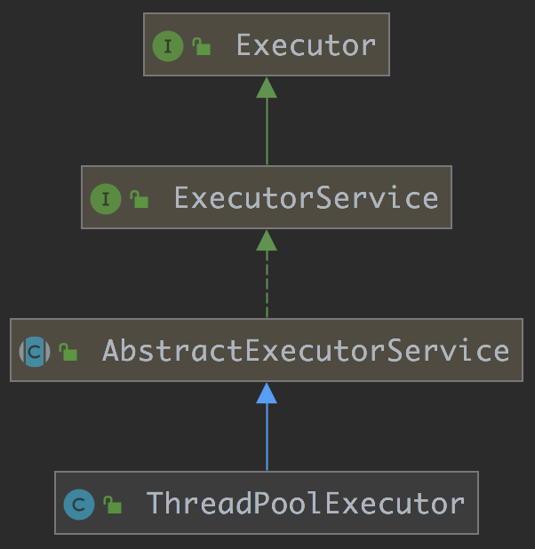
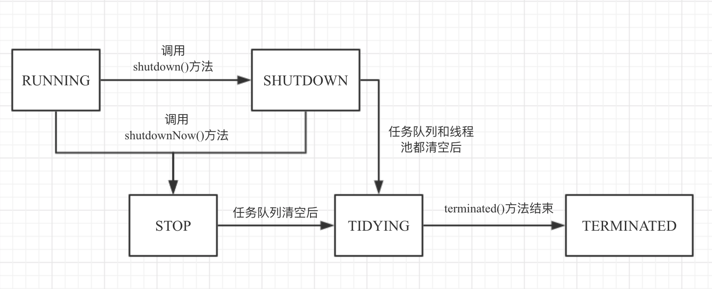
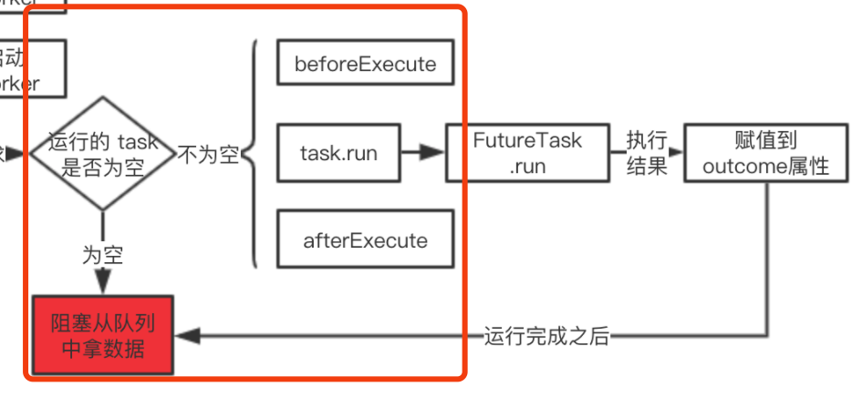
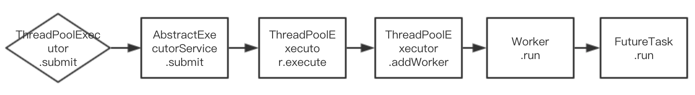

# 线程池工作原理(ThreadPoolExecutor 源码简析)

## 0、为什么使用线程池

线程池提供了一种限制和管理资源（包括执行一个任务）。 每个线程池还维护一些基本统计信息，例如已完成任务的数量。


> - **降低资源消耗。** 通过重复利用已创建的线程降低线程创建和销毁造成的消耗。
> - **提高响应速度。** 当任务到达时，任务可以不需要的等到线程创建就能立即执行。
> - **提高线程的可管理性。** 线程是稀缺资源，如果无限制的创建，不仅会消耗系统资源，还会降低系统的稳定性，使用线程池可以进行统一的分配，调优和监控。

------


先来张开门见山的流程图



------


------


## 1. ThreadPoolExecutor源码简析




------

### 0）简介

> 1. FutureTask 本身就是一个任务，而且具备对任务管理的功能，比如可以通过 get 方法拿到任务的执行结果；
> 2. submit 方法是我们平时使用线程池时提交任务的方法，支持 Runable 和 Callable 两种任务的提交，方法中 execute 方法是其子类 ThreadPoolExecutor 实现的，不管是那种任务入参，execute 方法最终执行的任务都是 FutureTask；
> 3. ThreadPoolExecutor 继承了 AbstractExecutorService 抽象类，具备以上三个类的所有功能。

### 1）记录线程池状态信息的变量ctl


```java
private final AtomicInteger ctl = new AtomicInteger(ctlOf(RUNNING, 0));

private static final int COUNT_BITS = Integer.SIZE - 3;// 前三位表示线程池状态，后29位表示工作线程数
private static final int CAPACITY   = (1 << COUNT_BITS) - 1; // 能表示的最大线程数(29位)

// 线程池状态
private static final int RUNNING    = -1 << COUNT_BITS;
private static final int SHUTDOWN   =  0 << COUNT_BITS;
private static final int STOP       =  1 << COUNT_BITS;
private static final int TIDYING    =  2 << COUNT_BITS;
private static final int TERMINATED =  3 << COUNT_BITS;

// 获取线程池状态（～为按位取反）
private static int runStateOf(int c)     { return c & ~CAPACITY; }
// 获取工作线程数亩
private static int workerCountOf(int c)  { return c & CAPACITY; }
// 构造ctl（将线程池状态和工作线程数织入该变量）
private static int ctlOf(int rs, int wc) { return rs | wc; }
```

> 其中，关于线程池状态具体解释如下：
>
> - RUNNING：最正常的状态：接受新的任务，处理等待队列中的任务
> - SHUTDOWN：<font color='gree'>不接受新的任务提交，但是会继续处理等待队列中的任务</font>
> - STOP：不接受新的任务提交，<font color='gree'>不再处理等待队列中的任务，中断正在执行任务的线程</font>
> - TIDYING：==**所有的任务都销毁了，workCount 为 0**==。线程池的状态在转换为 TIDYING 状态时，==会执行钩子方法 terminated()==
> - TERMINATED：terminated() 方法结束后，线程池的状态就会变成这个


状态转移图如下：




> <font color = 'red'>***后续各类方法都需要该变量来进行线程池状态和线程池工作线程数目的检查***</font>

------


### 2） 内部类Worker(线程池中任务运行的最小单元)

> - 线程池中任务执行的最小单元
> -  <font color = 'red'>**Worker 继承 AQS，具有锁功能**</font>
> -  <font color = 'red'>**Worker 实现 Runnable，本身是一个可执行的任务**</font>

```java
private final class Worker
    extends AbstractQueuedSynchronizer
    implements Runnable
{
    // 任务运行的线程
    final Thread thread;

    // 需要执行的任务
    Runnable firstTask;

    // 非常巧妙的设计,Worker本身是个 Runnable,把自己作为任务传递给 thread
    // 内部有个属性又设置了 Runnable
    Worker(Runnable firstTask) {
        setState(-1); // inhibit interrupts until runWorker
        this.firstTask = firstTask;
        // 把 Worker 自己作为 thread 运行的任务
        this.thread = getThreadFactory().newThread(this);
    }

   /** Worker 本身是 Runnable，run 方法是 Worker 执行的入口， runWorker 是外部的方法 */
    public void run() {
        runWorker(this);
    }

    private static final long serialVersionUID = 6138294804551838833L;

    // Lock methods
    // 0 代表没有锁住，1 代表锁住
    protected boolean isHeldExclusively() {
        return getState() != 0;
    }
    // 尝试加锁，CAS 赋值为 1，表示锁住
    protected boolean tryAcquire(int unused) {
        if (compareAndSetState(0, 1)) {
            setExclusiveOwnerThread(Thread.currentThread());
            return true;
        }
        return false;
    }
    // 尝试释放锁，释放锁没有 CAS 校验，可以任意的释放锁
    protected boolean tryRelease(int unused) {
        setExclusiveOwnerThread(null);
        setState(0);
        return true;
    }

    public void lock()        { acquire(1); }
    public boolean tryLock()  { return tryAcquire(1); }
    public void unlock()      { release(1); }
    public boolean isLocked() { return isHeldExclusively(); }

    void interruptIfStarted() {
        Thread t;
        if (getState() >= 0 && (t = thread) != null && !t.isInterrupted()) {
            try {
                t.interrupt();
            } catch (SecurityException ignore) {
            }
        }
    }
}
```

> 1. <font color='red'>***Worker 很像是任务的代理，在线程池中，最小的执行单位就是 Worker，所以 Worker 实现了 Runnable 接口，实现了 run 方法；Worker内部有一个线程属性用于表示任务执行的线程，见2***</font>
> 2. <font color='red'>***在 Worker 初始化时 `this.thread = getThreadFactory ().newThread (this) `这行代码比较关键，它把当前 Worker 作为线程的构造器入参***</font>，我们在后续的实现中会发现这样的代码：`Thread t = w.thread;t.start ()`，此时的 w 是 Worker 的引用申明，此处 t.start 实际上执行的就是 Worker 的 run 方法；
> 3. ==**Worker 本身也实现了 AQS，所以其本身也是一个锁**，其在执行任务的时候，会锁住自己，任务执行完成之后，会释放自己。==

------


### 3）核心方法execute()

```java
public void execute(Runnable command) {
    if (command == null)
        throw new NullPointerException();
    int c = ctl.get();
    if (workerCountOf(c) < corePoolSize) { // 工作线程数少于核心线程数
      	// 添加工作线程，true代表算作核心线程的添加
        if (addWorker(command, true))
            return;
        c = ctl.get(); // 线程池状态可能发生变化
    }
  
    //2.
   	// 添加核心线程失败
    // 检查线程池状态是否正常(为RUNNING)，然后将任务添加入任务队列
    if (isRunning(c) && workQueue.offer(command)) {
      	// 检查
        int recheck = ctl.get();
      	// 若状态不正常(不是RUNNING)，就从队列中移除任务
        if (! isRunning(recheck) && remove(command))
          	// 移除成功后执行拒绝策略
            reject(command);
      	// 如果状态正常且工作线程数为0，则添加一个非核心线程，且初始任务为null
        else if (workerCountOf(recheck) == 0)
            addWorker(null, false);
    }
  	//3.
    // 添加入队列失败，队列满了，开启线程到 maxSize，如果失败直接拒绝,
    else if (!addWorker(command, false))
      	// 若失败，直接执行拒绝策略
        reject(command);
}
```

> <font color = 'red'>其中第23-24行的代码就是处理，若corePoolSize = 0，且使用无界队列时，防止任务不断入队，但并没有线程来起动执行的情况</font>

------


### 4）核心方法addWorker()


**整个流程：**

> - 首先是执行了一堆==***校验***==
> - 然后使用 new Worker (firstTask) ==***新建了 Worker***==
> - 最后使用 ==***t.start () 执行 Worker***==，上文我们说了 Worker 在初始化时的关键代码：`this.thread = getThreadFactory ().newThread (this)`，Worker（this） 是作为新建线程的构造器入参的，所以 t.start () 会执行到 Worker 的 run 方法上，

```java
// 结合线程池的情况看是否可以添加新的 worker
// firstTask 不为空可以直接执行，为空执行不了，Thread.run()方法有判断，Runnable为空不执行
// core 为 true 表示线程最大新增个数是 coresize，false 表示最大新增个数是 maxsize
// 返回 true 代表成功，false 失败
// break retry 跳到retry处，且不再进入循环
// continue retry 跳到retry处，且再次进入循环
private boolean addWorker(Runnable firstTask, boolean core) {
  
  ////////// 1. 检验能否创建工作线程//////////////////////////
    retry:
    for (;;) {
        int c = ctl.get();
        int rs = runStateOf(c);

        // 检查是否满足创建工作线程的条件
      	// rs >= SHUTDOWN 说明线程池状态不正常
        if (rs >= SHUTDOWN &&
            ! (rs == SHUTDOWN &&
               firstTask == null &&
               ! workQueue.isEmpty()))
            return false;

        for (;;) {
            int wc = workerCountOf(c);
            if (wc >= CAPACITY ||
                wc >= (core ? corePoolSize : maximumPoolSize))
                return false;
            if (compareAndIncrementWorkerCount(c))
                break retry;
          	// 由于有并发，重新再读取一下 ctl
            c = ctl.get();  
          
          	// 正常如果是 CAS 失败的话，进到下一个里层的for循环就可以了
            // 可是如果是因为其他线程的操作，导致线程池的状态发生了变更，如有其他线程关闭了这个线程池
            // 那么需要回到外层的for循环
            if (runStateOf(c) != rs)
                continue retry;
        }
    }

  ////// 2. 创建工作线程 //////////////////////////////////////
  
    boolean workerStarted = false;     // worker 是否已经启动
    boolean workerAdded = false; // 是否已将这个 worker 添加到 workers 这个 HashSet 中
    Worker w = null;
    try {
      	// 巧妙的设计，Worker 本身是个 Runnable.
        // 在初始化的过程中，会把 worker 丢给 thread 去初始
        w = new Worker(firstTask);
        final Thread t = w.thread;
        if (t != null) {
            final ReentrantLock mainLock = this.mainLock;
          	// 这个是整个类的全局锁，持有这个锁才能让下面的操作“顺理成章”，
            // 因为关闭一个线程池需要这个锁，至少我持有锁的期间，线程池不会被关闭
            mainLock.lock();
            try {
                int rs = runStateOf(ctl.get());

              	// 状态判断，结合上文
                if (rs < SHUTDOWN ||
                    (rs == SHUTDOWN && firstTask == null)) {
                    if (t.isAlive()) // 这里理论上该线程不会是启动的
                        throw new IllegalThreadStateException();
                    workers.add(w); // 加入HashSet
                    int s = workers.size();
                    if (s > largestPoolSize)  // largestPoolSize来记录历史最大值
                        largestPoolSize = s;
                    workerAdded = true;
                }
            } finally {
                mainLock.unlock();
            }
            if (workerAdded) {
              	// 启动线程，实际上去执行 Worker.run 方法
                t.start(); // 添加成功再启动
                workerStarted = true;
            }
        }
    } finally {
        if (! workerStarted)
          // 启动失败，要回滚一些操作
          // workers 中删除掉相应的 worker
					// workCount 减 1
            addWorkerFailed(w);
    }
    return workerStarted;
}
```

> 注意：
>
> <font color = 'red'>***创建Worker前要上一个全局锁，因为关闭一个线程池需要这个锁，至少当前线程持有锁的期间（创建任务的期间），线程池不会被关闭***</font>

其中：

> ```java
> if (rs >= SHUTDOWN &&
>          ! (rs == SHUTDOWN &&
>             firstTask == null &&
>                ! workQueue.isEmpty()))
>             return false;
> ```
>
> 简要说明：
>
> 1. 状态大于SHUTDOWN时因不允许提交任务，并且要终止线程，所以不可新建线程。
> 2. <font color = 'red'>**状态等于SHUTDOWN时，提交的任务`firstTask != null`。因为不允许提交任务了。**</font>
> 3. 状态等于SHUTDOWN时，==任务队列为空==，因为不允许提交任务了，所以也无需新线程。
>
> <font color = 'red'>***注意，当状态等于SHUTDOWN时，且`firstTask == null`可以创建新线程。***</font>

------


### 5）任务执行run和runWorker

Worker类中



```java
public void run() {
        runWorker(this);
    }
```

```java
final void runWorker(Worker w) {
    Thread wt = Thread.currentThread();
    Runnable task = w.firstTask;
    //帮助gc回收
    w.firstTask = null;
    w.unlock(); // allow interrupts
    boolean completedAbruptly = true;
    try {
        // task 为空的情况：
        // 1：任务入队列了，极限情况下，发现没有运行的线程，于是新增一个线程；
        // 2：线程执行完任务执行，再次回到 while 循环。
        // 如果 task 为空，会使用 getTask 方法阻塞从队列中拿数据，如果拿不到数据，会阻塞住
        while (task != null || (task = getTask()) != null) {
            //锁住 worker
            w.lock();
            // 线程池 stop 中,但是线程没有到达中断状态，帮助线程中断
            if ((runStateAtLeast(ctl.get(), STOP) ||
                 (Thread.interrupted() &&
                  runStateAtLeast(ctl.get(), STOP))) &&
                !wt.isInterrupted())
                wt.interrupt();
            try {
                //执行 before 钩子函数
                beforeExecute(wt, task);
                Throwable thrown = null;
                try {
                    //同步执行任务
                    task.run();
                } catch (RuntimeException x) {
                    thrown = x; throw x;
                } catch (Error x) {
                    thrown = x; throw x;
                } catch (Throwable x) {
                    thrown = x; throw new Error(x);
                } finally {
                    //执行 after 钩子函数,如果这里抛出异常，会覆盖 catch 的异常
                    //所以这里异常最好不要抛出来
                    afterExecute(task, thrown);
                }
            } finally {
                //任务执行完成，计算解锁
                task = null;
                w.completedTasks++;
                w.unlock();
            }
        }
        completedAbruptly = false;
    } finally {
        //做一些抛出异常的善后工作
        processWorkerExit(w, completedAbruptly);
    }
}
```

> <font color='red'>***注意第13行的while循环，线程在执行完任务后会继续执行循环，继续找任务来执行。***</font>

------


### 6）获取任务getTask()

```java
// 从阻塞队列中拿任务
private Runnable getTask() {
    boolean timedOut = false; // Did the last poll() time out?

    for (;;) {
        int c = ctl.get();
        int rs = runStateOf(c);

        //线程池关闭 && 队列为空，不需要在运行了，直接放回
        if (rs >= SHUTDOWN && (rs >= STOP || workQueue.isEmpty())) {
            decrementWorkerCount();
            return null;
        }

        int wc = workerCountOf(c);

        // true  运行的线程数大于 coreSize || 核心线程也可以被灭亡
        boolean timed = allowCoreThreadTimeOut || wc > corePoolSize;

        // 队列以 LinkedBlockingQueue 为例，timedOut 为 true 的话说明下面 poll 方法执行返回的是 null
        // 说明在等待 keepAliveTime 时间后，队列中仍然没有数据
        // 说明此线程已经空闲了 keepAliveTime 了
        // 再加上 wc > 1 || workQueue.isEmpty() 的判断
        // 所以使用 compareAndDecrementWorkerCount 方法使线程池数量减少 1
        // 并且直接 return，return 之后，此空闲的线程会自动被回收
        if ((wc > maximumPoolSize || (timed && timedOut))
            && (wc > 1 || workQueue.isEmpty())) {
            if (compareAndDecrementWorkerCount(c))
                return null;
            continue;
        }

        try {
            // 从队列中阻塞拿 worker
            Runnable r = timed ?
                workQueue.poll(keepAliveTime, TimeUnit.NANOSECONDS) :
                workQueue.take();
            if (r != null)
                return r;
            // 设置已超时，说明此时队列没有数据
            timedOut = true;
        } catch (InterruptedException retry) {
            timedOut = false;
        }
    }
}
```

> 1. 使用队列的 poll 或 take 方法从队列中拿数据，根据队列的特性，队列中有任务可以返回，队列中无任务会阻塞；
> 2. 方法中的第二个 if 判断，说的是在满足一定条件下（条件看注释），会减少空闲的线程，减少的手段是使可用线程数减一，并且直接 return，直接 return 后，该线程就执行结束了，JVM 会自动回收该线程。


------


### 7）整个submit流程



------


## 2. 线程池大小的确定

有一个简单并且适用面比较广的公式：

- ==**CPU 密集型任务(N+1)：**== 这种任务消耗的主要是 CPU 资源，可以将线程数设置为 N（CPU 核心数）+1，比 CPU 核心数多出来的一个线程是为了防止线程偶发的缺页中断，或者其它原因导致的任务暂停而带来的影响。一旦任务暂停，CPU 就会处于空闲状态，而在这种情况下多出来的一个线程就可以充分利用 CPU 的空闲时间。
- ==**I/O 密集型任务(2N)：**== 这种任务应用起来，系统会用大部分的时间来处理 I/O 交互，而线程在处理 I/O 的时间段内不会占用 CPU 来处理，这时就可以将 CPU 交出给其它线程使用。因此在 I/O 密集型任务的应用中，我们可以多配置一些线程，具体的计算方法是 2N。


参考地址：https://juejin.im/entry/59b232ee6fb9a0248d25139a#comment

​				  https://snailclimb.gitee.io/javaguide/#/docs/java/Multithread/JavaConcurrencyAdvancedCommonInterviewQuestions


## 3、Java提供了哪几种线程池

#### Java 主要提供了下面 4 种线程池

- ==**FixedThreadPool：**== 该方法返回一个固定线程数量的线程池。该线程池中的线程数量始终不变。当有一个新的任务提交时，线程池中若有空闲线程，则立即执行。若没有，则新的任务会被暂存在一个任务队列中，待有线程空闲时，便处理在任务队列中的任务。
- ==**SingleThreadExecutor：**== 方法返回一个只有一个线程的线程池。若多余一个任务被提交到该线程池，任务会被保存在一个任务队列中，待线程空闲，按先入先出的顺序执行队列中的任务。
- ==**CachedThreadPool：**== 该方法返回一个可根据实际情况调整线程数量的线程池。线程池的线程数量不确定，<font color='red'>但若有空闲线程可以复用，则会==**优先使用可复用的线程**==。若所有线程均在工作，又有新的任务提交，则会创建新的线程处理任务。所有线程在当前任务执行完毕后，将返回线程池进行复用。</font>
- ==**ScheduledThreadPoolExecutor：**== 主要用来在给定的延迟后运行任务，或者定期执行任务。ScheduledThreadPoolExecutor 又分为：ScheduledThreadPoolExecutor（包含多个线程）和 SingleThreadScheduledExecutor （只包含一个线程）两种。

#### 各种线程池的适用场景介绍

- **FixedThreadPool：** 适用于为了满足资源管理需求，而需要限制当前线程数量的应用场景。它适用于负载比较重的服务器；
- **SingleThreadExecutor：** 适用于需要保证==***顺序地执行各个任务***==并且在任意时间点，不会有多个线程是活动的应用场景；
- **CachedThreadPool：** 适用于执行很多的短期异步任务的小程序，或者是负载较轻的服务器；
- **ScheduledThreadPoolExecutor：** 适用于需要多个后台执行周期任务，同时为了满足资源管理需求而需要限制后台线程的数量的应用场景；
- **SingleThreadScheduledExecutor：** 适用于需要单个后台线程执行周期任务，同时保证顺序地执行各个任务的应用场景。

------

## 4、拒绝策略

- ==**CallerRunsPolicy**== ：当触发拒绝策略，只要线程池没有关闭的话，则<font color='gree'>**使用调用线程直接运行任务。**</font>一般并发比较小，性能要求不高，不允许失败。但是，由于调用者自己运行任务，如果任务提交速度过快，可能导致程序阻塞，性能效率上必然的损失较大
- ==**AbortPolicy**== ： <font color='gree'>***丢弃任务，并抛出拒绝执行 RejectedExecutionException 异常信息。线程池默认的拒绝策略。==必须处理好抛出的异常==，否则会打断当前的执行流程，影响后续的任务执行。***</font>
-  ==**DiscardPolicy**== - 直接丢弃，其他啥都没有
- ==**DiscardOldestPolicy**== - 当触发拒绝策略，只要线程池没有关闭的话，<font color='gree'>**丢弃阻塞队列 workQueue 中最老的一个任务，并将新任务加入**</font>

