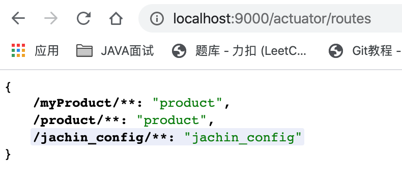
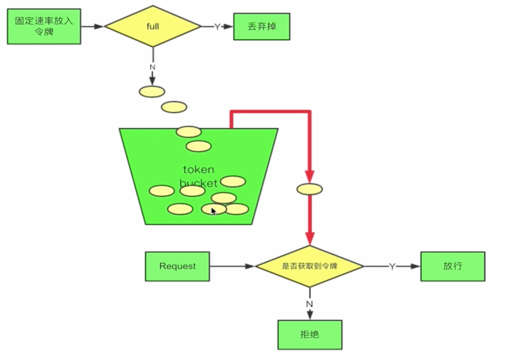

# 路由网关-Zuul

## 1、为什么需要网关

**<font color='#02C874' size=5>*一个处理非业务类服务的绝佳场所*</font>**

> 1. **身份认证**和安全:识别每一个资源的验证要求 审查和监控
> 2. **动态路由**：动态将请求路由到不同后端集群
> 3. 压力测试：组建增加指定集群流量，检测性能
> 4. 负载分配：为不同负载类型分配对应容量
> 5. 静态响应处理：边缘位置响应，避免转发到内部集群

------


**<font color='red'>统一接收前端请求，并配置到后端各服务的转发规则</font>**


## 2、Zuul特点

> - 就是一系列过滤器Filter：<font color='#02C874'>***前置(Pre)、后置(Post)、路由(Route)、错误(Error)四种类型的过滤器API***</font>
> - **<font color='#02C874'>路由器(Router) + 过滤器(Filter) = Zuul</font>**
> - **<font color='#02C874'>注册多实例到eureka实现高可用</font>**

------

过滤器：每种类型的过滤器都有很多种实现

> - **<font color='#02C874' size=4.5>Pre：限流、鉴权、参数校验调整</font>**
> - Post：统计、日志

------


## 3、简单使用

### 1) 创建工程


------


### 2）启动类加==`@EnableZuulProxy`==注解


### 3）即可简单使用

先看一下有哪些应用注册到了eureka：


通过网关(9000端口) 访问product应用中的/product/list接口：

`http://localhost:9000/product/product/list`即可成功调用

> - **<font color='red'>其中，第一个product是应用名，可通过yml配置自定义，详见下一节。</font>**
>
> - 可以通过访问:==`http://localhost:9000/actuator/routes`==可以查看所有可访问应用：
>
>   


------


### 3）bootstrap.yml初步个性化配置

```yml
spring:
  rabbitmq:
    host: 39.106.177.45
    port: 5672
    username: guest
    password: guest
  application:
    name: api-jachin_gateway
  cloud:
    config:
      discovery:
        enabled: true
        service-id: JACHIN_CONFIG
      profile: dev
eureka:
  client:
    service-url:
      defaultZone: http://localhost:8761/eureka
      
zuul:
	# 配置1:
  routes:
    myProduct: #可以自定义，只是个规则名而已
      path: /myProduct/** # 这个就是个性化访问路径名，代替应用名
      serviceId: product # 被代替的应用名，
  #配置2:
  ignored-patterns:
    - /product/product/listForOrder
    - /myProduct/product/listForOrder
#    - /**/product/listForOrder 通配符

```

> - 配置1：可以通过问`http://localhost:9000/myProduct/product/list`接口就可以实现对product应用的/product/list接口的调用。
> - <font color='red'>配置2：==**ignored-pattern**==：配置要对客户端屏蔽的应用接口，因为配置1，所以现在对网关有两种请求方式都可以访问到应用的listForOrder接口，故要将两个访问路径都屏蔽，所以可以通过通配符写法，更加简洁。客户端访问被屏蔽的路径，会**==返回404==**。</font>

------


## 4、配置过滤器


创建一个过滤器类，<font color='#02C874' size=4>**继承`ZuulFilter`类，并实现其所有方法**</font>，如下：

> <font color='#02C874' size=4>**注意一定要加上@Component！！！**</font>

```java
package com.jachincloud.apigateway.filter;

/**
 * @description:
 * @Author: JachinDo
 * @Date: 2020/01/06 21:30
 */
@Component
public class TokenFilter extends ZuulFilter {
    // 指定过滤器类型
    @Override
    public String filterType() {
        return PRE_TYPE; // 前置过滤器
    }

    // 过滤器优先级，越小越优先
    @Override
    public int filterOrder() {
        // 相当于优先于PRE_DECORATION_FILTER_ORDER类型的前置过滤器
        return PRE_DECORATION_FILTER_ORDER - 1;
    }

    // 是否开启过滤
    @Override
    public boolean shouldFilter() {
        return true;
    }

    // 过滤器逻辑
    @Override
    public Object run() throws ZuulException {
        RequestContext currentContext = RequestContext.getCurrentContext();
        HttpServletRequest request = currentContext.getRequest();

        // 这里从url中获取，也可以从cookie、header中获取，从cookie中获取要先配置禁止敏感头过滤
        // 因为默认是会过滤掉前端传来的cookie
        String token = request.getParameter("token");
        if (StringUtils.isEmpty(token)) {
            currentContext.setSendZuulResponse(false); // 表示请求不通过
            currentContext.setResponseStatusCode(HttpStatus.UNAUTHORIZED.value()); // 设置响应状态码
        }
        return null;
    }
}
```

> **<font color='red'>这里是配置的前置过滤器，所以通过`RequestContext`获得请求，若是后置过滤器，可以通过`RequestContext`获得响应，进行相关加工。</font>**

------


## 5、限流

限流概念参考：https://mp.weixin.qq.com/s/08qtprGeWqb1wFz-5AcvoQ

**控制请求速率，放在进入zuul的第一步进行**

**令牌桶限流：**



------

实现：

> ==直接用google的组件 RateLimiter==

```java
package com.jachincloud.apigateway.filter;

/**
 * @description: 限流
 * @Author: JachinDo
 * @Date: 2020/01/07 16:14
 */
@Component
public class RateLimitFilter extends ZuulFilter {

    // 直接用google的组件 RateLimiter
    private static final RateLimiter RATE_LIMITER = RateLimiter.create(100); // 每秒钟放几个令牌

    @Override
    public String filterType() {
        return PRE_TYPE;  // 限流，肯定要最高优先类型
    }

    @Override
    public int filterOrder() {
        return SERVLET_DETECTION_FILTER_ORDER - 1; // 要比最高优先级还要小
    }

    @Override
    public boolean shouldFilter() {
        return true;
    }

    @Override
    public Object run() throws ZuulException {
        if (!RATE_LIMITER.tryAcquire()) { // 尝试获取令牌
            throw new RateLimitException(); // 抛出自定义异常，或作其他返回给前端
        }
        return null;
    }
}
```


### &sect; 漏桶限流与令牌桶限流的区别

**漏桶只能以==固定的速率==去处理请求，而令牌桶可以以桶子==最大的令牌数去处理请求==**


## 6、负载均衡和熔断

<font color='red'>***Zuul中默认就已经集成了Ribbon负载均衡和Hystix熔断机制。***</font>但是所有的超时策略都是走的默认值，比如熔断超时时间只有1S，很容易就触发了。因此建议我们手动进行配置：

```java
zuul:
  retryable: true
ribbon:
  ConnectTimeout: 250 # 连接超时时间(ms)
  ReadTimeout: 2000 # 通信超时时间(ms)
  OkToRetryOnAllOperations: true # 是否对所有操作重试
  MaxAutoRetriesNextServer: 2 # 同一服务不同实例的重试次数
  MaxAutoRetries: 1 # 同一实例的重试次数
hystrix:
  command:
  	default:
        execution:
          isolation:
            thread:
              timeoutInMillisecond: 6000 # 熔断超时时长：6000ms
```

------

## 7、实现重定向

定义重定向过滤器：

<font color='red'>**通过设置filterType和filterOrder来保证该过滤器要在自带的`RibbonRoutingFilter`和`SendForwardFilter`之前运行。**</font>

```java
package com.jachincloud.apigateway.filter;
/**
 * @description:
 * @Author: JachinDo
 * @Date: 2020/03/14 15:53
 */
@Component
public class ReturnUrlFilter extends ZuulFilter {
    @Override
    public String filterType() {
        return ROUTE_TYPE;
    }

    @Override
    public int filterOrder() {
        return 1;
    }

    @Override
    public boolean shouldFilter() {
        return true;
    }

    @Override
    public Object run() throws ZuulException {
        RequestContext currentContext = RequestContext.getCurrentContext();
        HttpServletRequest request = currentContext.getRequest();
        String url = request.getRequestURI();
        if (url.equals("/order/order/target")) {
						// 想要重定向的地址
            String redirectURL = "http://127.0.0.1:9000/product/product/target2";
          	// 这个设置是用来屏蔽掉后面的`RibbonRoutingFilter`，
            currentContext.setSendZuulResponse(false);
          	// 设置重定向url
            currentContext.put(FORWARD_TO_KEY, redirectURL);
          	// 设置相应状态码为重定向	
            currentContext.setResponseStatusCode(HttpStatus.SC_TEMPORARY_REDIRECT);
            try {
              	// 将重定向放进响应中
                currentContext.getResponse().sendRedirect(redirectURL);
            } catch (IOException e) {
                e.printStackTrace();
            }
        }
        return null;
    }
}
```

这样就可以实现重定向了。

------


## 8、核心：过滤器

各种过滤器详解：https://www.jianshu.com/p/ff863d532767


------

由图可见一个请求的生命周期：

> - 外部http请求到达api网关服务的时候，首先它会进入第一个阶段pre，在这里它会被pre类型的过滤器进行处理。<font color='#02C874'>**该类型过滤器的主要目的是在进行请求路由之前做一些前置加工，比如请求的校验等。**</font>
> - 在完成了pre类型的过滤器处理之后，请求进入第二个阶段routing，也就是之前说的路由请求转发阶段，请求将会被routing类型的处理器处理。<font color='#02C874'>**这里的具体处理内容就是将外部请求转发到具体==服务实例==上去的过程，当服务实例请求结果都返回之后，routing阶段完成**.</font>
> - 请求进入第三个阶段post。此时请求将会被post类型的过滤器处理，这些过滤器在处理的时候不仅可以获取到请求信息，还能获取到服务实例的返回信息，所以在post类型的过滤器中，<font color='#02C874'>**我们可以对处理结果进行一些加工或转换等内容。**</font>
> - 另外，还有一个特殊的阶段error，<font color='#02C874'>**该阶段只有在上述三个阶段中发生异常的时候才会触发，但是它的最后流向还是post类型的过滤器**</font>，因为它需要通过post过滤器将最终结果返回给请求客户端（对于error过滤器的处理，在spring cloud zuul的过滤链中实际上有一些不同）

