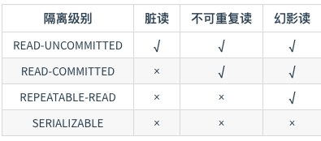
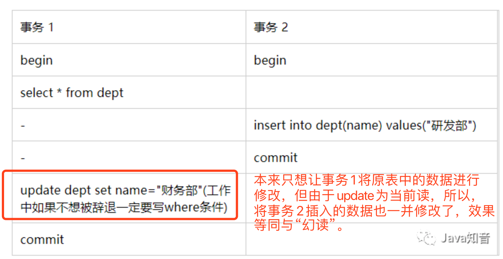

# Innodb事务隔离级别与锁

## 1、事务

### 1）定义

**事务是逻辑上的一组操作，要么都执行，要么都不执行。**

> MySQL中事务什么时候算开始？
>
> ​	并不是begin，而是执行第一条增删改查语句开始。

------

### 2）事务的特性(ACID)

> 1. **原子性：** 事务是==最小的执行单位==，不允许分割。事务的原子性确保动作要么全部完成，要么完全不起作用；
> 2. **一致性：** ==执行事务前后，数据保持一致==，例如转账业务中，无论事务是否成功，转账者和收款人的==总额应该是不变==的；**这里的一致性是指系统从一个正确的状态,迁移到另一个正确的状态**
> 3. **隔离性：** 并发访问数据库时，一个用户的事务==不被其他事务所干扰==，各并发事务之间数据库是独立的；
> 4. **持久性：** 一个事务被提交之后。它==对数据库中数据的改变是持久的==，==即使数据库发生故障也不应该对其有任何影响。==
> 5. ***其中，隔离性由数据库中的锁技术保证，持久性由redo log保证，原子性和一致性由undo log保证***

------

### 3）并发事务会带来的问题

- **丢失修改（Lost to modify）:** 指在一个事务读取一个数据时，另外一个事务也访问了该数据，那么在第一个事务中修改了这个数据后，第二个事务也修改了这个数据。这样第一个事务内的修改结果就被丢失，因此称为丢失修改。 例如：事务1读取某表中的数据A=20，事务2也读取A=20，事务1修改A=A-1，事务2也修改A=A-1，最终结果A=19，事务1的修改被丢失。
- **脏读（Dirty read）:** 当一个事务正在访问数据并且对数据进行了修改，而这种修改还没有提交到数据库中，这时另外一个事务也访问了这个数据，然后使用了这个数据。因为这个数据是还没有提交的数据(可能会回滚)，那么另外一个事务读到的这个数据是“脏数据”，依据“脏数据”所做的操作可能是不正确的。
- **不可重复读（Unrepeatableread）:** 指在一个事务内多次读同一数据。在这个事务还没有结束时，另一个事务也访问该数据。那么，在第一个事务中的两次读数据之间，由于第二个事务的修改导致第一个事务两次读取的数据可能不太一样。这就发生了在一个事务内两次读到的数据是不一样的情况，因此称为不可重复读。
- **幻读（Phantom read）:** 幻读与不可重复读类似。它发生在一个事务（T1）读取了几行数据，接着另一个并发事务（T2）插入了一些数据时。在随后的查询中，第一个事务（T1）就会发现多了一些原本不存在的记录，就好像发生了幻觉一样，所以称为幻读。

------

## 2、“锁”与事务隔离级别

**在数据库操作中，为了有效保证==并发==读取数据的正确性，提出的事务隔离级别。我们的==数据库锁，也是为了构建这些隔离级别存在的==。**

### 1）数据库中的==悲观锁==

这里主要讨论***“行锁”***

- ==***排它锁(Exclusice) ：又称 X锁，写锁。***==
- ==***共享锁(Shared)：又称S锁，读锁。***==

关系：

- 一个事务对数据对象O加了 S 锁，可以对 O进行读取操作，但是不能进行更新操作。==加锁期间其它事务能对O 加 S 锁，但是不能加 X 锁。==
- 一个事务对数据对象 O 加了 X 锁，就可以对 O 进行读取和更新。加锁期间其它事务不能对 O 加任何锁。

------

### 2）数据库中的乐观锁

***版本号字段+CAS***

> 具体可通过给表加一个版本号或时间戳字段实现，当读取数据时，***将version字段的值一同读出，数据每更新一次，对此version值加一。当我们提交更新的时候，判断当前版本信息与第一次取出来的版本值大小，如果数据库表当前版本号与第一次取出来的version值相等，则予以更新，否则认为是过期数据，拒绝更新，让用户重新操作。***

------

### 3）事务隔离级别

**SQL 标准定义了四个隔离级别：**

约定：

> 写： UPDATE, DELETE，（==因为行锁，所以无法管到INSERT==）
>
> 读：SELECT

------

#### a）基于悲观锁实现的隔离级别：

***前三种也可称为三级封锁协议***

- **READ-UNCOMMITTED(读取未提交)：**

  ==写时加写锁，读时不加锁==

  **解决了更新丢失问题**， 最低的隔离级别，允许读取尚未提交的数据变更(可能会回滚)，**可能会导致脏读、幻读或不可重复读**。

- **READ-COMMITTED(读取已提交)：**

  ==写时加写锁，读时加读锁，读完就释放读锁，不用等到事务结束==

  **解决脏读**,允许读取并发事务已经提交的数据，**可以阻止脏读，但是幻读或不可重复读仍有可能发生**。

- **REPEATABLE-READ(可重复读)：** **默认的隔离级别**

  ==写时加写锁，读时加读锁，读完不释放锁，要等到事务结束再释放==

  **解决了不可重复读**，对同一字段的多次读取结果都是一致的，除非数据是被本身事务自己所修改，**可以阻止脏读和不可重复读，*但幻读仍有可能发生，因为是行锁，无法阻止“插入”。***。

- ==**SERIALIZABLE(可串行化)：**== 最高的隔离级别，完全服从ACID的隔离级别。所有的事务依次逐个执行，这样事务之间就完全不可能产生干扰，也就是说，**该级别可以防止脏读、不可重复读以及幻读**。

------

------

#### b）==MVCC--基于乐观锁实现的隔离级别==

##### 1.概念

多版本并发控制(Multi-Version Concurrency Control, MVCC)是MySQL中基于==乐观锁==理论实现隔离级别的方式，用于实现读已提交和可重复读取隔离级别的实现。

***该思想可用在分布式事务中！！！***

> - **系统版本号：**一个递增的数字，==每开始一个新的事务，系统版本号就会自动递增。==
> - **事务版本号：**事务开始时的系统版本号。

以上版本号意思是说每个事务有一个唯一id标示，且根据事务开始的时间按序递增的。

在MySQL中建表时，每个表都会有三列隐藏记录，其中和MVCC有关系的有两列

- ***数据行的(创建)版本号 （DB_TRX_ID）***
- ***删除版本号 (DB_ROLL_PT)***

------

##### 2.增删改过程

> - INSERT：将当前事务版本号记录到数据行版本号。
> - DELETE：将当前事务版本号记录到删除版本号。
> - UPDATE：
>   - ***先将当前数据行复制一行出来，并将其数据行版本号置为当前事务版本号。***
>   - ***再将原来的数据行的删除版本号置为当前事务版本号。***

------

##### 3.查询SELECT过程

select时读取数据的规则为：(==insert/update/delete不用此规则，它们读最新全表==)

***创建版本号<=当前事务版本号，删除版本号为空或>当前事务版本号。***

创建版本号<=当前事务版本号保证取出的数据不会有后启动的事务中创建的数据。

删除版本号为空或>当前事务版本号保证了至少在该事务开启之前数据没有被删除，是应该被查出来的数据。

------

##### 4.MVCC中的幻读问题

***InnoDB默认select为“快照读”，增删改(INSERT/DELETE/UPDATE)为“当前读”。***

>- 快照读：事务中**第一条**select语句执行时会将全表最新的数据读入，而之后该事务中的其他select所读取的结果完全等于第一条select所生成的“快照”，这自然==***保证了“可重复读”，解决了幻读。***==
>
>- 当前读：默认insert、update、delete在执行前都会读去全表最新数据。
>
>  - 为什么需要当前读：
>
>    ==***假设要update一条记录，但是在另一个事务中已经delete掉这条数据并且commit了，如果update就会产生冲突，所以在update的时候需要知道最新的数据。也正是因为这样所以才导致上面我们测试的那种情况。***==

------

***所以MVCC解决了一个事务中多次select中的不可重复读(有其他事务修改数据)和幻读(有其他事务增加数据)问题。***

------

***但没有解决增删改操作的幻读问题***，如下：

如何完美解决幻读：

- 使用==串行化读==的隔离级别
- ***MVCC+==next-key locks==：next-key locks由record locks(索引加锁) 和 gap locks(间隙锁)组成，每次锁住的不光是需要使用的数据，还会锁住这些数据附近的数据)***

实际上很多的项目中是不会使用到上面的两种方法的，串行化读的性能太差，而且其实幻读很多时候是我们完全可以接受的。