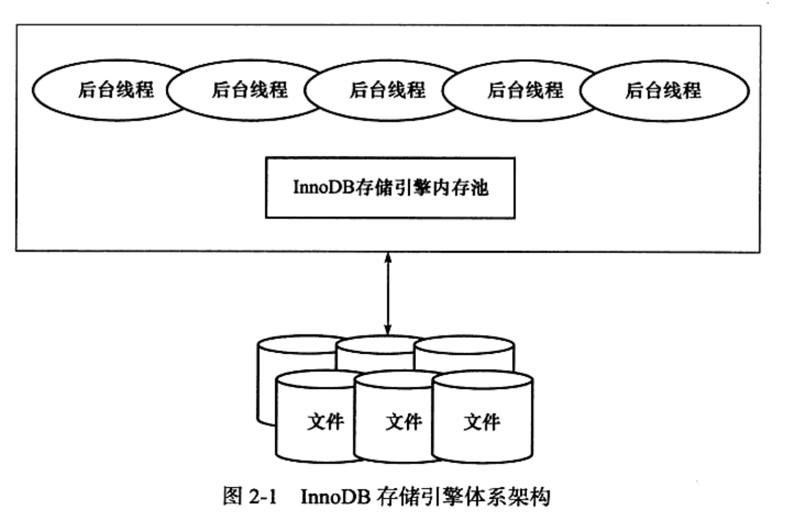
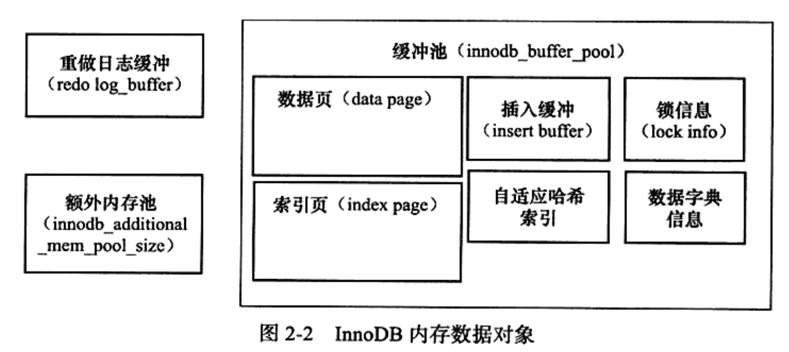

# Innodb技术内幕读书笔记

## 1、基本结构

其中，内存池如下：

> - ***缓冲池的作用：==就像cpu多级缓存一样==，通过内存（缓冲）来弥补cpu和磁盘速度上的差距。在数据库中读取页的操作，首先将读到的页放到缓冲池中，下次再读时先判断缓冲池中有没有。对数据页的修改也是对缓冲池中的页做操作（产生==“脏页”==，然后通过后台线程将其更新到磁盘（这里用到了==checkpoint技术==）。***
>
> - **从InnoDB 1.0.x版本开始，允许多个缓冲池实例，每个页根据哈希值分不到不同的缓冲池中，减少了数据库内部的资源竞争，提升了数据库的并发能力。这感觉有点==像hystrix中的多线程池呗==**
>
> - **缓冲池中的淘汰策略：LRU**
>
>   **只是新数据页插入时是差到一个中部位置mid上，不是插到头。这样一定程度上不会抢占那些已经被认为是热点的数据页了。**
>
> - **ChectPoint技术：**
>
>   **使用ChectPoint技术来将缓冲池中的页刷新到磁盘中。只靠redo log不太行。**

------

## &sect; 事务实现（存储引擎层面的日志）

> - Redo log + CheckPoint 实现持久性，redo log是物理日志，直接记录数据的改变，恢复更快。（binlog是数据库层面的日志，是逻辑日志，恢复慢）
> - Undo log实现回滚（一致性，和原子性），undo log是逻辑日志，在没执行一个命令时，undo log记录一个相反的命令操作，如执行insert，则undo记录对应的delete。
> - undo log会产生redo log，因为undo log也需要持久性保护。

