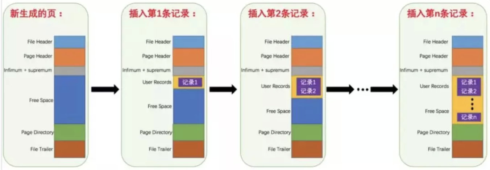

# Mysql页与索引

> **B+树中一个节点为一页或页的倍数最为合适**。

因为如果一个节点的大小小于1页，那么读取这个节点的时候其实也会读出1页，造成资源的浪费。

如果一个节点的大小大于1页，比如1.2页，那么读取这个节点的时候会读出2页，也会造成资源的浪费。

所以为了不造成浪费，所以最后把一个节点的大小控制在1页、2页、3页、4页等倍数页大小最为合适。

------

## &sect; 页

首先Mysql的基本存储结构是**页**(记录都存在页里边)：

------

各个数据页可以组成一个双向链表

**而每个数据页中的记录又可以组成一个单向链表**

- 每个数据页都会为存储在它里边儿的记录生成一个页目录，***在通过主键查找某条记录的时候可以在页目录中使用二分法快速定位到对应的槽，然后再遍历该槽对应分组中的记录即可快速找到指定的记录***

以其他列(非主键)作为搜索条件：只能从最小记录开始依次遍历单链表中的每条记录。

所以说，如果我们写` select * from user where username='丙丙'`这样没有进行任何优化的sql语句，默认会这样做：

定位到记录所在的页

- 需要遍历双向链表，找到所在的页

从所在的页内中查找相应的记录

- 由于不是根据主键查询，只能遍历所在页的单链表了

------

## &sect; 回表与覆盖索引

回表大概就是我们有个主键为ID的索引，和一个普通name字段的索引，我们在普通字段上搜索：

`select * from table where name = '丙丙'`

**执行的流程是先查询到name索引上的“丙丙”，然后找到他的id是2，最后去主键索引，找到id为2对应的值。==回到主键索引树搜索的过程==，就是回表。**

不过也有方法避免回表，那就是覆盖索引。

这个其实比较好理解，刚才我们是 select * ，查询所有的，==我们如果只查询ID那，其实在Name字段的索引上就已经有了，那就不需要回表了。==

覆盖索引可以减少树的搜索次数，提升性能，他也是我们在实际开发过程中经常用来优化查询效率的手段。

很多联合索引的建立，就是为了支持覆盖索引，特定的业务能极大的提升效率。

------

