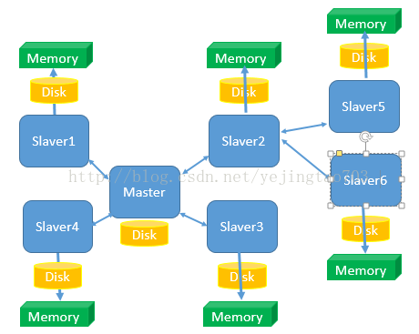
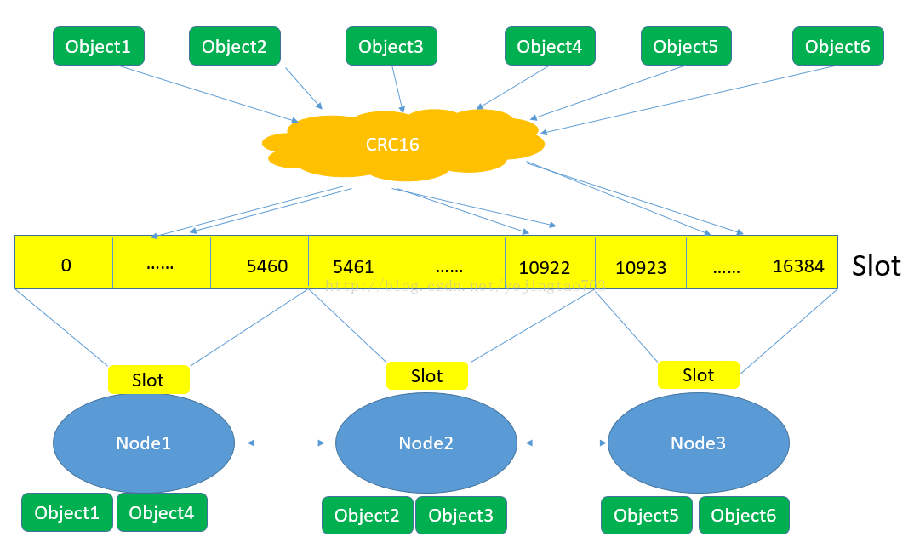
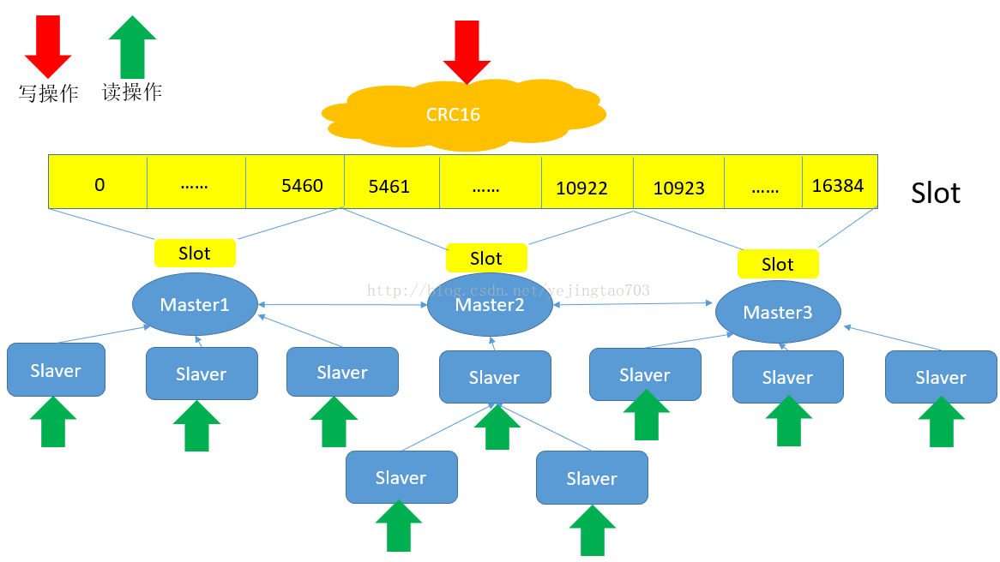

# Redis主从与集群

## 1、普通主从

> 优点：
>
> - **读写分离，通过增加*Slaver*可以提高并发读的能力。**
> - **提供了master的备份容灾能力**
>
> 缺点：
>
> - ***Master*写能力是瓶颈。**
> - **Master的存储能力受到单机的限制。**
> - 虽然理论上对*Slaver*没有限制但是**维护*Slaver*开销总将会变成瓶颈。**
> - **一旦 Master宕机，Slaver 晋升成 Master，同时需要修改 应用方 的 Master地址，还需要命令所有 Slaver 去 复制 新的Master，整个过程需要 人工干预。**
>

***主从复制不要用图状结构，用单向链表结构更为稳定，即：Master <- Slave1 <- Slave2 <- Slave3...。这样的结构==方便解决单点故障问题，实现Slave对Master的替换。如果Master挂了，可以立刻启用Slave1做Master，其他不变==。***

------

## 2、hash slot

> **对象保存到Redis之前先经过CRC16哈希到一个指定的Node上，例如Object4最终Hash到了Node1上。**
>
> 2， 每个Node被平均分配了一个Slot段，对应着0-16384，Slot不能重复也不能缺失，否则会导致对象重复存储或无法存储。
>
> 3， ***Node之间也互相监听，一旦有Node退出或者加入，会按照Slot为单位做数据的迁移。例如Node1如果掉线了，0-5640这些Slot将会平均分摊到Node2和Node3上,由于Node2和Node3本身维护的Slot还会在自己身上不会被重新分配，所以迁移过程中不会影响到5641-16384Slot段的使用。***
>
> 
>
> 缺点：每个Node承担着互相监听、高并发数据写入、高并发数据读出，工作任务繁重
>
> 优点：**将Redis的写操作分摊到了多个节点上，提高写的并发能力，扩容简单。**

------

## 3、集群cluster

> - **去中心化的**
> - Redis Cluster 将所有数据划分为 16384 的 slots，每个节点负责其中一部分槽位。槽位的信息存储于每个节点中。
> - **当 Redis Cluster 的客户端来连接集群时，它也会得到一份集群的槽位配置信息。这样当 客户端要查找某个 key 时，可以直接定位到目标节点。**

------

### 容错

> **Redis Cluster 可以为每个主节点设置若干个从节点，单主节点故障时，集群会自动将其 中某个从节点提升为主节点。==如果某个主节点没有从节点，那么当它发生故障时，集群将完 全处于不可用状态。不过 Redis 也提供了一个参数 cluster-require-full-coverage 可以允许部分 节点故障，其它节点还可以继续提供对外访问==。**

### 网络抖动

> **Redis Cluster 提供了一种选项 cluster-node-timeout，表示当某个节点持 续 timeout 的时间失联时，才可以认定该节点出现故障，需要进行主从切换。==如果没有这个 选项，网络抖动会导致主从频繁切换 (数据的重新复制)。==**

### 如何确定某个主节点故障？

> 因为 Redis Cluster 是去中心化的，一个节点认为某个节点失联了并不代表所有的节点都 认为它失联了。
>
> - **所以集群还得经过一次协商的过程，只有当大多数节点都认定了某个节点失 联了，集群才认为该节点需要进行主从切换来容错。**
>
> - **Redis 集群节点采用 ==Gossip 协议来广播自己的状态以及自己对整个集群认知的改变==。比如一个节点发现某个节点失联了 (PFail)，它会将这条信息向整个集群广播，其它节点也就可 以收到这点失联信息。如果一个节点收到了某个节点失联的数量 (PFail Count) 已经达到了集群的大多数，就可以标记该节点为确定下线状态 (Fail)，然后向整个集群广播，强迫其它节 点也接收该节点已经下线的事实，并立即对该失联节点进行主从切换。**

