# Redis原理与结构

参考：https://juejin.im/post/5b70dfcf518825610f1f5c16

https://snailclimb.gitee.io/javaguide/#/docs/database/Redis/Redis

<font color='red'>！！！！必看https://mp.weixin.qq.com/s/t2kFvvSKuz8wU08juT30bA</font>

------


## 1、简介

​	简单来说 redis **就是一个数据库**，不过与传统数据库不同的是 redis 的数据是**==存在内存中==**的，所以读写速度非常快，因此 redis 被广泛应用于缓存方向。另外，redis 也经常用来做**==分布式锁==**。redis 提供了多种数据类型来支持不同的业务场景。除此之外，redis 支持事务 、持久化、LUA脚本、LRU驱动事件、多种集群方案。


## 2、为什么要用redis/缓存

> - **高性能：<font color='red'>将redis作为数据库的前置存储。</font>**
>
>   
>
>   
>
> - **高并发：<font color='red'>将部分数据从数据库分离出来，存在redis中(数据库中不再存储)</font>**。
>
>   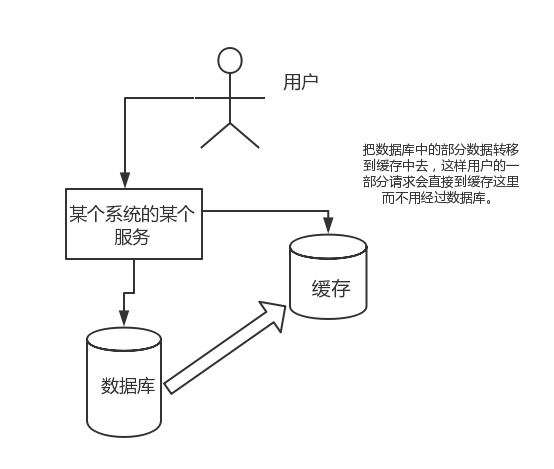


------

## 3、redis常见数据结构

https://juejin.im/post/5b53ee7e5188251aaa2d2e16

### &sect; string

> Redis的字符串是==**动态字符串**==，是可以修改的字符串，**<font color='red'>内部结构实现上类似于Java的ArrayList，采用预分配冗余空间的方式来减少内存的频繁分配，</font>**如图中所示，内部为当前字符串实际分配的空间capacity一般要高于实际字符串长度len。当字符串长度小于1M时，扩容都是==加倍==现有的空间，如果超过1M，扩容时一次只会多扩1M的空间。需要注意的是==**字符串最大长度为512M。**==


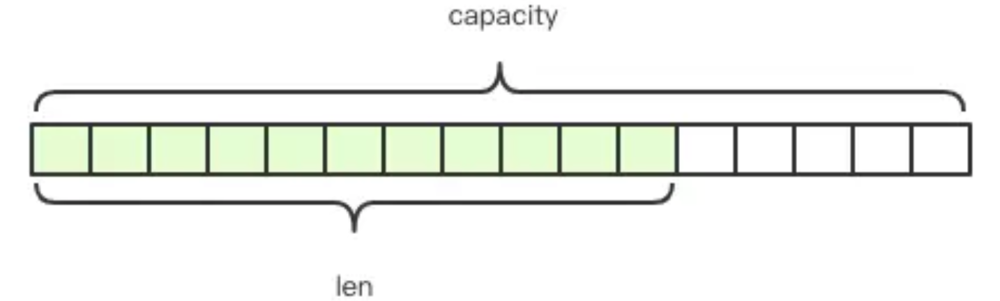

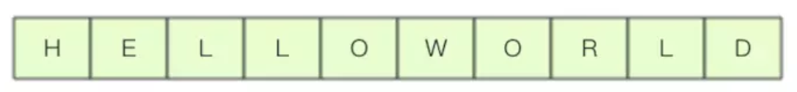


底层结构：c语言：

```c
/* Note: sdshdr5 is never used, we just access the flags byte directly.
 * However is here to document the layout of type 5 SDS strings. */
struct __attribute__ ((__packed__)) sdshdr5 {
    unsignedchar flags; /* 3 lsb of type, and 5 msb of string length */
    char buf[];
};
struct __attribute__ ((__packed__)) sdshdr8 {
    uint8_t len; /* used */
    uint8_t alloc; /* excluding the header and null terminator */
    unsignedchar flags; /* 3 lsb of type, 5 unused bits */
    char buf[];
};
struct __attribute__ ((__packed__)) sdshdr16 {
    uint16_t len; /* used */
    uint16_t alloc; /* excluding the header and null terminator */
    unsignedchar flags; /* 3 lsb of type, 5 unused bits */
    char buf[];
};
struct __attribute__ ((__packed__)) sdshdr32 {
    uint32_t len; /* used */
    uint32_t alloc; /* excluding the header and null terminator */
    unsignedchar flags; /* 3 lsb of type, 5 unused bits */
    char buf[];
};
struct __attribute__ ((__packed__)) sdshdr64 {
    uint64_t len; /* used */
    uint64_t alloc; /* excluding the header and null terminator */
    unsignedchar flags; /* 3 lsb of type, 5 unused bits */
    char buf[];
};
```

> 你会发现同样一组结构 Redis 使用泛型定义了好多次，**为什么不直接使用 int 类型呢？**
>
> 因为当字符串比较短的时候，len 和 alloc 可以使用 byte 和 short 来表示，<font color='red'>***Redis 为了对内存做极致的优化，不同长度的字符串使用不同的结构体来表示。***</font>

------

### &sect; list

> Redis将列表数据结构命名为list而不是array，是因为**<font color='red'>列表的存储结构用的是链表而不是数组，而且链表还是==双向链表==</font>**。因为它是链表，所以随机定位性能较弱，首尾插入删除性能较优。如果list的列表长度很长，使用时我们一定要关注链表相关操作的时间复杂度。

------

关于链表节点与链表总体的定义：

```c
/* Node, List, and Iterator are the only data structures used currently. */
// 定义链表节点
typedefstruct listNode {
    struct listNode *prev;
    struct listNode *next;
    void *value;
} listNode;

typedefstruct listIter {
    listNode *next;
    int direction;
} listIter;

// 定义链表
typedefstruct list {
    listNode *head; // 头
    listNode *tail; // 尾
    void *(*dup)(void *ptr);
    void (*free)(void *ptr);
    int (*match)(void *ptr, void *key);
    unsignedlong len; // 长度
} list;
```

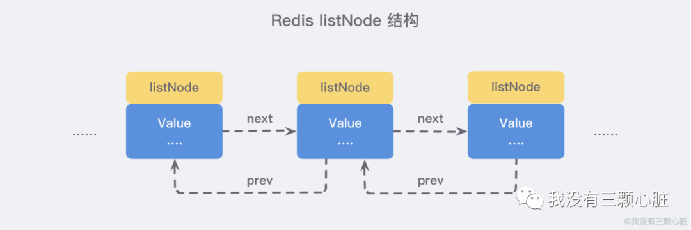


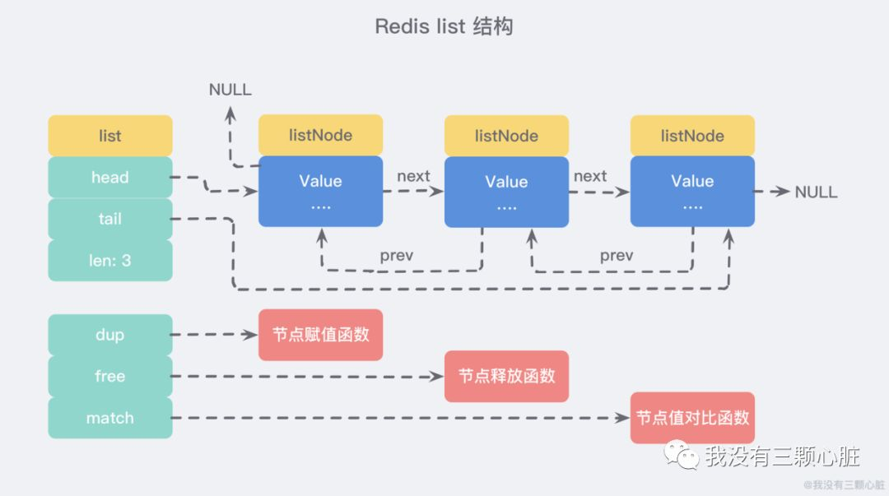

> <font color='red'>***虽然仅仅使用多个 listNode 结构就可以组成链表，但是使用 `adlist.h/list` 结构来持有链表的话，操作起来会更加方便***</font>

------


> - **==负下标==** 链表元素的位置使用自然数`0,1,2,....n-1`表示，还可以使用负数`-1,-2,...-n`来表示，==`-1`表示「倒数第一」，`-2`表示「倒数第二」，那么`-n`就表示第一个元素，对应的下标为`0`。==
> - **==队列／堆栈==** 链表可以从表头和表尾追加和移除元素，<font color='red'>结合使用==**rpush/rpop/lpush/lpop**==四条指令，**可以将链表作为队列或堆栈使用，左向右向进行都可以**</font>

------


### &sect; 字典hash

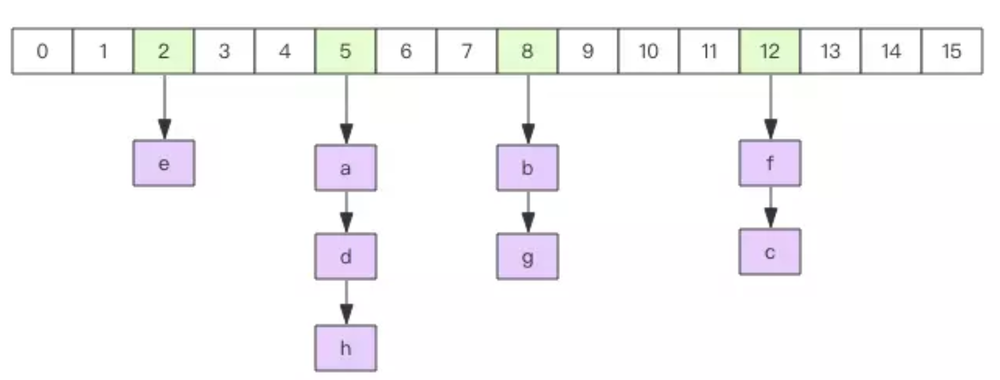

> Redis 中的字典相当于 Java 中的 **HashMap**，内部实现也差不多类似，都是通过 <font color='red'>**"数组 + 链表"** </font>的链地址法来解决部分 **哈希冲突**，同时这样的结构也吸收了两种不同数据结构的优点。源码定义：

```c
// 数组上元素的定义，相当于hashmap中的Node
typedef struct dictEntry {
    // 键
    void *key;
    // 值
    union {
        void *val;
        uint64_t u64;
        int64_t s64;
        double d;
    } v;
    // 指向下个哈希表节点，形成链表！！！
    struct dictEntry *next;
} dictEntry;

// 相当于hashmap中的table[]数组
typedef struct dictht {
    // 哈希表数组元素
    dictEntry **table; 
    // 哈希表大小
    unsigned long size;
    // 哈希表大小掩码，用于计算索引值，总是等于 size - 1
    unsigned long sizemask;
    // 该哈希表已有节点的数量
    unsigned long used;
} dictht;

// 字典的整体定义，相当于hashmap的定义
typedef struct dict {
    dictType *type;
    void *privdata;
    // ！！！！！内部有两个 dictht 结构
    dictht ht[2]; // 相当于有两个table[]数组
    long rehashidx; /* rehashing not in progress if rehashidx == -1 */
    unsigned long iterators; /* number of iterators currently running */
} dict;

```

------

#### &sect; 渐进式rehash

<font color='yellow' size=5>***在分布式系统的日志技术中也有用到类似两份table的技术：Check Point技术***</font>

------


> 1. <font color='gree'>**为 `ht[1]` 分配空间(扩容)**</font>， 让字典同时持有 `ht[0]` 和 `ht[1]` 两个哈希表。
> 2. <font color='gree'>在字典中维持一个**索引计数器变量 `rehashidx`** ， 并将它的值设置为 `0` ， 表示 rehash 工作正式开始。</font>
> 3. 在 rehash 进行期间， <font color='red'>***每次对字典执行添加、删除、查找或者更新操作时， 程序除了执行指定的操作以外， 还会顺带将 `ht[0]` 哈希表在 `rehashidx` 索引上的所有键值对 rehash 到 `ht[1]` ， 当 rehash 工作完成之后， 程序将 `rehashidx` 属性的值增一。***</font>
> 4. 随着字典操作的不断执行， 最终在某个时间点上， `ht[0]` 的所有键值对都会被 rehash 至 `ht[1]` ，<font color='purple'>***然后再将ht[1]赋给ht[0]，把ht[1]置为null 。***</font>这时程序将 `rehashidx` 属性的值设为 `-1` ， 表示 rehash 操作已完成。

图例见：http://redisbook.com/preview/dict/incremental_rehashing.html


<font size = 5>**注意：**</font>

> - 因为在进行渐进式 rehash 的过程中， 字典会同时使用 `ht[0]` 和 `ht[1]` 两个哈希表， <font color='red'>***所以在渐进式 rehash 进行期间， 字典的删除（delete）、查找（find）、更新（update）等操作会在两个哈希表上进行***</font>： 比如说， 要在字典里面查找一个键的话， ==程序会先在 `ht[0]` 里面进行查找， 如果没找到的话， 就会继续到 `ht[1]` 里面进行查找==， 诸如此类。
>
> - 另外， 在渐进式 rehash 执行期间， <font color='red'>**新添加到字典的键值对一律会被保存到 `ht[1]` 里面， 而 `ht[0]` 则不再进行任何添加操作： 这一措施保证了 `ht[0]` 包含的键值对数量会只减不增， 并随着 rehash 操作的执行而最终变成空表。**</font>

------

### &sect; set

> Redis 的集合相当于 Java 语言中的 **HashSet**，它内部的键值对是无序、唯一的。==***它的内部实现相当于一个特殊的字典，字典中所有的 value 都是一个值 NULL。***==

------


### &sect; zset (SortedSet)

zset是Redis提供的一个非常特别的数据结构，*<font color='red'>一方面它等价于Java的数据结构`Map<value,score>`，可以给每一个元素value赋予一个权重`score`，另一方面它又类似于`TreeSet`，内部的元素会按照权重score进行排序，</font>*可以得到每个元素的名次，还可以通过score的范围来获取元素的列表。

------

> zset底层实现使用了两个数据结构:
>
> - ==hash==：hash的作用就是<font color='red'>关联元素value和权重score，保障元素value的唯一性，可以通过元素value找到相应的score值。</font>
> - ==跳表==：跳跃列表的目的在于<font color='red'>给元素value排序</font>，根据score的范围获取元素列表。

------

#### 有关跳表

https://juejin.im/post/57fa935b0e3dd90057c50fbc

因为zset要**==支持随机的插入和删除，所以它不好使用数组来表示。==**

​	

------


## 4、redis过期时间

Redis中有个设置时间过期的功能，即对存储在 redis 数据库中的值可以设置一个过期时间。作为一个缓存数据库，这是非常实用的。如我们一般项目中的 token 或者一些登录信息，尤其是短信验证码都是有时间限制的，按照传统的数据库处理方式，一般都是自己判断过期，这样无疑会严重影响项目性能。

**我们 set key 的时候，都可以给一个 expire time，就是过期时间，通过过期时间我们可以指定这个 key 可以存活的时间。**

如果假设你设置了一批 key 只能存活1个小时，那么接下来1小时后，redis是怎么对这批key进行删除的？

### 过期数据怎么办？

**<font color='red'>定期删除+惰性删除。</font>**

通过名字大概就能猜出这两个删除方式的意思了。

- **定期删除**：<font color='red'>redis默认是每隔 100ms 就**随机抽取**一些设置了过期时间的key，检查其是否过期，如果过期就删除。</font>注意这里是随机抽取的。为什么要随机呢？你想一想假如 redis 存了几十万个 key ，每隔100ms就遍历所有的设置过期时间的 key 的话，就会给 CPU 带来很大的负载！
- **惰性删除** ：定期删除可能会导致很多过期 key 到了时间并没有被删除掉。所以就有了惰性删除。假如你的过期 key，靠定期删除没有被删除掉，还停留在内存里，<font color='red'>除非你的系统去查一下那个 key，才会被redis给删除掉</font>。这就是所谓的惰性删除，也是够懒的哈！

但是仅仅通过设置过期时间还是有问题的。我们想一下：**<font color='red'>如果定期删除漏掉了很多过期 key，然后你也没及时去查，也就没走惰性删除，此时会怎么样？如果大量过期key堆积在内存里，导致redis内存块耗尽了。怎么解决这个问题呢？ ==redis 内存淘汰机制==。</font>**

------


## 5、redis内存淘汰机制

**redis 提供 6种数据淘汰策略：**

1. **volatile-lru**：从已设置过期时间的数据集（server.db[i].expires）中挑选==最近最少使用的数据淘汰==

   https://zhuanlan.zhihu.com/p/34133067

2. **volatile-ttl**：从已设置过期时间的数据集（server.db[i].expires）中挑选==将要过期的数据淘汰==

3. **volatile-random**：从已设置过期时间的数据集（server.db[i].expires）中==任意选择数据淘汰==

4. **allkeys-lru**：当内存不足以容纳新写入数据时，在键空间中，移除最近最少使用的key（这个是最常用的）

5. **allkeys-random**：从数据集（server.db[i].dict）中任意选择数据淘汰

6. **no-eviction**：禁止驱逐数据，也就是说当内存不足以容纳新写入数据时，新写入操作会报错。这个应该没人使用吧！

4.0版本后增加以下两种：

1. **volatile-lfu**：从已设置过期时间的数据集(server.db[i].expires)中挑选最不经常使用的数据淘汰
2. **allkeys-lfu**：当内存不足以容纳新写入数据时，在键空间中，移除最不经常使用的key


## 6、redis持久化

<font color='red'>很多时候我们需要持久化数据也就是将内存中的数据写入到硬盘里面，大部分原因是为了之后重用数据（比如重启机器、机器故障之后恢复数据），或者是为了防止系统故障而将数据备份到一个远程位置。</font>

Redis支持持久化，而且支持两种不同的持久化操作。

> 1. **快照(snapshotting)持久化(RDB)**：**<font color='red'>Redis可以通过创建快照来获得存储在==内存==里面的数据在某个时间点上的副本。</font>**Redis创建快照之后，可以对快照进行备份，可以将快照复制到其他服务器从而创建具有相同数据的服务器副本（Redis主从结构，主要用来提高Redis性能），还可以将快照留在原地以便重启服务器的时候使用。
>
>    快照持久化是Redis默认采用的持久化方式，在==redis.conf==配置文件中默认有此下配置：
>
>    ```yml
>    save 900 1           #在900秒(15分钟)之后，如果至少有1个key发生变化，Redis就会自动触发BGSAVE命令创建快照。
>    
>    save 300 10          #在300秒(5分钟)之后，如果至少有10个key发生变化，Redis就会自动触发BGSAVE命令创建快照。
>    
>    save 60 10000        #在60秒(1分钟)之后，如果至少有10000个key发生变化，Redis就会自动触发BGSAVE命令创建快照。
>    ```
>
> 2. **只追加文件(append-only file)持久化(AOF**)：**<font color='red'>记录每次对服务器写的操作,当服务器重启的时候会重新执行这些命令来恢复原始的数据。</font>**
>
>    与快照持久化相比，AOF持久化 的==实时性==更好，因此已成为==主流的持久化方案==。默认情况下Redis没有开启AOF（append only file）方式的持久化，可以通过appendonly参数开启：
>
>    ```conf
>    appendonly yes
>    ```
>
>    **<font color='red'>开启AOF持久化后每执行一条会更改Redis中的数据的命令，Redis就会将该命令写入硬盘中的AOF文件</font>**。AOF文件的保存位置和RDB文件的位置相同，都是通过dir参数设置的，默认的文件名是appendonly.aof。
>
>    在Redis的配置文件中存在三种不同的 AOF 持久化方式，它们分别是：
>
>    ```yml
>    appendfsync always    #每次有数据修改发生时都会写入AOF文件,这样会严重降低Redis的速度
>    appendfsync everysec  #每秒钟同步一次，显示地将多个写命令同步到硬盘
>    appendfsync no        #让操作系统决定何时进行同步
>    ```
>
>    为了兼顾数据和写入性能，**用户可以考虑==`appendfsync everysec`==选项** ，让Redis每秒同步一次AOF文件，Redis性能几乎没受到任何影响。而且这样即使出现系统崩溃，用户最多只会丢失一秒之内产生的数据。当硬盘忙于执行写入操作的时候，Redis还会优雅的放慢自己的速度以便适应硬盘的最大写入速度。

------


## 7、redis事务

Redis 通过 **<font color='red'>MULTI、EXEC、WATCH</font>** 等命令来实现事务(transaction)功能。事务提供了一种将多个命令请求打包，然后一次性、按顺序地执行多个命令的机制，并且在事务执行期间，服务器不会中断事务而改去执行其他客户端的命令请求，它会将事务中的所有命令都执行完毕，然后才去处理其他客户端的命令请求。

在传统的关系式数据库中，常常用 ACID 性质来检验事务功能的可靠性和安全性。在 Redis 中，事务总是具有***原子性（Atomicity）、一致性（Consistency）和隔离性（Isolation）***，==并且当 Redis 运行在某种特定的持久化模式下时，事务也具有持久性（Durability）。==


#### 举例：

参考：http://www.justdojava.com/2019/07/02/java-redis-transaction/

<font color='red'>使用Multi命令表示开启一个事务</font>

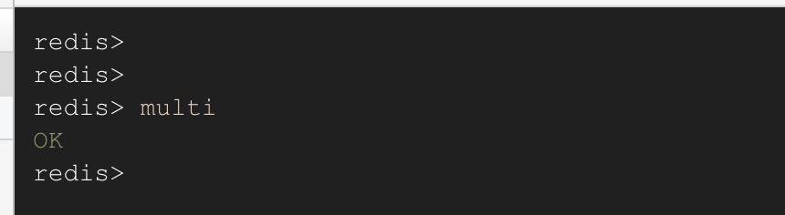


<font color='red'>***开启一个事务过后中间输入的所有命令都不会被立即执行，而是被加入到队列中缓存起来，当收到Exec命令的时候Redis服务会按入队顺序依次执行命令。***</font>

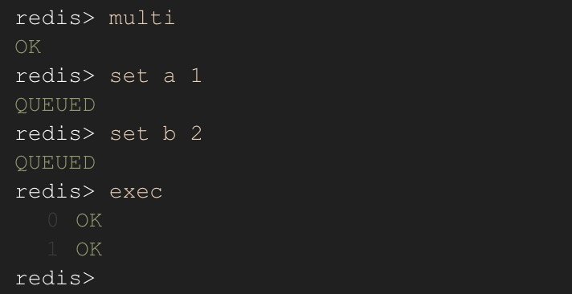

从上面的两个截图中我们可以看出以下几点:

1. `multi` 命令可以开启一个事务，开启成功会 redis 会返回 OK 状态；

2. 在`multi`命令后输入的命令不会被立即执行，而是被加入的队列中，并且<font color='red'>***加入成功 redis 会返回 QUEUED，表示加入队列成功，如果这里的命令输入错误了，或者命令参数不对，Redis 会返回 ERR 如下图，并且此次事务无法继续执行了***</font>。这里需要注意的是在 Redis 2.6.5 版本后是会取消事务的执行，但是在 2.6.5 之前 Redis 是会执行所有成功加入队列的命令。详细信息可以看官方文档。

   > If there is an error while queueing a command, most clients will abort the transaction discarding it.


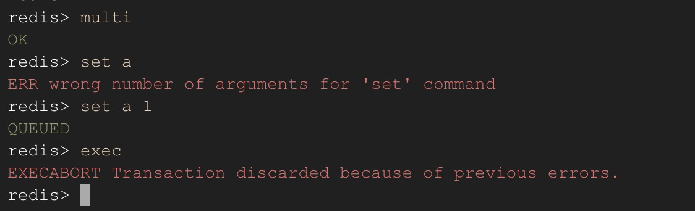

3. 输入`exec`命令后会依次执行加入到队列中的命令

------


> 注意：***<font color='gree' size=4>redis同一个事务中如果有一条命令执行失败(添加时不报错，exec时出错），其后的命令仍然会被执行，没有回滚。</font>***

------


## 8、缓存雪崩和缓存穿透

### &sect; 缓存雪崩

**<font color='red'>缓存同一时间大面积的==失效==，所以，后面的请求都会落到数据库上，==造成数据库短时间内承受大量请求而崩掉==。</font>**

**如何解决？**

> - **<font color='blue'>事前：尽量保证整个 redis ==集群的高可用性(主从+哨兵，redis cluster)==，发现机器宕机尽快补上。选择合适的内存淘汰策略。</font>**
> - **<font color='blue'>事中：本地ehcache缓存 + hystrix==限流&降级==，==避免MySQL数据库崩掉==</font>**
> - **<font color='blue'>事后：利用 redis ==持久化机制==保存的数据尽快==恢复缓存==</font>**


------


### &sect; 缓存穿透

缓存穿透说简单点就是**<font color='red'>大量请求的 key 根本==不存在于缓存==中，导致请求直接到了数据库上，根本没有经过缓存这一层</font>**。举个例子：某个黑客故意制造我们缓存中不存在的 key 发起大量请求，导致大量请求落到数据库。

> - 正常缓存处理流程：
>
>   ​							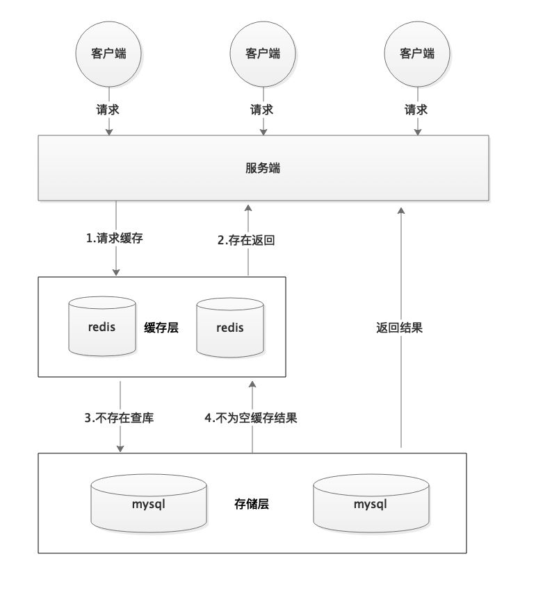
>
> - 缓存穿透情况处理流程：
>
>   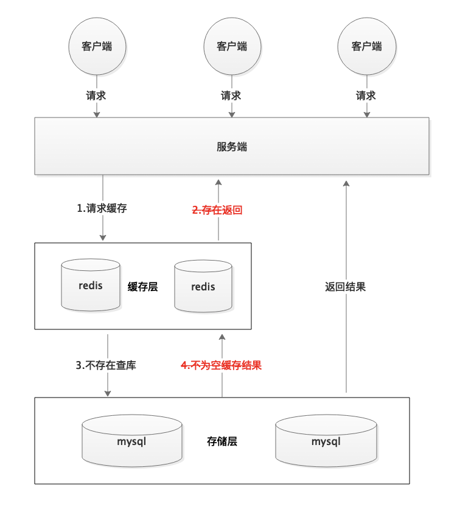
>
>   **<font color='red'>数据库并发能力很低</font>**：一般MySQL 默认的最大连接数在 150 左右，这个可以通过 `show variables like '%max_connections%';`命令来查看。最大连接数一个还只是一个指标，cpu，内存，磁盘，网络等无力条件都是其运行指标，这些指标都会限制其并发能力！所以，一般 3000 个并发请求就能打死大部分数据库了。

------


**如何解决缓存穿透？**

> 1. **<font color='red'>==参数校验==：一些不合法的参数请求直接抛出异常信息返回给客户端。比如查询的数据库 id 不能小于 0、传入的邮箱格式不对的时候直接返回错误消息给客户端等等。</font>**
>
> 2. **==缓存无效key==**：<font color='red'>如果缓存和数据库都查不到某个 key 的数据就写一个到 redis 中去并设置过期时间</font>，具体命令如下：`SET key value EX 10086`。==这种方式可以解决请求的 key 变化不频繁的情况==，如何黑客恶意攻击，每次构建的不同的请求key，会导致 redis 中缓存大量无效的 key 。很明显，这种方案并不能从根本上解决此问题。如果非要用这种方式来解决穿透问题的话，尽量将无效的 key 的过期时间设置短一点比如 1 分钟。另外，这里多说一嘴，一般情况下我们是这样设计 key 的： `表名:列名:主键名:主键值`。
>
>    如果用 Java 代码展示的话，差不多是下面这样的：
>
>    ```java
>    public Object getObjectInclNullById(Integer id) {
>        // 从缓存中获取数据
>        Object cacheValue = cache.get(id);
>        // 缓存为空
>        if (cacheValue != null) {
>            // 从数据库中获取
>            Object storageValue = storage.get(key);
>            // 缓存空对象
>            cache.set(key, storageValue);
>            // 如果存储数据为空，需要设置一个过期时间(300秒)
>            if (storageValue == null) {
>                // 必须设置过期时间，否则有被攻击的风险
>                cache.expire(key, 60 * 5);
>            }
>            return storageValue;
>        }
>        return cacheValue;
>    }
>    ```
>
> 3. **==布隆过滤器==：**
>
>    https://snailclimb.gitee.io/javaguide/#/docs/dataStructures-algorithms/data-structure/bloom-filter
>
>    布隆过滤器是一个非常神奇的数据结构，通过它我们可以非常方便地<font color='red'>***判断一个给定数据是否存在与海量数据中***</font>。我们需要的就是判断 key 是否合法，有没有感觉布隆过滤器就是我们想要找的那个“人”。具体是这样做的：把所有可能存在的请求的值都存放在布隆过滤器中，当用户请求过来，我会先判断用户发来的请求的值是否存在于布隆过滤器中。不存在的话，直接返回请求参数错误信息给客户端，存在的话才会走下面的流程。总结一下就是下面这张图：
>
>    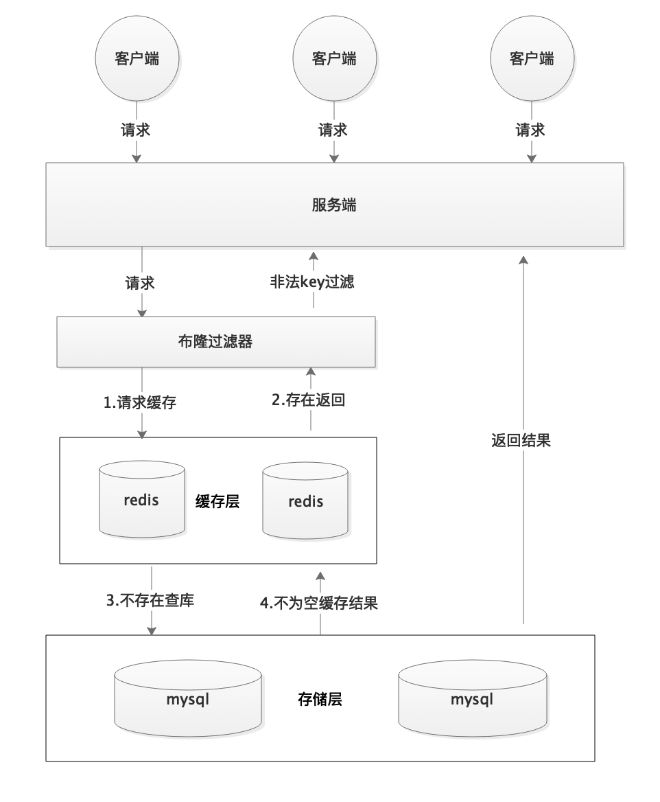


## 9、Redis并发竞争key问题

所谓 Redis 的并发竞争 Key 的问题也就是多个系统同时对一个 key 进行操作，但是最后执行的顺序和我们期望的顺序不同，这样也就导致了结果的不同！

**解决方法：**

**<font color='red'>分布式锁：Zookeeper和redis都可实现分布式锁</font>**


## 10、如何保证缓存与数据库双写时的数据一致性？

参考：https://github.com/doocs/advanced-java/blob/master/docs/high-concurrency/redis-consistence.md

> 一般情况下我们都是这样使用缓存的：**先读缓存，缓存没有的话，就读数据库，然后取出数据后放入缓存，同时返回响应。这种方式很明显会存在缓存和数据库的数据不一致的情况。**

------

**举例：**

### **&sect; <font color='red'>Cache Aside Pattern</font>**

最经典的缓存+数据库读写的模式，就是 Cache Aside Pattern。

- ==***1. 读的时候***==，先读缓存，缓存没有的话，就读数据库，然后取出数据后放入缓存，同时返回响应。
- ==***2. 更新的时候***==，**<font color='red'>先更新数据库，然后再删除缓存</font>**。为什么是删除缓存而不是更新缓存：首先，缓存的数据可能来源于多表，构成复杂，更新代价大于删除，其次，老是更新缓存，万一并没有多少访问呢，那不是白更新了，还不如lazy，删掉缓存。

------


> - **不一致情况1**: 数据库更新成功，缓存删除失败，导致缓存中仍是旧数据。
>
>   ***<font color='gree' size=4>解决：先删缓存，再更新数据库。</font>***如果数据库更新失败了，那么数据库中是旧数据，缓存中是空的，那么数据不会不一致。因为读的时候缓存没有，所以去读了数据库中的旧数据，然后更新到缓存中。
>
> - **不一致情况2**: 数据发生了变更，先删除了缓存，然后要去修改数据库，此时还没修改。一个请求过来，去读缓存，发现缓存空了，去查询数据库，==**查到了修改前的旧数据**==，放到了缓存中。随后数据变更的程序完成了数据库的修改。完了，数据库和缓存中的数据不一样了...
>
>   **为什么上亿流量高并发场景下，缓存会出现这个问题？**
>
>   ==只有在对一个数据在并发的进行**"读"和"写"**的时候，才可能会出现这种问题==。其实如果说你的并发量很低的话，特别是读并发很低，每天访问量就 1 万次，那么很少的情况下，会出现刚才描述的那种不一致的场景。但是问题是，如果每天的是上亿的流量，每秒并发读是几万，每秒只要有数据更新的请求，就**可能会出现上述的数据库+缓存不一致的情况**。

------

你只要用缓存，就可能会涉及到缓存与数据库双存储双写，你只要是双写，就一定会有数据一致性的问题，那么如何满足强一致性呢？

> 一般来说，就是如果你的系统不是严格要求缓存+数据库必须一致性的话，缓存可以稍微的跟数据库偶尔有不一致的情况，最好不要做这个方案，==**读请求和写请求串行化**==，串到一个内存队列里去，这样就可以保证一定不会出现不一致的情况
>
> 串行化之后，就会导致系统的吞吐量会大幅度的降低，用比正常情况下多几倍的机器去支撑线上的一个请求。

------

## 11、Redis 的主从复制是如何实现的？

1. 从服务器连接主服务器，发送 SYNC 命令；
2. 主服务器接收到 SYNC 命名后，开始执行 BGSAVE 命令==**生成 RDB 文件**==并使用** ==缓冲区记录此后执行的所有写命令；**==
3. 主服务器 BGSAVE 执行完后，向所有从服务器发送快照文件，==**并在发送期间继续记录被执行的写命令；**==
4. 从服务器收到快照文件后丢弃所有旧数据，载入收到的快照；
5. ==**主服务器快照发送完毕后开始向从服务器发送缓冲区中的写命令；**==
6. 从服务器完成对快照的载入，开始接收命令请求，并执行来自主服务器缓冲区的写命令

