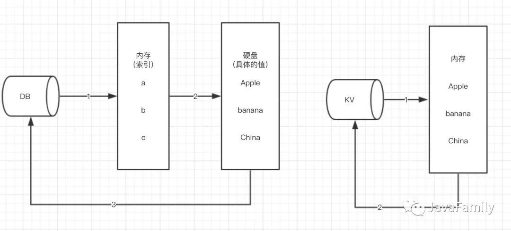
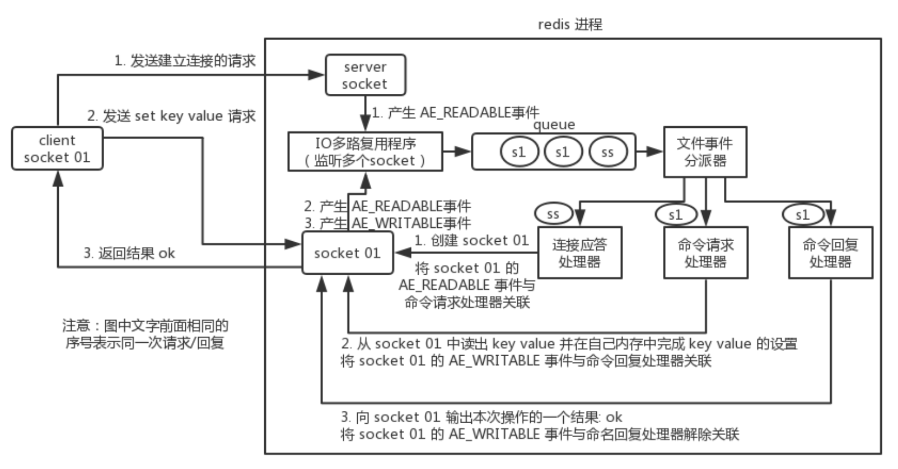

# Redis线程模型以及Redis为什么这么快

## redis和普通关系型数据库的区别

------

## 为什么多线程？

**因为多线程主要是解决cpu空转，因为处理一条请求，经常涉及到RPC、数据库访问、磁盘IO等操作，这些操作的速度比CPU慢很多，而在等待这些响应的时候，CPU却不能去处理新的请求，效率就很低，性能就有瓶颈。所以出现多线程，在线程A调用IO等耗时操作时，并不影响cpu继续忙碌执行线程B，永远不停息。**

------

## redis为什么单线程？

**因为redis是内存操作，IO速度贼快，不会造成显著的cpu空转，所以多线程不仅效果不明显，反而由于线程的上下文切换，以及需要维护多线程下的线程安全，会使用锁等，这些会造成大量的开销导致性能的下降。因此redis选择单线程 + 多路复用。**

==**遇到多核机器的话可以开多个redis实例不就完美利用了嘛**==

------

## redis线程模型

redis 内部使用==**文件事件处理器**== `file event handler`，这个文件事件处理器是单线程的，所以 redis 才叫做单线程的模型。它采用 IO 多路复用机制同时监听多个 socket，将产生事件的 socket 压入内存队列中，事件分派器根据 socket 上的事件类型来选择对应的事件处理器进行处理。

***文件事件处理器的结构包含 4 个部分：***

- 多个 socket
- IO 多路复用程序
- 文件事件分派器
- 事件处理器（连接应答处理器、命令请求处理器、命令回复处理器）

**多个 socket 可能会并发产生不同的操作，每个操作对应不同的文件事件，但是 IO 多路复用程序会监听多个 socket，会将产生事件的 socket 放入==队列中排队==，==事件分派器==每次从队列中取出一个 socket，根据 socket 的事件类型交给对应的==事件处理器==进行处理。**

