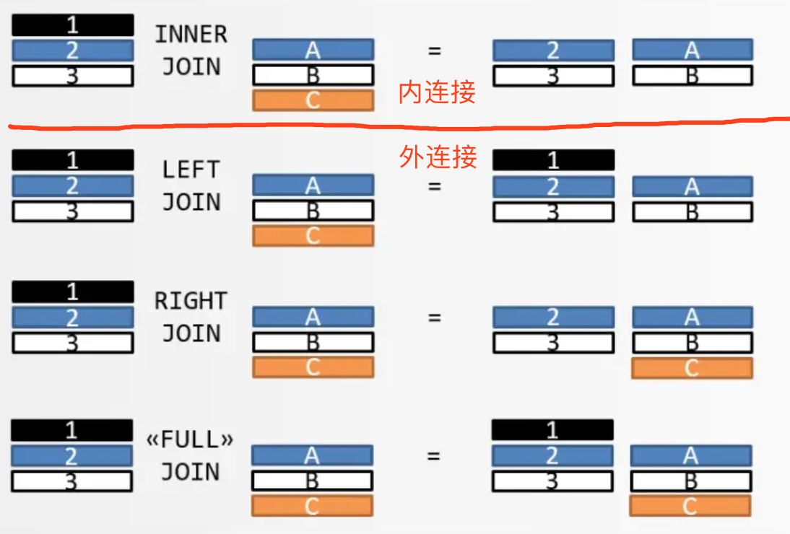
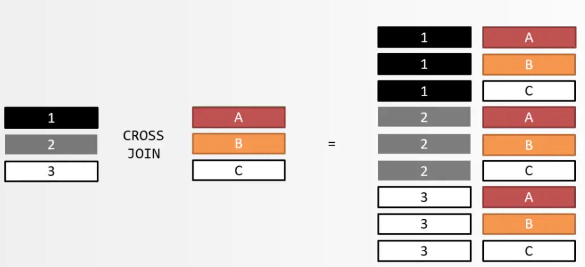

# SQL JOIN

## &sect; 作用

Join是关系型数据库系统的重要操作之一，一般关系型数据库中包含的常用Join：内联接、外联接和交叉联接等。**如果我们想在两个或以上的表获取其中从一个表中的行与另一个表中的行匹配的数据，这时我们应该考虑使用Join**。

## &sect; 内连接和外连接

>  **==mysql并不支持 full outer join==**

------

## &sect; 交叉连接

