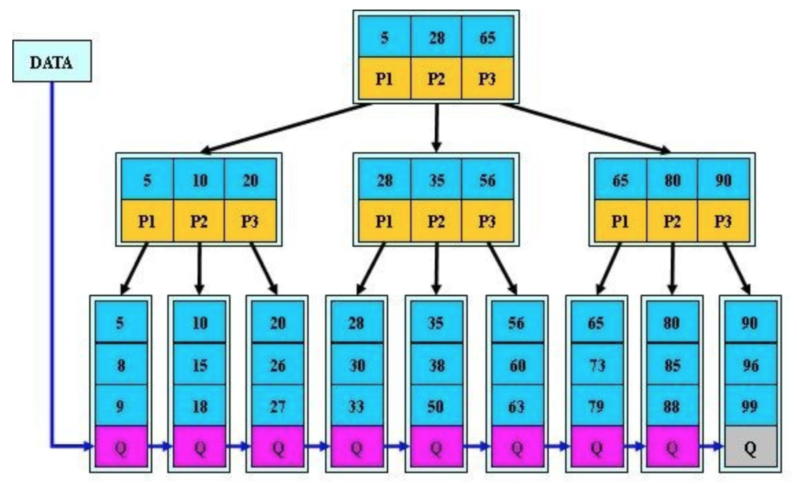

# b树与b+树对比

参考：https://zhuanlan.zhihu.com/p/27700617

***！！！！b/b+树的插入与删除：https://www.cnblogs.com/nullzx/p/8729425.html***

------

> ***JachinDo提示：树中存储的是数据行。但通过B+树索引获取数据时最少要读出一页。***

b树：

------

b+树：

> **结构上**
>
> - **B树中关键字集合分布在整棵树中，叶节点中不包含任何关键字信息，而B+树关键字集合分布在叶子结点中，非叶节点只是叶子结点中关键字的索引；**
> - **B树中任何一个关键字只出现在一个结点中，而B+树中的关键字必须出现在叶节点中，也可能在非叶结点中重复出现；**
> - ***B+树中的非叶子节点保存的数据是：键值和指向子数据页的偏移指针。***

------

------

B+树其实和B树是非常相似的，我们首先看看**相同点**。

- 根节点至少一个元素
- ***非根节点元素(关键字）范围：m/2 <= k <= m-1（m为阶数：节点最多可拥有的孩子数）***
- 注意：关键字有m-1个，则共有m个指针，对应m个孩子。

==**不同点**。==

- B+树有两种类型的节点：***内部结点（也称索引结点）和叶子结点***。内部节点就是非叶子节点，内部节点不存储数据，只存储索引，数据都存储在叶子节点，且内部节点出现的索引再叶节点中会再次出现。而B树的非叶子结点也会存储指向数据的指针，在内部节点出现的索引项不会再出现在叶子节点中。
- 内部结点中的key都按照从小到大的顺序排列，对于内部结点中的一个key，左树中的所有key都小于它，右子树中的key都大于等于它。叶子结点中的记录也按照key的大小排列。
- ***B+树中所有叶子节点都是通过指针连接在一起，而B树不会。***
- 父节点存有右孩子的第一个元素的索引。

------

### b+树优点

> - B+**树的层级更少**：==因为相较于B树B+每个**非叶子**节点存储的关键字数更多==，树的层级更少所以查询数据更快；
>
> - B+**树查询速度更稳定**：B+所有关键字数据地址都存在**叶子**节点上，所以每次查找的次数都相同所以查询速度要比B树更稳定;
>
> - B+**树天然具备排序功能：**==B+树所有的**叶子**节点数据构成了一个有序链表==，在查询大小区间的数据时候更方便，数据紧密性很高，缓存的命中率也会比B树高。
>
> - B+**树全节点遍历更快：**==B+树遍历整棵树只需要遍历所有的**叶子**节点即可，而不需要像B树一样需要对每一层进行遍历，这有利于数据库做全表扫描。==
>
> - *==**B树**相对于**B+树**的优点是，如果经常访问的数据离根节点很近，而**B树**的**非叶子**节点本身存有关键字其数据的地址，所以这种数据检索的时候会要比**B+树**快。==*

------

## &sect; 为什么不使用AVL树或红黑树

***因为这两种树是“二叉”，容易深度太深，就gg了。***

