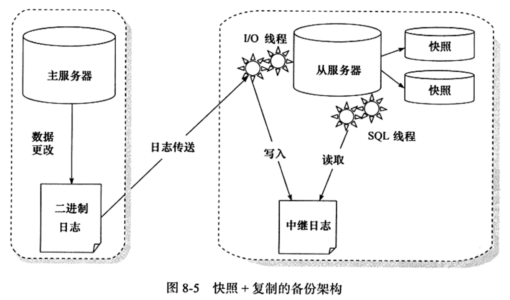

# 数据库的主从复制

主从复制（***Replication***）是指数据可以从一个MySQL数据库主服务器复制到一个或多个从服务器，从服务器可以复制主服务器中的所有数据库或者特定的数据库，或者特定的表。默认采用异步模式。

## 实现原理：

> - 主服务器 ==***binary log dump 线程***==：将主服务器中的数据更改==**（增删改）日志写入 Binary log 中**==；
> - 从服务器==***I/O 线程***== ：负责从主服务器读取binary log，并写入本地的 ==Relay log==；
> - 从服务器==***SQL 线程***==：负责读取 Relay log，解析出主服务器已经执行的数据更改，并在从服务器中重新执行（Replay），保证主从数据的一致性
> - ***从服务器要对数据进行快照备份，以防主服务器的误操作（drop table）会通过日志传送给从服务器也执行，这样的话还可以通过快照恢复。***

------

------

## 为什么要主从复制？

- **读写分离：主服务器负责写，从服务器负责读**
- 缓解了锁的争用，即使主服务器中加了锁，依然可以进行读操作；
- 从服务器可以使用 MyISAM，提升查询性能以及节约系统开销；
- **增加冗余，提高可用性**
- 数据实时备份，当系统中某个节点发生故障时，可以方便的故障切换
- 降低单个服务器磁盘I/O访问的频率，提高单个机器的I/O性能