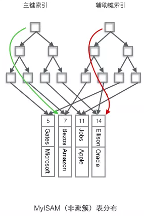

# 索引

------

## &sect; 区分聚簇和非聚簇索引

> - <font color='#02C874'>**聚簇索引：将数据存储与索引放到了一块，索引结构的叶子节点保存了行数据**</font>
> - <font color='#02C874'>**非聚簇索引：将数据与索引分开存储，索引结构的叶子节点指向了数据对应的位置**</font>

------

> <font color='red'>***澄清一个概念：innodb中，在聚簇索引之上创建的索引称之为==辅助索引，辅助索引访问数据总是需要二次查找==，非聚簇索引都是辅助索引。像复合索引、前缀索引、唯一索引，辅助索引叶子节点存储的不再是行的物理位置，而是==主键值==***</font>

------


## &sect; InnoDB使用聚簇索引

<font color='#02C874' size = 5>**"规整"**</font>


------

> 1. InnoDB使用的是聚簇索引，将主键组织到一棵B+树中，而行数据就储存在叶子节点上，若使用"where id = 14"这样的条件查找主键，则按照B+树的检索算法即可查找到对应的叶节点，之后获得行数据。
> 2. 若对Name列进行条件搜索，则需要两个步骤：第一步在辅助索引B+树中检索Name，到达其叶子节点获取对应的主键。第二步使用主键在主索引B+树种再执行一次B+树检索操作，最终到达叶子节点即可获取整行数据。（重点在于通过其他键需要建立辅助索引）

------


## &sect; MyISAM使用非聚簇索引

<font color='#02C874' size = 5>**"零散"**</font>



------

> **非聚簇索引的两棵B+树看上去没什么不同**，节点的结构完全一致只是存储的内容不同而已，主键索引B+树的节点存储了主键，辅助键索引B+树存储了辅助键。<font color='#02C874'>**表数据存储在独立的地方，这两颗B+树的叶子节点都使用一个地址指向真正的表数据，对于表数据来说，这两个键没有任何差别。由于索引树是独立的，通过辅助键检索无需访问主键的索引树。**</font>

------

## &sect; <font color='red'>聚簇索引的优势</font>

> 1. 由于行数据和聚簇索引的叶子节点存储在一起，同一页中会有多条行数据，<font color='red'>**访问同一数据页不同行记录时，已经把页加载到了Buffer中（缓冲区），再次访问时，会在内存中完成访问，不必访问磁盘**</font>。这样主键和行数据是一起被载入内存的，找到叶子节点就可以立刻将行数据返回了，如果按照主键Id来组织数据，获得数据更快。
>
> 2. 辅助索引的叶子节点，存储主键值，而不是数据的存放地址。好处是当行数据放生变化时，索引树的节点也需要分裂变化；或者是我们需要查找的数据，在上一次IO读写的缓存中没有，需要发生一次新的IO操作时，<font color='red'>**可以避免对辅助索引的维护工作，只需要维护聚簇索引树就好了。另一个好处是，因为辅助索引存放的是主键值，减少了辅助索引占用的存储空间大小。**</font>
>
> 3. 因为MyISAM的主索引并非聚簇索引，<font color='#02C874'>**那么他的数据的物理地址必然是凌乱的，拿到这些物理地址，按照合适的算法进行I/O读取，于是开始不停的寻道不停的旋转。聚簇索引则只需一次I/O。（强烈的对比）**</font>
>
> 注：我们知道一次io读写，可以获取到16K大小的资源，我们称之为读取到的数据区域为Page。而我们的B树，B+树的索引结构，叶子节点上存放好多个关键字（索引值）和对应的数据，都会在一次IO操作中被读取到缓存中，<font color='#02C874'>**所以在访问同一个页中的不同记录时，会在内存里操作，而不用再次进行IO操作了。**</font>除非发生了页的分裂，即要查询的行数据不在上次IO操作的缓存里，才会触发新的IO操作。

------

## &sect; **聚簇索引需要注意的地方**

> - 当使用主键为聚簇索引时，主键最好不要使用uuid，<font color='#02C874'>**因为uuid的值太过离散，不适合排序且可能出线新增加记录的uuid，会插入在索引树中间的位置，导致索引树调整复杂度变大，消耗更多的时间和资源。**</font>
> - 建议使用int类型的自增，<font color='#02C874'>方便排序并且默认会在索引树的末尾增加主键值，对索引树的结构影响最小。</font>而且，主键值占用的存储空间越大，辅助索引中保存的主键值也会跟着变大，占用存储空间，也会影响到IO操作读取到的数据量。

------


### **为什么主键通常建议使用自增id**

<font color='#02C874'>**聚簇索引的数据的物理存放顺序与索引顺序是一致的**，即：==**只要索引是相邻的，那么对应的数据一定也是相邻地存放在磁盘上的**==。如果主键不是自增id，那么可以想 象，它会干些什么，不断地调整数据的物理地址、分页，当然也有其他一些措施来减少这些操作，但却无法彻底避免。但，如果是自增的，那就简单了，它只需要一 页一页地写，索引结构相对紧凑，磁盘碎片少，效率也高。</font>

------


## &sect; 非聚集索引的二次查询问题

**解决方式**：使用==**复合索引**==。

建立两列以上的索引，即可查询复合索引里的列的数据而不需要进行回表二次查询，如index(col1, col2)，执行下面的语句：

```sql
select col1, col2 from t1 where col1 = '213';
```

要注意使用复合索引需要满足==**最左侧索引的原则**==，<font color='red'>***也就是查询的时候如果where条件里面没有最左边的一到多列，索引就不会起作用。***</font>

------


### &sect; 为什么使用联合索引？


> ## **为什么要使用联合索引**
>
> - **减少开销**。建一个联合索引(col1,col2,col3)，实际相当于建了(col1),(col1,col2),(col1,col2,col3)三个索引。**<font color='red'>每多一个索引，都会增加写操作的开销和磁盘空间的开销(I/O开销)</font>**。对于大量数据的表，使用联合索引会大大的减少开销！
> - **覆盖索引**。对联合索引(col1,col2,col3)，如果有如下的sql: select col1,col2,col3 from test where col1=1 and col2=2。那么MySQL可以直接通过遍历索引取得数据，而无需回表，这减少了很多的随机io操作。减少io操作，特别的随机io其实是dba主要的优化策略。所以，在真正的实际应用中，覆盖索引是主要的提升性能的优化手段之一。
> - **效率高**。索引列越多，通过索引筛选出的数据越少。有1000W条数据的表，有如下sql:select *from table where col1=1 and col2=2 and col3=3,假设假设每个条件可以筛选出10%的数据，如果只有单值索引，那么通过该索引能筛选出1000W*10%=100w条数据，然后再回表从100w条数据中找到符合col2=2 and col3= 3的数据，然后再排序，再分页；如果是联合索引，通过索引筛选出1000w*10%* 10% *10%=1w，效率提升可想而知！

------

## &sect; 覆盖索引

https://blog.csdn.net/jh993627471/article/details/79421363

> **如果索引包含所有满足查询需要的数据的索引成为覆盖索引(Covering Index)，==即满了的复合索引==也就是平时所说的<font color='red'>不需要回表操作。</font>**

------


### 覆盖索引的好处：

1. 索引大小远小于数据行大小。因而，如果只读取索引，则能极大减少对数据访问量。
2. 索引按顺序储存。对于IO密集型的范围查询会比随机从磁盘读取每一行数据的IO要少。
3. 避免对主键索引的二次查询。二级索引的叶子节点包含了主键的值，如果二级索引包含所要查询的值，则能避免二次查询主键索引（聚簇索引，聚簇索引既存储了索引，也储存了值）。

------

## &sect; 倒排索引

> <font color='red'>**用于InnoDB全文检索，简历一个辅助表，其中存放word和文档的信息**</font>

------


## &sect; 索引失效情况

https://juejin.im/post/5d8dc96a6fb9a04e3b1107cd

<font color='red'>**explain + sql查看语句执行情况**</font>

### 针对普通索引：

> - **查询条件使用不等式**
> - **查询条件类型不一致**
> - **查询条件使用函数计算**
> - **模糊查询**

------

### 针对复合索引：

> - **查询条件使用不等式**
> - **查询条件类型不一致**
> - **查询条件使用函数计算**
> - **<font color='red'>不使用索引首列当查询条件</font>**

------

## &sect; sql查询优化方法

https://zhuanlan.zhihu.com/p/48385127

### 声明NOT NULL

当数据列被声明为NOT NULL以后，==在查询的时候就不需要判断是否为NULL，由于减少了判断，可以降低复杂性==，提高查询速度。

如果要表示数据列为空，可以使用0等代替。

### 考虑使用数值类型代替字符串

MySQL对数值类型的处理速度要远远快于字符串，而且数值类型往往更加节省空间。

例如对于“Male”和“Female”可以用“0”和“1”进行代替。

### 考虑使用ENUM类型

如果你的数据列的取值是确定有限的，可以使用ENUM类型代替字符串。<font color='red'>因为MySQL会把这些值表示为一系列对应的数字，这样处理的速度会提高很多。</font>

```java
CREATE TABLE shirts (
    name VARCHAR(40),
    size ENUM('x-small', 'small', 'medium', 'large', 'x-large')
);

INSERT INTO shirts (name, size) VALUES ('dress shirt','large'), ('t-shirt','medium'),
  ('polo shirt','small');

SELECT name, size FROM shirts WHERE size = 'medium';
```

------


## &sect; <font color='red'>索引使用原则</font>

> - <font color='red'>**写操作频繁的列慎用索引**</font>，因为写会带来B+树的维护操作，开销较大。
> - <font color='red'>索引是会占磁盘空间的</font>，要考虑。
> - <font color='red'>**索引要加在维度大的列上**</font>，及列的值不尽相同的那种，而不是列的值范围很小，重复很大。因为查询优化器发现根据该索引查询出的结果在全表的30%以上，即会跳过该索引，直接进行全表扫描
> - <font color='red'>**建立索引的值要短小，这样一页可以放更多的索引，IO就会降低**</font>

------

## &sect; 索引下推(mysql 5.6+)

<font color='#02C874' size=4.1>**减少联合索引的辅助索引（二级索引）的回表次数**</font>

> 场景：查询字段
>
> > - <font color='red'>**不是主键索引（主键索引本来也无需回表）**</font>
> >
> > - <font color='red'>**为联合索引**</font>
> >
> > - <font color='red'>**where条件数大于1**</font>
>
> ```sql
> select * from t where a > 2 and b > 10; -- (a,b)是联合索引且都不是主键索引
> ```
>
> 功能：<font color='#02C874' size=4.1>***先按照第一个条件查询出对应的索引，==但先不回表查数据，而是直接在第一步查出的索引上直接按第二个条件进行筛选==，完毕后才进行回表，这样只需回表一次。***</font>

