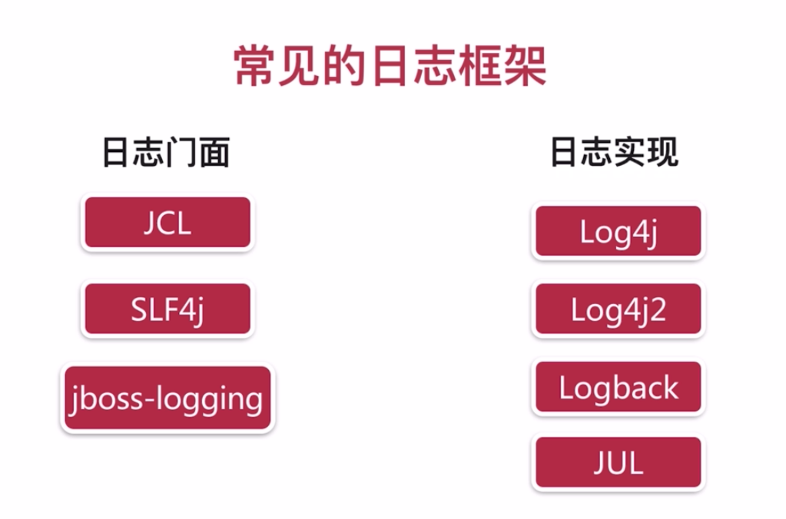
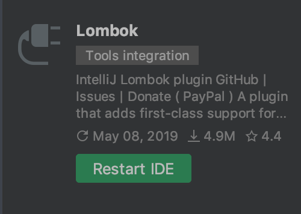
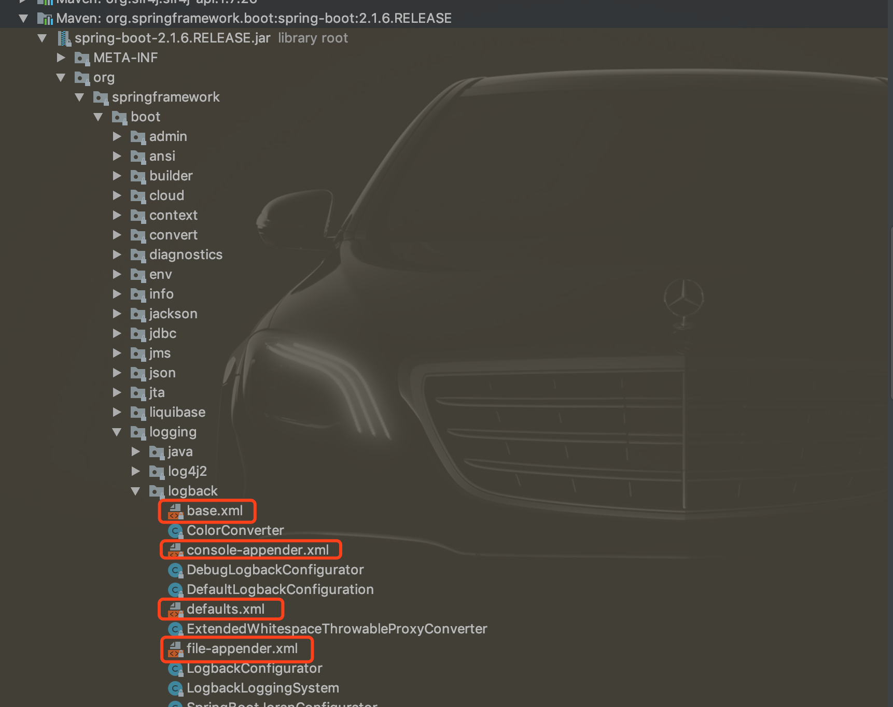

# 日志框架简要梳理

## 1、简介



从左面选一个做接口，右面选一个做实现，最后选择的最优方案为：

==SLF4j + Logback== 


## 2、使用

### 方法一

```java
package com.jachin.springbootday02logging;
@RunWith(SpringRunner.class)
@SpringBootTest
public class SpringbootDay02LoggingApplicationTests {


    //日志记录器
    Logger logger = LoggerFactory.getLogger(getClass());
    @Test
    public void contextLoads() {

        //日志的级别：
        //由低到高：trace < debug < info < warn < error
        //输出日志级别：只打印>=该级别的日志信息（默认是info级别）
        logger.trace("这是trace日志。。。");
        logger.debug("这是debug日志。。。");
        logger.info("这是info。。。");
        logger.warn("这是warn...");
        logger.error("这是error。。。");
    }

}
```


### 方法二

关于lombok的相关讲解参考博客https://juejin.im/post/5a6eceb8f265da3e467555fe


引入lombok依赖：

```xml
<dependency>
    <groupId>org.projectlombok</groupId>
    <artifactId>lombok</artifactId>
</dependency>
```


idea安装lombok插件：




```java
package com.jachin.sell;
@RunWith(SpringRunner.class)
@SpringBootTest
@Slf4j
public class LoggerTest {

    @Test
    public void test1() {
        log.debug("debug...");
        log.info("info....");
        log.error("error...");
    }
}
```


## 3、配置

### 方法一：application.yml中配置

```yml
logging:
  pattern:
    console: "%d - %msg%n"   # 配置控制台输出格式：%d：日期；%msg：信息；%n：换行
#  path: /Users/jc/IdeaProjects/springboot/sell-log  # 日志文件名称固定为spring.log
  file: /Users/jc/IdeaProjects/springboot/sell-log/sell.log  # 配置指定名称的日志文件
  level:
    com.jachin.sell.LoggerTest: debug   # 指定某类的日志输出级别

#  level: debug  # 指定统一日志输出级别
```


### 方法二：自定义logback-spring.xml配置


**例1**

将info信息输入到info文件中，error信息输入到error文件中

```xml
<?xml version="1.0" encoding="UTF-8" ?>
<configuration>
<!--    每一个appender代表一个配置项-->
<!--    ConsoleAppender" ： 配置控制台日志输出-->
    <appender name="consoleLog" class="ch.qos.logback.core.ConsoleAppender">
        <layout class="ch.qos.logback.classic.PatternLayout">
            <pattern>
                %d --- %msg%n
            </pattern>
        </layout>
    </appender>


<!--    RollingFileAppender 配置日志文件输出-->
    <appender name="fileInfoLog" class="ch.qos.logback.core.rolling.RollingFileAppender">
        <!--        过滤，LevelFilter: 配置日志信息类型是否记录-->
        <filter class="ch.qos.logback.classic.filter.LevelFilter">
<!--            若是ERROR 则拒绝记录，若不是ERROR 则使用下面的规则记录日志-->
            <level>ERROR</level>
            <onMatch>DENY</onMatch>
            <onMismatch>ACCEPT</onMismatch>
        </filter>
        <encoder>
            <pattern>
                %msg%n
            </pattern>
        </encoder>
<!--        滚动策略 TimeBasedRollingPolicy: 按时间滚动（天）-->
        <rollingPolicy class="ch.qos.logback.core.rolling.TimeBasedRollingPolicy">
        <!-- 路径 : 将日期加入到文件名中：info.%d.log-->
            <fileNamePattern>/Users/jc/IdeaProjects/springboot/sell-log/info.%d.log</fileNamePattern>
        </rollingPolicy>
    </appender>

    <appender name="fileErrorLog" class="ch.qos.logback.core.rolling.RollingFileAppender">
<!--        过滤，ThresholdFilter: 只记录>=指定类型的日志信息-->
        <filter class="ch.qos.logback.classic.filter.ThresholdFilter">
            <level>ERROR</level>
        </filter>
        <encoder>
            <pattern>
                %msg%n
            </pattern>
        </encoder>
        <!--        滚动策略 TimeBasedRollingPolicy: 按时间滚动（天）-->
        <rollingPolicy class="ch.qos.logback.core.rolling.TimeBasedRollingPolicy">
            <!-- 路径 : 将日期加入到文件名中：info.%d.log-->
            <fileNamePattern>/Users/jc/IdeaProjects/springboot/sell-log/error.%d.log</fileNamePattern>
        </rollingPolicy>
    </appender>


<!--    配置项使用位置：root：整个项目-->
    <root level="info">
        <appender-ref ref="consoleLog"/>
        <appender-ref ref="fileInfoLog"/>
        <appender-ref ref="fileErrorLog"/>
    </root>
</configuration>
```


**例2**

```xml
<?xml version="1.0" encoding="UTF-8"?>
<!--
scan：当此属性设置为true时，配置文件如果发生改变，将会被重新加载，默认值为true。
scanPeriod：设置监测配置文件是否有修改的时间间隔，如果没有给出时间单位，默认单位是毫秒当scan为true时，此属性生效。默认的时间间隔为1分钟。
debug：当此属性设置为true时，将打印出logback内部日志信息，实时查看logback运行状态。默认值为false。
-->
<configuration scan="false" scanPeriod="60 seconds" debug="false">
    <!-- 定义日志的根目录 -->
    <property name="LOG_HOME" value="/Users/jc/Desktop/app/log" />
    <!-- 定义日志文件名称 -->
    <property name="appName" value="atguigu-springboot"></property>
    <!-- ch.qos.logback.core.ConsoleAppender 表示控制台输出 -->
    <appender name="stdout" class="ch.qos.logback.core.ConsoleAppender">
        <!--
        日志输出格式：
         %d表示日期时间，
         %thread表示线程名，
         %-5level：级别从左显示5个字符宽度
         %logger{50} 表示logger名字最长50个字符，否则按照句点分割。 
         %msg：日志消息，
         %n是换行符
        -->
        <layout class="ch.qos.logback.classic.PatternLayout">
            <springProfile name="dev">
                <pattern>%d{yyyy-MM-dd HH:mm:ss.SSS} ------> [%thread] ------> %-5level ------> %logger{50} - %msg%n</pattern>
            </springProfile>
            <springProfile name="!dev">
                <pattern>%d{yyyy-MM-dd HH:mm:ss.SSS} ======> [%thread] ======> %-5level ======> %logger{50} - %msg%n</pattern>
            </springProfile>
        </layout>
    </appender>

    <!-- 滚动记录文件，先将日志记录到指定文件，当符合某个条件时，将日志记录到其他文件 -->  
    <appender name="appLogAppender" class="ch.qos.logback.core.rolling.RollingFileAppender">
        <!-- 指定日志文件的名称 -->
        <file>${LOG_HOME}/${appName}.log</file>
        <!--
        当发生滚动时，决定 RollingFileAppender 的行为，涉及文件移动和重命名
        TimeBasedRollingPolicy： 最常用的滚动策略，它根据时间来制定滚动策略，既负责滚动也负责出发滚动。
        -->
        <rollingPolicy class="ch.qos.logback.core.rolling.TimeBasedRollingPolicy">
            <!--
            滚动时产生的文件的存放位置及文件名称 %d{yyyy-MM-dd}：按天进行日志滚动 
            %i：当文件大小超过maxFileSize时，按照i进行文件滚动
            -->
            <fileNamePattern>${LOG_HOME}/${appName}-%d{yyyy-MM-dd}-%i.log</fileNamePattern>
            <!-- 
            可选节点，控制保留的归档文件的最大数量，超出数量就删除旧文件。假设设置每天滚动，
            且maxHistory是365，则只保存最近365天的文件，删除之前的旧文件。注意，删除旧文件是，
            那些为了归档而创建的目录也会被删除。
            -->
            <MaxHistory>365</MaxHistory>
            <!-- 
            当日志文件超过maxFileSize指定的大小是，根据上面提到的%i进行日志文件滚动 注意此处配置SizeBasedTriggeringPolicy是无法实现按文件大小进行滚动的，必须配置timeBasedFileNamingAndTriggeringPolicy
            -->
            <timeBasedFileNamingAndTriggeringPolicy class="ch.qos.logback.core.rolling.SizeAndTimeBasedFNATP">
                <maxFileSize>100MB</maxFileSize>
            </timeBasedFileNamingAndTriggeringPolicy>
        </rollingPolicy>
        <!-- 日志输出格式： -->     
        <layout class="ch.qos.logback.classic.PatternLayout">
            <pattern>%d{yyyy-MM-dd HH:mm:ss.SSS} [ %thread ] - [ %-5level ] [ %logger{50} : %line ] - %msg%n</pattern>
        </layout>
    </appender>

    <!-- 
      logger主要用于存放日志对象，也可以定义日志类型、级别
      name：表示匹配的logger类型前缀，也就是包的前半部分
      level：要记录的日志级别，包括 TRACE < DEBUG < INFO < WARN < ERROR
      additivity：作用在于children-logger是否使用 rootLogger配置的appender进行输出，
      false：表示只用当前logger的appender-ref，true：
      表示当前logger的appender-ref和rootLogger的appender-ref都有效
    -->
    <!-- hibernate logger -->
    <logger name="com.jachin" level="debug" />
    <!-- Spring framework logger -->
    <logger name="org.springframework" level="debug" additivity="false"></logger>


    <!-- 
    root与logger是父子关系，没有特别定义则默认为root，任何一个类只会和一个logger对应，
    要么是定义的logger，要么是root，判断的关键在于找到这个logger，然后判断这个logger的appender和level。 
    -->
    <root level="info">
        <appender-ref ref="stdout" />
        <appender-ref ref="appLogAppender" />
    </root>
</configuration> 
```


==spring有默认的日志配置，有兴趣可以查看==

