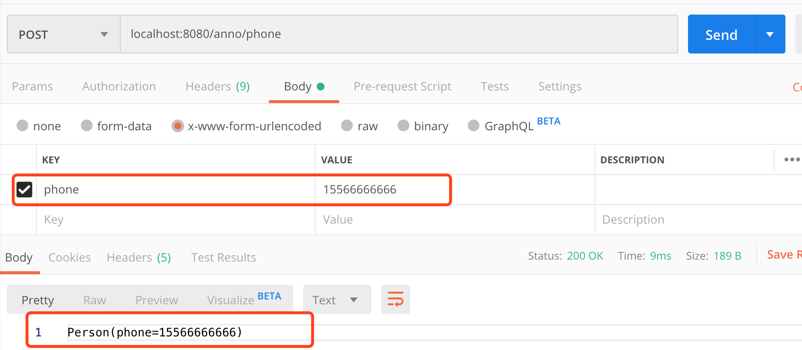

# 注解原理与自定义注解

## **注解的基本原理**

> 其本来的意思就是用来做**标注**用：<font color='#02C874' size = 4>*可以在**类**、**字段变量**、**方法**、**接口**等位置进行一个**特殊的标记**，为后续做一些诸如：==**代码生成**、**数据校验**、**资源整合**==等工作做铺垫。*</font>

> <font color='red'>***注解一旦对代码标注完成，后续我们就可以结合Java强大的==反射机制==，在运行时动态地获取到注解的标注信息，从而可以执行很多其他逻辑，完成我们想要的自动化工作。***</font>

------

## 自定义注解

没有注解加持时，我们想要校验 `Student`类：

```java
public class Student {    
  private Long id;        // 学号    
  private String name;    // 姓名    
  private String mobile;  // 手机号码(11位)
}
```

我们只能通过手写 `if`判断来进行校验：

```java
@PostMapping("/add")public String addStudent( @RequestBody Student student ) {
    if( student == null ) return "传入的Student对象为null，请传值";    			if( student.getName()==null || "".equals(student.getName()))      			return "传入的学生姓名为空，请传值";    
  	if( student.getScore()==null )        
      return "传入的学生成绩为null，请传值";    
  	if( (student.getScore()<0) || (student.getScore()>100) )        			return "传入的学生成绩有误，分数应该在0~100之间";    
  	if( student.getMobile()==null || "".equals(student.getMobile()) )        			 return "传入的学生电话号码为空，请传值";    
  	if( student.getMobile().length()!=11 )        
      return "传入的学生电话号码长度有误，应为11位";
    studentService.addStudent( student ); // 将student对象存入MySQL数据库    return "SUCCESS";}
```

这样非常繁琐！

但是借助于 `Spring`提供的注解，数据校验工作可以变得非常优雅，就像这样：

```java
public class Student {
    @NotNull(message = "传入的姓名为null，请传值")    
  	@NotEmpty(message = "传入的姓名为空字符串，请传值")    
  	private String name;    // 姓名
    @NotNull(message = "传入的分数为null，请传值")    
  	@Min(value = 0,message = "传入的学生成绩有误，分数应该在0~100之间")    		@Max(value = 100,message = "传入的学生成绩有误，分数应该在0~100之间")    		private Integer score;  // 分数
    @NotNull(message = "传入的电话为null，请传值")    
  	@NotEmpty(message = "传入的电话为空字符串，请传值")    
  	@Length(min = 11, max = 11, message = "传入的电话号码长度有误，必须为11位")    
  	private String mobile;  // 电话号码
}
```

于是很多人就表示疑问，**这些注解到底如何实现功能的呢**？

今天本文则以上文的 `@Length`注解为例，自己动手实现一遍，这个学会了，其他注解实现原理也是类似。


总共分三大步实现。

------

引入依赖：

```xml
<!-- https://mvnrepository.com/artifact/javax.validation/validation-api -->
<dependency>
    <groupId>javax.validation</groupId>
    <artifactId>validation-api</artifactId>
    <version>2.0.1.Final</version>
</dependency>

```


### **第一步：**首先定义注解：@JachinLength

==可通过default指定默认值==

```java
package com.jachin.zhujie;

import javax.validation.Constraint;
import javax.validation.Payload;
import java.lang.annotation.ElementType;
import java.lang.annotation.Retention;
import java.lang.annotation.RetentionPolicy;
import java.lang.annotation.Target;

@Target({ElementType.FIELD})
@Retention(RetentionPolicy.RUNTIME)
@Constraint(validatedBy = LengthValidatorClass.class) // 指定验证类
public @interface JachinLength {
    int length() default 11;          // 允许字符串长度
    String message() default "kkkkk";  // 自定义的错误提示信息
  	// 下面这两个必须有
    Class<?>[] groups() default {};
    Class<? extends Payload>[] payload() default {};
}

```

下面做几点说明：

1、注解的定义有点像定义接口 `interface`，但唯一不同的是==前面需要加一个 `@`符号==

2、注解的成员变量只能使用==基本类型、 `String`或者 `enum`枚举，比如 `int`可以，但 `Integer`这种包装类型就不行==，需注意

3、<font color='red'>***像上面 `@Target`、 `@Retention`这种加在注解定义上面的注解，我们称为 “元注解”，元注解就是专门用于给注解添加注解的注解***</font>

4、 `@Target(xxx)` 用来说明该自定义==***注解可以用在什么位置***==，比如：

- `ElementType.FIELD`：<font color='red'>说明自定义的注解可以用于类的变量</font>
- `ElementType.METHOD`：<font color='red'>说明自定义的注解可以用于类的方法</font>
- `ElementType.TYPE`：<font color='red'>说明自定义的注解可以用于类本身、接口或 `enum`类型</font>
- 等等... 还有很多，如果记不住，建议现用现查

5、 `@Retention(xxx)` 用来说明你自定义==***注解的生命周期***==，比如：

- `@Retention(RetentionPolicy.RUNTIME)`：表示注解可以<font color='red'>一直保留到运行时，因此可以通过反射获取注解信息</font>
- `@Retention(RetentionPolicy.CLASS)`：<font color='red'>表示注解被编译器编译进 `class`文件，但运行时会忽略</font>
- `@Retention(RetentionPolicy.SOURCE)`：<font color='red'>表示注解仅在源文件中有效，编译时就会被忽略</font>

所以声明周期从长到短分别为：*==**RUNTIME** > **CLASS** > **SOURCE**==* ，一般来说，如果需要在运行时去动态获取注解的信息，还是得用RUNTIME，就像本文所用。

6、@Constraint：指定验证属性的类。

​		message()指明了验证失败后返回的消息，此方法为@Constraint要求

​		groups()和payload()也为@Constraint要求，可默认为空，详细用途可以查看@Constraint文档

------

### 第二步：实现验证类LengthValidatorClass

```java
package com.jachin.zhujie;

import javax.validation.ConstraintValidator;
import javax.validation.ConstraintValidatorContext;

/**
 * @description:
 * @Author: JachinDo
 * @Date: 2020/03/09 11:55
 */

public class LengthValidatorClass implements ConstraintValidator<JachinLength, String> { // 第一个参数是注解类，第二个注解是作用的对象类型
   private JachinLength length;
// 将注解提取出来，底层利用反射生成注解的代理类
   @Override
   public void initialize(JachinLength constraint) {
      this.length = constraint;
   }
		// 验证逻辑
   @Override
   public boolean isValid(String obj, ConstraintValidatorContext context) {
      return obj.length() != length.length() ? false : true;
   }
}

```

------

### 第三步：使用controller处验证字段

实体类：

```java
package com.jachin.zhujie;
/**
 * @description:
 * @Author: JachinDo
 * @Date: 2020/03/09 12:06
 */
@Data
public class Person {

    @JachinLength(message = "长度错误！")
    private String phone;
}
```

controller：

```java
package com.jachin.zhujie;
/**
 * @description:
 * @Author: JachinDo
 * @Date: 2020/03/09 13:02
 */
@RestController
@RequestMapping("/anno")

public class TestZhujie {
    @PostMapping("/phone")
    public String print(@Valid Person person,
                      BindingResult bindingResult) throws Exception {
        if (bindingResult.hasErrors()) {
            System.out.println("错误 " + person);
            throw new Exception(bindingResult.getFieldError().getDefaultMessage());
        }
        return person.toString();
    }
}

```

------

### 结果：

当输入phone长度不为11时：


为11时：



------


## &sect; 模拟上述通过@Constraint、@Valid等注解自动做的验证

​	

### **第二步：**获取注解并对其进行验证

<font color='red'>*在运行时想获取注解所代包含的信息，该怎么办？那当然得用 **Java的反射相关知识**！*</font>

下面写了一个验证函数 `validate()`，代码中会**逐行用注释去解释**想要达到的目的，认真看一下每一行的注释：这里代码是模拟注解底层实现，==**实际自定义使用时要使用@Constrict注解指定处理逻辑**==

```java
public static String validate( Object object ) throws IllegalAccessException {
    // 首先通过反射获取object对象的类有哪些字段    
  	// 对本文来说就可以获取到Student类的id、name、mobile三个字段    
  Field[] fields = object.getClass().getDeclaredFields();
    // for循环逐个字段校验，看哪个字段上标了注解    
  for( Field field : fields ) {        
    // if判断：检查该字段上有没有标注了@Length注解        
    if( field.isAnnotationPresent(Length.class) ) {            
      // 通过反射获取到该字段上标注的@Length注解的详细信息            
      Length length = field.getAnnotation( Length.class );            			field.setAccessible( true ); // 让我们在反射时能访问到私有变量            			 // 用过反射获取字段的实际值
      int value =( (String)field.get(object) ).length();            			// 将字段的实际值和注解上做标示的值进行比对            
      if( value<length.min() || value>length.max() ) {                					return length.errorMsg();            
      }        
    }    
  }    
  return null;
}
```

> - getAnnotation：返回指定的注解
>
> - isAnnotationPresent：判定当前元素是否被指定注解修饰
>
> - getAnnotations：返回所有的注解
>
> - getDeclaredAnnotation：返回本元素的指定注解
>
> - getDeclaredAnnotations：返回本元素的所有注解，不包含父类继承而来的

可见，学好Java的反射知识是多么的重要！

------


### **第三步：**使用注解

这一步比较轻松，使用注解的过程往往都是很愉悦的

```java
public class Student {
    private Long id;        // 学号
    private String name;    // 姓名
    @Length(min = 11, max = 11, errorMsg = "电话号码的长度必须为11位")    		 private String mobile;  // 手机号码(11位)
}
```

------

