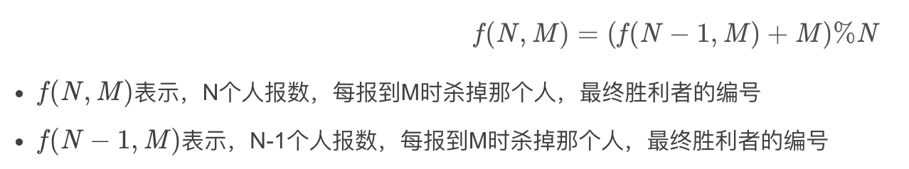

# leetcode与剑指的收藏题目

map的遍历：https://www.jianshu.com/p/3d1fb84b2b63

------


### &sect; 链表类

> - 孩子们的游戏(圆圈中最后剩下的数)（链表模拟）：可能会超时，可以用约瑟夫环：
>
>   https://blog.csdn.net/u011500062/article/details/72855826
>
>   
>
>   ```java
>   class Solution {
>       public int lastRemaining(int n, int m) {
>           int p = 0;
>           for(int i = 2; i <= n; i++){
>               p = (p + m) % i;
>           }
>           return p;
>       }
>   }
>   ```
>
>   
>
> - 反转链表（链表）
>
> - 链表中倒数第k个结点
>
> - 【🎖🎖】复杂链表的复制(注意指针满天飞，***判断null***)
>
>   ```java
>   class Solution {
>       public Node copyRandomList(Node head) {
>           if(head == null) return null;
>           Node curr = head;
>           while (curr != null) {
>               Node copy = new Node(curr.val);
>               Node next = curr.next;
>               curr.next = copy;
>               copy.next = next;
>               curr = next;
>           }
>   
>           curr = head;
>           while (curr != null) {
>               curr.next.random = curr.random == null ? null : curr.random.next;
>               curr = curr.next.next;
>           }
>   
>           curr = head;
>           Node resHead = curr.next;
>           while (curr != null) {
>               Node copy = curr.next;
>               curr.next = copy.next;
>               curr = curr.next;
>               copy.next = copy.next == null ? null : copy.next.next;
>           }
>           return resHead;
>       }
>   }
>   ```
>   
>
>   
>- **删除链表中重复的结点（注意指针处理）**
> 
>- 链表中环的入口结点：（快慢指针，相遇于环内一点，再让一个从链表头，一个从该相遇点开始，最终相遇即为入口）
> 
>- 从尾到头打印链表
> 
>- 【🎖🎖🎖🎖】 [K 个一组翻转链表](https://leetcode-cn.com/problems/reverse-nodes-in-k-group/)

------


### &sect; 树类

> - 【🎖🎖】平衡二叉树（树）
>
>   ```java
>   class Solution {
>       public boolean isBalanced(TreeNode root) {
>           return lenOfTree(root) == -1 ? false : true;
>       }    
>       public int lenOfTree(TreeNode node){
>           if(node == null) return 0;
>           
>           int left = lenOfTree(node.left);
>           int right = lenOfTree(node.right);
>           if(left == -1 || right == -1){
>               return -1;
>           }else if(Math.abs(left - right) > 1){
>               return -1;
>           }else{
>               return Math.max(left,right) + 1;
>           }  
>       }
>   }
>   ```
>
>   
>
> - 【🎖🎖】树的子结构（树）
>
>   ```java
>   class Solution {
>       public boolean isSubStructure(TreeNode A, TreeNode B) {
>           if(B == null) return false;
>           Queue<TreeNode> queue = new LinkedList<>();
>           queue.add(A);
>           while(queue.size() > 0){
>               int size = queue.size();
>               while(size > 0){
>                   TreeNode node = queue.poll();
>                   if(node.val == B.val && hasB(node,B)){
>                       return true;
>                   }
>                   if(node.left != null){
>                       queue.add(node.left);
>                   }
>                   if(node.right != null){
>                       queue.add(node.right);
>                   }
>                   size--;
>               }
>           }
>           return false;
>       }
>       
>       public boolean hasB(TreeNode a, TreeNode b){
>           if(b == null) return true;
>           if(a == null || (a.val != b.val)) return false;
>           return hasB(a.left,b.left) && hasB(a.right,b.right);
>       }
>   }
>   ```
>
>   
>
> - 【🎖🎖🎖🎖】二叉搜索树与双向链表（递归或栈+遍历）（中序遍历的递归和非递归法https://segmentfault.com/a/1190000016674584）
>
>   ```java
>   class Solution {
>       Node head;
>       Node curr;
>       public Node treeToDoublyList(Node root) {
>           if(root == null) return null;
>           inOrder(root);
>           head.left = curr;
>           curr.right = head;
>           return head;
>       }
>       public void inOrder(Node root){
>           if(root == null) return;
>           
>           inOrder(root.left);
>           if(head == null){
>               head = root;
>               curr = root;
>           }else{
>               curr.right = root;
>               root.left = curr;
>               curr = root;
>           }
>           inOrder(root.right);
>       }
>   }
>   ```
>
>   
>
> - 二叉树中和为某一值的路径(注意ArrayList做参数不要直接传引用)
>
> - 【🎖🎖】二叉搜索树的后序遍历序列(判断某序列是否为一个二叉搜索树的后续遍历)：
>
>   ​	数组分界递归，每次末尾就是根，在前面找到左右子树分界点，并验证左右子树是否严格小于/大于根，然后递归验证左右子树序列。
>   
> - 二叉搜索树的第k个结点
>
> - 对称的二叉树：左子树==右子树
>
>   ```java
>   public class Solution {
>       boolean isSymmetrical(TreeNode pRoot)
>       {
>           if(pRoot == null) return true;
>           return isSameTree(pRoot.left,pRoot.right);
>       }
>       public boolean isSameTree(TreeNode LTree, TreeNode RTree){
>           if(LTree == null && RTree == null) return true;
>           if(LTree == null && RTree != null) return false;
>           if(LTree != null && RTree == null) return false;
>           if(LTree.val != RTree.val) return false;
>           return isSameTree(LTree.left,RTree.right) && isSameTree(LTree.right,RTree.left);
>       }
>   }
>   ```
>
>   
>
> - 【🎖🎖🎖🎖】二叉树的下一个结点：***若有右子树，则递归找到右子树最左叶子节点即可。若无则向父节点递归，直到找到当前节点是父节点的左子树，则返回父节点。***
>
>   ```java
>   public class Solution {
>       public TreeLinkNode GetNext(TreeLinkNode pNode)
>       {
>           if(pNode.right != null){
>               TreeLinkNode node = pNode.right;
>               while(node.left != null){
>                   node = node.left;
>               }
>               return node;
>           }else{
>               TreeLinkNode node = pNode;
>               while(node.next != null && (node.next.left == null ||
>                     node.next.left.val != node.val)){
>                   node = node.next;
>               }
>               return node.next;
>           }
>       }
>   }
>   ```
>
>   
>
> - 按之字形顺序打印二叉树：正反序迭代器：iterator/descendingIterator或者用链表的头插/尾插交替（迭代器是对queue的，头插尾插是对当前层遍历的结果的）
>
> - 【🎖🎖🎖🎖】序列化二叉树：关键是利用前序遍历序列重构二叉树：(整体也可使用层序遍历)
>
>   ```java
>   TreeNode Deserialize(String str) {
>           String[] strs = str.split("!");
>           Queue<String> queue = new LinkedList<>();
>           for(int i = 0; i < strs.length; i++){
>               queue.add(strs[i]);
>           }
>           return reConstruct(queue);
>     }
>       public TreeNode reConstruct(Queue<String> queue){
>           // 队列FIFO正好适用于前序遍历构造二叉树
>           String val = queue.poll();
>           if(val.equals("#")){
>               return null;
>           }
>           TreeNode node = new TreeNode(Integer.parseInt(val));
>         	// 先构造左后构造右
>           node.left = reConstruct(queue);
>         	// 遇到左右都为“#”即会结束该子树的遍历，转到右子树去
>           node.right = reConstruct(queue);
>         return node;
>       }
>   ```
>   
> - 【🎖🎖】[从前序与中序遍历序列构造二叉树](https://leetcode-cn.com/problems/construct-binary-tree-from-preorder-and-inorder-traversal/)
>
> - 【🎖🎖🎖】  [二叉树中的最大路径和](https://leetcode-cn.com/problems/binary-tree-maximum-path-sum/)
>
>   对于任意一个节点, 如果最大和路径包含该节点, 那么只可能是两种情况:
>   1. 其左右子树中所构成的和路径值较大的那个加上该节点的值后向父节点回溯构成最大路径
>   2. 左右子树都在最大路径中, 加上该节点的值构成了最终的最大路径
>   3. 返回给上层时只能选某一子树，或不选，因为要返回给上层，所以不能返回left + node + right，这样无法与上层节点构成路径

------


### &sect; 数组类

> - 【🎖】数组中的逆序对（归并排序）
>
> - 调整数组顺序使奇数位于偶数前面：双指针
>
> - 【🎖🎖🎖】 [在排序数组中查找数字 I](https://leetcode-cn.com/problems/zai-pai-xu-shu-zu-zhong-cha-zhao-shu-zi-lcof/)（***二分查找***）：见到排序就可以想到二分
>
>   以找左边界为例：
>
>   ```java
>   public int searchLeft(int[] nums, int start, int end, int target){
>           if(start <= end){
>               int mid = start + ((end - start) >> 1);
>               if(nums[mid] > target){
>                   return searchLeft(nums,start,mid-1,target);
>               }
>               if(nums[mid] < target){
>                   return searchLeft(nums,mid+1,end,target);
>               }
>               if(mid == start || nums[mid - 1] < target){
>                   return mid;
>               }else{
>                   return searchLeft(nums,start,mid-1,target);
>               }
>               
>           }
>           return -1;
>       }
>   ```
>
>   
>
> - 【🎖🎖🎖】把数组排成最小的数(自定义Comparator)：核心如下：
>
>   ```java
>   Collections.sort(list,new Comparator<String>(){
>     public int compare(String s1, String s2){
>       String s12 = s1 + "" + s2;
>       String s21 = s2 + "" + s1;
>       return s12.compareTo(s21); // 利用String的比较方法，避免转换Integer来比的开销
>     }
>   });
>   ```
>
>   
>
> - 连续子数组的最大和：(前面的和+当前值不可小于当前值，若小于，则起点重新从当前值开始)
>
> - 【🎖】机器人的运动范围：dfs/bfs 
>
> - 【🎖🎖🎖】矩阵中的路径：dfs+记忆矩阵***（注意走过的路若不对要恢复记忆矩阵(回溯的感觉))***
>
>   ```java
>   public boolean dfs(char[] matrix, int row, int col, char[] str,int index,boolean[][] visited){
>           if(index > str.length-1) return true;
>           int ind = row*cols + col; // 注意因为row为标号，比行数少1，所以直接这样就可以
>           if(row >= rows || row < 0 || col >= cols || col < 0 || visited[row][col] || matrix[ind] != str[index]){
>               return false;
>           }
>           visited[row][col] = true;
>           if(dfs(matrix,row + 1, col, str, index+1,visited)
>               || dfs(matrix,row - 1, col, str, index+1,visited)
>               || dfs(matrix,row, col + 1, str, index+1,visited)
>               || dfs(matrix,row, col - 1, str, index+1,visited)){
>               return true;
>           }
>           // 记忆矩阵需要及时恢复！！！！！！！！
>           visited[row][col] = false;
>           return false;
>            
>       }
>   ```
>
>   
>
> - 【🎖🎖🎖】滑动窗口的最大值：**可用堆**
>
>   ```java
>   class Solution {
>       public int[] maxSlidingWindow(int[] nums, int k) {
>           int len = nums.length;
>           int[] res = new int[len - k + 1];
>           if(len == 0) return new int[0];
>           Queue<Integer> maxHeap = new PriorityQueue<>(k,new Comparator<Integer>() {
>               @Override
>               public int compare(Integer o1, Integer o2) {
>                   return o2 - o1;
>               }
>           });
>   
>           for (int i = 0; i < k; i++) {
>               maxHeap.add(nums[i]);
>           }
>           res[0] = maxHeap.peek();
>           int index = 1;
>           for (int i = k; i < len; i++) {
>               maxHeap.remove(nums[i - k]);
>               maxHeap.add(nums[i]);
>               res[index++] = maxHeap.peek();
>           }
>           return res;
>       }
>   }
>   ```
>
>   
>
> - 【🎖🎖🎖】 [下一个排列](https://leetcode-cn.com/problems/next-permutation/)
>
>   ```java
>   class Solution {
>       public void nextPermutation(int[] nums) {
>           int len = nums.length;
>           // 从尾到头找第一个nums[i] > nums[i-1]
>           for(int i = len-1; i > 0; i--){
>               if(nums[i] > nums[i-1]){
>                   // 将i及以后的排序
>                   Arrays.sort(nums,i,len);
>                   int index = i;
>                   // 找i及以后的第一个大于nums[i-1]的值与nums[i-1]交换
>                   while(index < len && nums[index] <= nums[i-1]){
>                       index++;
>                   }
>                   int temp = nums[index];
>                   nums[index] = nums[i-1];
>                   nums[i-1] = temp;
>                   return;
>               }
>           }
>           // 否则（说明已经全部逆序了），直接排序变为升序
>           Arrays.sort(nums);
>       }
>   }
>   ```
>
>   
>
> - 【🎖🎖🎖】[子集](https://leetcode-cn.com/problems/subsets/)：很巧
>
>   ```java
>   class Solution {
>       public List<List<Integer>> subsets(int[] nums) {
>           List<List<Integer>> res = new ArrayList<>();
>           res.add(new ArrayList<>());
>           for(int i = 0; i < nums.length; i++){
>               int size = res.size();
>               for(int j = 0; j < size; j++){
>                   List<Integer> list = new ArrayList<>(res.get(j));
>                   list.add(nums[i]);
>                   res.add(list);
>               }
>           }
>           return res;
>       }
>   }
>   ```
>
>   
>
> -   [数组中的第K个最大元素](https://leetcode-cn.com/problems/kth-largest-element-in-an-array/)：快速选择（利用快排的partition，因为归位的元素便已知是第几大）/或用**最小堆**
>
> - 【🎖🎖🎖】 [较小的三数之和](https://leetcode-cn.com/problems/3sum-smaller/)：先排序 + 遍历+双指针，注意去重
>
> -  [接雨水](https://leetcode-cn.com/problems/trapping-rain-water/)：每个点能储水的高度等于其与左右两边最大值中的较小者之差。
>
> -  数组中重复的数字：
>
>   - 使用额外空间：
>
>     ```java
>     boolean[] visited = new boolean[length];
>     for(int i = 0; i < length; i++){
>       if(!visited[numbers[i]]){
>         visited[numbers[i]] = true;
>       }else{
>         duplication[0] = numbers[i];
>         return true;
>       }
>     }
>     return false;
>     ```
>
>   - 不使用额外空间，每次交换归位元素，归位冲突即发现重复元素：
>
>     ```java
>     int i = 0;
>     while(i < length){
>       if(numbers[i] != i){
>         int temp = numbers[numbers[i]];
>         if(temp == numbers[i]){
>           duplication[0] = temp;
>           return true;
>         }else{
>           numbers[numbers[i]] = numbers[i];
>           numbers[i] = temp;
>         }
>       }else{
>         i++;
>       }
>     }
>     return false;
>     ```
>
>     
>
> - 【🎖🎖🎖🎖】构建乘积数组：构建二维（只用上三角，会有嵌套循环）&rArr;优化为上下三角
>
>   
>
>   ```java
>   //这是只用上三角的方法，对角线元素为A[i]
>   public int[] multiply(int[] A) {
>           int len = A.length;
>           int[][] prod = new int[len][len];
>           for(int i = 0; i < len; i++){
>               prod[i][i] = A[i];
>           }
>            
>           for(int i = 0; i < len; i++){
>               for(int j = i+1; j < len; j++){
>                   prod[i][j] = prod[i][j-1] * A[j];
>               }
>           }
>           int[] B = new int[len];
>           for(int i = 0; i < len; i++){
>               int left = i-1 >= 0 ? prod[0][i-1] : 1;
>               int right = i + 1 < len ? prod[i+1][len-1] : 1;
>               B[i] = left * right;
>           }
>           return B;
>       }
>   ```
>   
>   更简单做法：
>   
>   ```java
>   public class Solution {
>       public int[] multiply(int[] A) {
>           int length = A.length;
>           int[] B = new int[length];
>           if(length != 0 ){
>               B[0] = 1;
>               //计算下三角连乘
>               for(int i = 1; i < length; i++){
>                   B[i] = B[i-1] * A[i-1];
>               }
>               int temp = 1;
>               //计算上三角
>               for(int j = length-2; j >= 0; j--){
>                   temp *= A[j+1];
>                   B[j] *= temp;
>               }
>           }
>           return B;
>       }
>   }
>   ```
>   
>   
>   
> - 【🎖🎖🎖】[从前序与中序遍历序列构造二叉树](https://leetcode-cn.com/problems/construct-binary-tree-from-preorder-and-inorder-traversal/)

------


### &sect; 栈/堆

> - 栈的压入、弹出序列（栈）
>
> - 包含min函数的栈（栈）：单有一个栈，每轮push都往里压当前min，每轮pop也都往外pop一个。
>
> - 【🎖🎖🎖🎖】 [队列的最大值](https://leetcode-cn.com/problems/dui-lie-de-zui-da-zhi-lcof/)：类似上面那题：
>
>   ```java
>   class MaxQueue {
>       
>       Deque<Integer> maxQ = new LinkedList<>();
>       Queue<Integer> queue = new LinkedList<>();
>   
>       public MaxQueue() {
>   
>       }
>   
>       public int max_value() {
>           return maxQ.isEmpty() ? -1 : maxQ.peek();
>       }
>   
>       public void push_back(int value) {
>           queue.add(value);
>           while (!maxQ.isEmpty() && value > maxQ.peekLast()) {
>               maxQ.pollLast(); // ！！！！
>           }
>           maxQ.add(value);
>   
>       }
>   
>       public int pop_front() {
>           if (queue.isEmpty()) {
>               return -1;
>           }
>           // ！！！！
>           int val = queue.poll();
>           if (val == maxQ.peek()) {
>               maxQ.poll();
>           }
>           return val;
>       }
>   }
>   ```
>
>   
>
> - 【🎖🎖🎖】数据流中的中位数：***双堆法：***
>
>   ```java
>   class MedianFinder {
>       PriorityQueue<Integer> left;//大顶
>       PriorityQueue<Integer> right;//小顶
>       public MedianFinder() {
>           left=new PriorityQueue<>((n1,n2)->n2-n1);
>           right=new PriorityQueue<>();
>       }
>       public void addNum(int num) {
>           left.add(num); //先放大堆
>           right.add(left.poll()); // 取大堆头放小堆
>           if(left.size()+1<right.size())
>               left.add(right.poll()); // 不平衡的话再取小堆头放大堆
>       }
>       public double findMedian() {
>           if(right.size()>left.size())return right.peek();
>           return (double)(left.peek()+right.peek())/2;
>       }
>   }
>   ```
>
>   
>
> - 【🎖🎖🎖】 [简化路径](https://leetcode-cn.com/problems/simplify-path/)：
>
>   // 1.此题主要考察的是““栈””,所以定义一个辅助栈;
>   // 2.先把字符串以"/"为分隔符分割成数组,此时数组有"路径"、""、"."、".."这四种情况;
>   // 3.遍历数组,当s[i].equals("..")并且栈不空时pop,当!s[i].equals("") && !s[i].equals(".") && !s[i].equals(".."),即s[i]是路径入栈;
>   // 4.栈空,返回"/",栈非空,用StringBuffer做一个连接返回即可;
>   // 5完结。
>   
> -  [有效的括号字符串](https://leetcode-cn.com/problems/valid-parenthesis-string/)
>
>   ```java
>   class Solution {
>       // 两个栈，一个存左括号，一个存*号，
>       // 存的是下标，避免错序匹配了，如*(
>       public boolean checkValidString(String s) {
>           int len = s.length();
>           if(len == 0) return true;
>           Stack<Integer> stackL = new Stack<>();
>           Stack<Integer> stackStar = new Stack<>();
>           
>           for(int i = 0; i < len; i++){
>               if(s.charAt(i) == '('){
>                   stackL.push(i);
>               }else if(s.charAt(i) == '*'){
>                   stackStar.push(i);
>               }else{
>                   if(!stackL.empty()){
>                       stackL.pop();
>                   }else if(!stackStar.empty()){
>                       stackStar.pop();
>                   }else{
>                       return false;
>                   }
>               }
>           }
>           if(stackL.size() > stackStar.size()) return false;
>           while(!stackL.empty() && !stackStar.empty()){
>               
>               if(stackL.peek() < stackStar.peek()){
>                   stackL.pop();
>                   stackStar.pop();
>               }else{
>                   return false;
>               }
>           }
>           return stackL.empty() ? true : false;
>       }
>   }
>   ```
>
>   
>
> - 【🎖🎖🎖🎖】 [最长有效括号](https://leetcode-cn.com/problems/longest-valid-parentheses/)
>
>   ```java
>   Stack<Integer> stack = new Stack<>();
>           stack.push(-1); // !!!!
>           for (int i = 0; i < s.length(); i++) {
>               if (s.charAt(i) == '(') {
>                   stack.push(i);
>               } else {
>                   stack.pop();
>                   if (stack.size() == 0) {
>                       stack.push(i); // !!!!!
>                   } else {
>                       maxLen = Math.max(maxLen, i - stack.peek());
>                   }
>               }
>           }
>           return maxLen;
>   ```
>
>   

------


### &sect; 二进制与位运算

https://mp.weixin.qq.com/s/45mfS3ciiVt8nghUSjezFg

> - 【🎖🎖🎖】二进制中1的个数
>
>   **如果一个整数不为0，那么这个整数至少有一位是1。如果我们把这个整数减1，那么原来处在整数最右边的1就会变为0，原来在1后面的所有的0都会变成1(如果最右边的1后面还有0的话)。其余所有位将不会受到影响。**  
>
>   ​      **举个例子：一个二进制数1100，从右边数起第三位是处于最右边的一个1。减去1后，第三位变成0，它后面的两位0变成了1，而前面的1保持不变，因此得到的结果是1011.我们发现减1的结果是把最右边的一个1开始的所有位都取反了。这个时候如果我们再把原来的整数和减去1之后的结果做与运算，从原来整数最右边一个1那一位开始所有位都会变成0。如1100&1011=1000.也就是说，把一个整数减去1，再和原整数做与运算，会把该整数最右边一个1变成0.那么一个整数的二进制有多少个1，就可以进行多少次这样的操作。**
>
>   ```java
>   public class Solution {
>       public int NumberOf1(int n) {
>           int count = 0;
>           while(n != 0){
>               n = n & (n-1);
>               count++;
>           }
>           return count;
>       }
>   }
>   ```
>
>   
>
> - 【🎖🎖】求1+2+3+...+n
>
>   ```java
>   // 短路求值原理(&&前面为假后面就不计算了)
>   public int sumNums(int n) {
>           int ans = n;
>           return ans == 0 ? 0 : sumNums(n-1)+ans;
>       }
>   ```
>   
> - 【🎖🎖🎖🎖】 [数组中数字出现的次数](https://leetcode-cn.com/problems/shu-zu-zhong-shu-zi-chu-xian-de-ci-shu-lcof/)
>
>   我们首先仍然从前向后依次异或数组中的数字，那么得到的结果是两个只出现一次的数字的异或结果，其他成对出现的数字被抵消了。由于这两个数字不同，所以异或结果肯定不为0，也就是这个异或结果一定至少有一位是1，我们在结果中找到第一个为1的位的位置，记为第n位。接下来，**以第n位是不是1为标准，将数组分为两个子数组**，第一个数组中第n位都是1，第二个数组中第n位都是0。这样，便实现了我们的目标。最后，两个子数组分别异或则可以找到只出现一次的数字。
>
>   ```java
>   class Solution {
>       public int[] singleNumbers(int[] nums) {
>           int sum = 0;
>           for(int num : nums){
>               sum ^= num;
>           }
>           int offset = 0;
>           while(offset < 32 && ((sum >> offset) & 1) != 1){
>               offset++;
>           }
>           int[] res = new int[2];
>           for(int i = 0; i < nums.length; i++){
>               if(((nums[i] >> offset) & 1) == 1){
>                   res[0] = (res[0] ^ nums[i]);
>               }else{
>                   res[1] = (res[1] ^ nums[i]);
>               }
>           }
>           return res;
>       }
>   }
>   ```
>
> - 【🎖🎖🎖】 [数组中数字出现的次数 II](https://leetcode-cn.com/problems/shu-zu-zhong-shu-zi-chu-xian-de-ci-shu-ii-lcof/)
>
>   现将数组排序，用到函数`Arrays.sort(nums)`;然后从第二个元素遍历到倒数第二个元素，比较它与左右两边元素是否相等。若都不相等，则说明只出现了一次。遍历完后，没有找到的话，则对第一个元素和最后一个元素进行判断。
>
>   ```java
>   class Solution {
>       public int singleNumber(int[] nums) {
>           Arrays.sort(nums);
>           for(int i = 1; i < nums.length - 1; i++){
>               if(nums[i] != nums[i-1] && nums[i] != nums[i+1]){
>                   return nums[i];
>               }
>           }
>           if(nums[0] == nums[1]) return nums[nums.length - 1];
>           return nums[0];
>       }
>   }
>   ```
>
>   
>

------


### &sect; 动态规划

> -  [礼物的最大价值](https://leetcode-cn.com/problems/li-wu-de-zui-da-jie-zhi-lcof/)
>
> - 矩形覆盖
>
>     ```java
>     public int RectCover(int target) {
>             if(target < 2) return target;
>             int[] dp = new int[target+1];
>             dp[0] = 0;
>             dp[1] = 1;
>             dp[2] = 2;
>             for(int i = 3; i <= target; i++){
>                 dp[i] = dp[i-1]+dp[i-2];
>             }
>             return dp[target];
>         }
>     ```
>
> -  【🎖🎖🎖🎖】[01背包问题（有价值）](https://www.lintcode.com/problem/backpack-ii/description)
>
> -  【🎖🎖🎖】 [最长公共子序列](https://leetcode-cn.com/problems/longest-common-subsequence/)
>
>     ```java
>     for (int i = 1; i <= len1; i++) {
>       for (int j = 1; j <= len2; j++) {
>         dp[i][j] = Math.max(dp[i - 1][j], dp[i][j - 1]); // 无须dp[i-1][j-1]，因为他必然最小，所以取max不会取到的
>         if (text1.charAt(i - 1) == text2.charAt(j - 1)) {
>           dp[i][j] = dp[i - 1][j - 1] + 1;
>         }
>       }
>     }
>     ```
>
>     
>
> -  [不同路径](https://leetcode-cn.com/problems/unique-paths/)：机器人走路
>
> - 【🎖】 [最小路径和](https://leetcode-cn.com/problems/minimum-path-sum/)：同礼物最大价值
>
> - 【🎖🎖🎖🎖】[编辑距离](https://leetcode-cn.com/problems/edit-distance/)
>
>     ```java
>     class Solution {
>         public int minDistance(String word1, String word2) {
>             int len1 = word1.length();
>             int len2 = word2.length();
>     
>             int[][] dp = new int[len1 + 1][len2 + 1];
>     
>             for (int i = 1; i <= len1; i++) {
>                 dp[i][0] = i;
>             }
>             for (int j = 1; j <= len2; j++) {
>                 dp[0][j] = j;
>             }
>     
>             for (int i = 1; i <= len1; i++) {
>                 for (int j = 1; j <= len2; j++) {
>                     if (word1.charAt(i-1) == word2.charAt(j-1)) {
>                         dp[i][j] = dp[i - 1][j - 1]; // 无需与dp[i][j-1] dp[i-1][j]做比较，因为他就是最短的
>                     } else {
>                         int temp = Math.min(dp[i - 1][j], dp[i][j - 1]);
>                         temp = Math.min(temp, dp[i - 1][j - 1]);
>                         dp[i][j] = temp + 1;
>                     }
>                 }
>             }
>             return dp[len1][len2];
>         }
>     }
>     ```
>
>     
>
> - 【🎖】[ 买卖股票的最佳时机](https://leetcode-cn.com/problems/best-time-to-buy-and-sell-stock/)：动态规划，并维护一个历史最低price值
>
> - [买卖股票的最佳时机 II](https://leetcode-cn.com/problems/best-time-to-buy-and-sell-stock-ii/)
>
> - 【🎖🎖】 [完全平方数](https://leetcode-cn.com/problems/perfect-squares/)：找出前面最小dp[i]
>
>   ```java
>   for (int i = 2; i <= n; i++) {
>     for (int j = 1; j * j <= i; j++) {
>       dp[i] = Math.min(dp[i], dp[i - j * j] + 1);
>     }
>   }
>   ```
>
>   
>
> - 【🎖🎖🎖】 [最长上升子序列](https://leetcode-cn.com/problems/longest-increasing-subsequence/)：找出前面最大dp[j]，最终遍历所有dp[i]取最大
>
>   ```java
>   for (int i = 1; i < len; i++) {
>     for (int j = 0; j < i; j++) {
>       if (nums[j] < nums[i]) {
>         dp[i] = Math.max(dp[i], dp[j] + 1);
>       }
>     }
>   }
>   ```
>   
>   
>   
> - 【🎖🎖】 [二维区域和检索 - 矩阵不可变](https://leetcode-cn.com/problems/range-sum-query-2d-immutable/)：先把每行元素按dp叠加，然后再对结果进行计算。
>
> - 【🎖🎖🎖】 [最大正方形](https://leetcode-cn.com/problems/maximal-square/)：`dp[i][j] = 1 + min(dp[i-1][j-1], dp[i-1][j], dp[i][j-1]);`
>
> - 【🎖🎖🎖】 [俄罗斯套娃信封问题](https://leetcode-cn.com/problems/russian-doll-envelopes/)：先按宽度升序排序，宽度相等时按高度降序排序，然后按高度用最长上升子序列的解法
>
> - 【🎖🎖🎖】 [最长回文子序列](https://leetcode-cn.com/problems/longest-palindromic-subsequence/):
>
>     ```java
>     for (int i = len - 1; i >= 0; i--) {
>       for (int j = i + 1; j < len; j++) {
>         if (s.charAt(i) == s.charAt(j)) {
>           dp[i][j] = dp[i + 1][j - 1] + 2;
>         } else {
>           dp[i][j] = Math.max(dp[i + 1][j], dp[i][j - 1]);
>         }
>       }
>     }
>     ```
>
>     
>
> - 【🎖🎖🎖🎖】 [最长回文子串](https://leetcode-cn.com/problems/longest-palindromic-substring/)：
>
>     核心：
>
>   ```java
>   // 注意遍历起点
>   for(int i = len - 2; i >= 0; i--){
>     for(int j = i + 1; j < len; j++){
>       if(j - 1 >= i + 1 && dp[i+1][j-1] && s.charAt(i) == s.charAt(j)){
>         // 如果i，j之间还有字符串，则先看中间的是不是回文
>         dp[i][j] = true;
>       }else if( j - 1 < i + 1 && s.charAt(i) == s.charAt(j)){
>         // 如果i，j之间没有其他字符串了，就直接看i，j是否相同即可
>         dp[i][j] = true;
>       }
>     }
>   }
>   ```

------


### &sect; 字符串类

> - 第一个只出现一次的字符
>
> - 【🎖🎖🎖🎖】字符串的排列(固定一位，递归交换)
>
>   ```java
>   public void helper(char[] strArr, int start, int end){
>           if(start == end){
>               res.add(String.valueOf(strArr));
>           }
>           HashSet<Character> set = new HashSet<>(); // 防重复
>           for(int i = start; i <= end; i++){
>               if(!set.contains(strArr[i])){
>                   char[] curr = Arrays.copyOf(strArr,strArr.length);
>                   swap(curr,i,start);
>                   set.add(strArr[i]);
>                   helper(curr,start+1,end);
>               }
>           }
>       }
>   ```
>
>   
>
> - 【🎖】字符流中第一个不重复的字符：主要是LinkedHashMap/HashMap的遍历：
>
>   ```java
>   Iterator<Map.Entry<Character,Integer>> itr = map.entrySet().iterator();
>           while(itr.hasNext()){
>               Map.Entry entry = itr.next();
>               if(entry.getValue().equals(1)){
>                   return (char)entry.getKey();
>               }
>           }
>   ```
>
> - 【🎖】表示数值的字符串：疯狂判定
>
>   ```java
>   public boolean isNumeric(char[] str) {
>           int len = str.length;
>           // 通过多个boolean标签层层筛选
>           boolean sign = false, decimal = false, hasE = false;
>           for(int i = 0; i < len; i++){
>               if(str[i] == '+' || str[i] == '-'){
>                   if(!sign && i > 0 && str[i-1] != 'e' && str[i-1] != 'E')
>                       return false;
>                   if(sign && str[i-1] != 'e' && str[i-1] != 'E')
>                       return false;
>                   sign = true;
>               }else if(str[i] == 'e' || str[i] == 'E'){
>                   if(i == len - 1)
>                       return false;
>                   if(hasE)
>                       return false;
>                   hasE = true;
>               }else if(str[i] == '.'){
>                   if(hasE || decimal)
>                       return false;
>                   decimal = true;
>               }else if(str[i] < '0' || str[i] > '9')
>                   return false;
>           }
>           return true;
>       }
>   ```
>
>   
>
> - 【🎖🎖🎖🎖】正则表达式匹配：分清情况
>
>   ```java
>   public boolean matchCore(char[] str, int strIndex, char[] pattern, int patternIndex) {
>       //有效性检验：str到尾，pattern到尾，匹配成功
>       if (strIndex == str.length && patternIndex == pattern.length) {
>           return true;
>       }
>       //pattern先到尾，匹配失败
>       if (strIndex != str.length && patternIndex == pattern.length) {
>           return false;
>       }
>       //模式第2个是*，且字符串第1个跟模式第1个匹配,分3种匹配模式；如不匹配，模式后移2位
>       if (patternIndex + 1 < pattern.length && pattern[patternIndex + 1] == '*') {
>           if ((strIndex != str.length && pattern[patternIndex] == str[strIndex]) || (pattern[patternIndex] == '.' && strIndex != str.length)) {
>               return matchCore(str, strIndex, pattern, patternIndex + 2)//模式后移2，视为x*匹配0个字符
>                       || matchCore(str, strIndex + 1, pattern, patternIndex + 2)//视为模式匹配1个字符
>                       || matchCore(str, strIndex + 1, pattern, patternIndex);//*匹配1个，再匹配str中的下一个，因为*可匹配多个
>           } else {
>               return matchCore(str, strIndex, pattern, patternIndex + 2);
>           }
>       }
>       //模式第2个不是*，且字符串第1个跟模式第1个匹配，则都后移1位，否则直接返回false
>       if ((strIndex != str.length && pattern[patternIndex] == str[strIndex]) || (pattern[patternIndex] == '.' && strIndex != str.length)) {
>           return matchCore(str, strIndex + 1, pattern, patternIndex + 1);
>       }
>       return false;
>       }
>   }
>   ```
>
>   
>
> - 【🎖】 [复原IP地址](https://leetcode-cn.com/problems/restore-ip-addresses/)
>
>   ```java
>   List<String> ret = new ArrayList<>();
>   
>           StringBuilder ip = new StringBuilder();
>           
>           for(int a = 1 ; a < 4 ; ++ a)
>               for(int b = 1 ; b < 4 ; ++ b)
>                   for(int c = 1 ; c < 4 ; ++ c)
>                       for(int d = 1 ; d < 4 ; ++ d)
>                       {
>                           if(a + b + c + d == s.length() )
>                           {
>                               int n1 = Integer.parseInt(s.substring(0, a));
>                               int n2 = Integer.parseInt(s.substring(a, a+b));
>                               int n3 = Integer.parseInt(s.substring(a+b, a+b+c));
>                               int n4 = Integer.parseInt(s.substring(a+b+c));
>                               if(n1 <= 255 && n2 <= 255 && n3 <= 255 && n4 <= 255)
>                               {
>                                   ip.append(n1).append('.').append(n2)
>                                           .append('.').append(n3).append('.').append(n4);
>                                   if(ip.length() == s.length() + 3) ret.add(ip.toString());
>                                   ip.delete(0, ip.length());
>                               }
>                           }
>                       }
>           return ret;
>   ```
>
>   
>
> - 【🎖🎖🎖🎖】 [ Z 字形变换](https://leetcode-cn.com/problems/zigzag-conversion/)
>
>   ```java
>   class Solution {
>       public String convert(String s, int numRows) {
>           if(numRows < 2) return s;
>           List<StringBuilder> rows = new ArrayList<StringBuilder>();
>           for(int i = 0; i < numRows; i++) rows.add(new StringBuilder());
>           int i = 0, flag = -1;
>           for(char c : s.toCharArray()) {
>               rows.get(i).append(c);
>               if(i == 0 || i == numRows -1) flag = - flag;
>               i += flag;
>           }
>           StringBuilder res = new StringBuilder();
>           for(StringBuilder row : rows) res.append(row);
>           return res.toString();
>       }
>   }
>   ```
>
>   


### &sect; 穷举

> - 【🎖🎖🎖🎖】[丑数](https://leetcode-cn.com/problems/chou-shu-lcof/)
>
>   ```java
>   public int nthUglyNumber(int n) {
>           if(n == 1) return 1;
>           // 三指针
>           int[] res = new int[n];
>           int p2 = 0;
>           int p3 = 0; 
>           int p5 = 0;
>           res[0] = 1;
>           for(int i = 1; i < n; i++){
>               res[i] = Math.min(res[p2] * 2, Math.min(res[p3] * 3, res[p5] * 5));
>               // 哪个小，哪个下标后移
>               if(res[i] == res[p2] * 2) p2++; 
>               if(res[i] == res[p3] * 3) p3++;
>               if(res[i] == res[p5] * 5) p5++;
>           }
>           return res[n-1];
>       }
>   ```

------

### &sect; 回溯法

> - 【🎖🎖🎖🎖】 [N皇后](https://leetcode-cn.com/problems/n-queens/)
>
> -  [全排列](https://leetcode-cn.com/problems/permutations/)
>
> - 【🎖🎖】 [括号生成](https://leetcode-cn.com/problems/generate-parentheses/)：模拟生成
>
>   ```java
>   class Solution {
>       List<String> res = new ArrayList<>();
>       public List<String> generateParenthesis(int n) {
>           int leftC = n;
>           int rightC = n;
>   
>           LinkedList<String> list = new LinkedList<>();
>           putKuohao(list, leftC, rightC, new StringBuilder());
>           return res;
>       }
>       
>       public void putKuohao(LinkedList<String> list, int leftC, int rightC,StringBuilder sb) {
>           if (leftC == 0 && rightC == 0) {
>               if (list.isEmpty()) {
>                   res.add(sb.toString());
>               }
>               return;
>           }
>           if (leftC != 0) {
>               LinkedList list1 = new LinkedList(list);
>               StringBuilder sb1 = new StringBuilder(sb);
>               list1.add("(");
>               sb1.append("(");
>               putKuohao(list1, leftC-1, rightC, sb1);
>           }
>           if (rightC != 0) {
>               if (!list.isEmpty() && list.getLast().equals("(")) {
>                   LinkedList list2 = new LinkedList(list);
>                   StringBuilder sb2 = new StringBuilder(sb);
>                   list2.removeLast();
>                   sb2.append(")");
>                   putKuohao(list2, leftC, rightC-1, sb2);
>               } else {
>                   return;
>               }
>           }
>       }
>   }
>   ```
>
> -  [单词搜索](https://leetcode-cn.com/problems/word-search/)

------

### &sect; dfs/bfs

> - 【🎖🎖🎖】 [岛屿数量](https://leetcode-cn.com/problems/number-of-islands/)：递归去“连岛成片”，每次连到头都是发现了一座孤独的大岛。

------

### &sect; 数据结构设计

> - 【🎖🎖🎖🎖】 [常数时间插入、删除和获取随机元素](https://leetcode-cn.com/problems/insert-delete-getrandom-o1/)：hashmap+list，hashmap存list中的下标，删除时若要删除的元素下标不是list末尾，则将末尾元素赋给目标位置即可，然后删除末尾。
>
> - 【🎖🎖🎖】[LRU缓存机制](https://leetcode-cn.com/problems/lru-cache/)
>
>   ```java
>   class LRUCache {
>       private Map<Integer,Integer> map = new LinkedHashMap<>(); //保持插入顺序,末尾是最新
>       private int capacity;
>       public LRUCache(int capacity) {
>           this.capacity = capacity;
>       }
>       
>       public int get(int key) {
>           if(map.get(key) != null){
>               int value = map.get(key);
>               map.remove(key); // 除旧
>               map.put(key,value); // 查询后变最新，放末尾
>               return value;
>           }else{
>               return -1;
>           }
>       }
>       
>       public void put(int key, int value) {
>           if(map.containsKey(key)){
>               map.remove(key);
>           }else if(map.size() == capacity){
>               Iterator itr = map.keySet().iterator(); // 找到头元素，并删除
>               map.remove(itr.next());
>           }
>           map.put(key,value);
>       }
>   }
>   ```
>
>   

------

### &sect; 滑动窗口

> - 【🎖🎖🎖】 [无重复字符的最长子串](https://leetcode-cn.com/problems/longest-substring-without-repeating-characters/)
> - 【🎖🎖🎖🎖】 [最小覆盖子串](https://leetcode-cn.com/problems/minimum-window-substring/)：// 在滑动窗口类型的问题中都会有两个指针。一个用于延伸现有窗口的 right，right指针，和一个用于收缩窗口的left，left 指针。在任意时刻，只有一个指针运动，而另一个保持静止。
>   // 本题的解法很符合直觉。我们通过移动right指针不断扩张窗口。当窗口包含全部所需的字符后，如果能收缩，我们就收缩窗口直到得到最小窗口。

------

### &sect; 双指针/三指针

> -  [和为s的两个数字](https://leetcode-cn.com/problems/he-wei-sde-liang-ge-shu-zi-lcof/)
>
> - 【🎖🎖🎖】 [无重复字符的最长子串](https://leetcode-cn.com/problems/longest-substring-without-repeating-characters/)
>
> - 【🎖🎖🎖🎖】[三数之和](https://leetcode-cn.com/problems/3sum/)
>
>   ```java
>   class Solution {
>       public List<List<Integer>> threeSum(int[] nums) {
>           Arrays.sort(nums);
>           int len = nums.length;
>           List<List<Integer>> res = new ArrayList<>();
>           for(int i = 0; i < len - 2; i++){
>               if(nums[i] > 0) break; // 关键
>               if( i > 0 && nums[i] == nums[i-1]) continue; // 关键
>               
>               int p1 = i + 1;
>               int p2 = len - 1;
>               while(p1 < p2){
>                   int sum = nums[i] + nums[p1] + nums[p2];
>                   if(sum < 0){
>                       p1++;
>                   }else if(sum > 0){
>                       p2--;
>                   }else{
>                       List<Integer> list = new ArrayList<>();
>                       list.add(nums[i]);
>                       list.add(nums[p1]);
>                       list.add(nums[p2]);
>                       res.add(list);
>                       // 跳过重复
>                       while(p1 < p2 && nums[p1] == nums[++p1]);
>                       while(p1 < p2 && nums[p2] == nums[--p2]);
>                   }
>               }
>           }
>           return res;
>       }
>   }
>   ```
>
>   
>
> - [接雨水](https://leetcode-cn.com/problems/trapping-rain-water/)
>
> - [盛最多水的容器](https://leetcode-cn.com/problems/container-with-most-water/)：核心是一左一右两指针，然后不停的挪动较短的那一端（因为面积已经是按短的那边算了，如果不挪短的这边，那不可能出现更大的面积）
>
> - [最接近的三数之和](https://leetcode-cn.com/problems/3sum-closest/)
>
>   ```java
>   class Solution {
>       public int threeSumClosest(int[] nums, int target) {
>           Arrays.sort(nums);
>           int len = nums.length;
>           int minDist = Integer.MAX_VALUE;
>           int res = 0;
>           for(int i = 0; i < len; i++){
>               int subTar = target - nums[i];
>               int p1 = i + 1;
>               int p2 = len - 1;
>               while(p1 < p2){
>                   if(Math.abs(nums[p1] + nums[p2] + nums[i] - target) < minDist){
>                       minDist = Math.abs(nums[p1] + nums[p2] + nums[i] - target);
>                       res = nums[p1] + nums[p2] + nums[i];
>                   }
>   
>                   if(nums[p1] + nums[p2] < subTar){
>                       p1++;
>                   }else if(nums[p1] + nums[p2] > subTar){
>                       p2--;
>                   }else{
>                       return target;
>                   }
>               }
>           }
>           return res;
>       }
>   }
>   ```
>
>   
>
> - 【🎖🎖🎖🎖】丑数：三指针
>
>   ```java
>   class Solution {
>       public int nthUglyNumber(int n) {
>           if(n == 1) return 1;
>           // 三指针
>           int[] res = new int[n];
>           int p2 = 0;
>           int p3 = 0; 
>           int p5 = 0;
>           res[0] = 1;
>           for(int i = 1; i < n; i++){
>               res[i] = Math.min(res[p2] * 2, Math.min(res[p3] * 3, res[p5] * 5));
>               // 哪个小，哪个下标后移
>               if(res[i] == res[p2] * 2) p2++; 
>               if(res[i] == res[p3] * 3) p3++;
>               if(res[i] == res[p5] * 5) p5++;
>           }
>           return res[n-1];
>       }
>   }
>   ```
>
> - 【🎖🎖🎖】和为S的连续正数序列：**等差数列+双指针**

------

### &sect; 其他

### 快速幂

> - ####【🎖🎖🎖🎖】 [数值的整数次方](https://leetcode-cn.com/problems/shu-zhi-de-zheng-shu-ci-fang-lcof/)
>
> ```java
> class Solution {
>     public double myPow(double x, int n) {
>         double res = 1;
>         double base = x;
>         boolean flag = n > 0 ? true : false;
>         long exp = n;
>         exp = Math.abs(exp);
>         while(exp > 0){
>             if((exp & 1) != 0){
>                 res *= base; // 奇数时计算结果
>             }
>             base *= base; // 权值增加
>             exp >>= 1;
>         }
>         return flag ? res : 1/res;
>     }
> }
> ```
>
> 