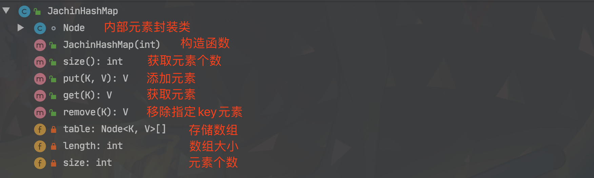
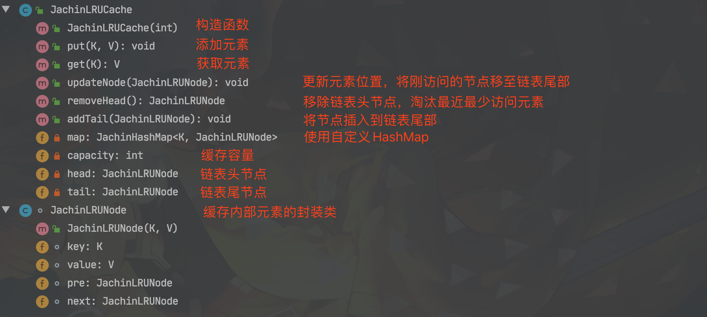

# 彻底手撕LRU设计（使用JDK容器与不使用JDK容器）

**JDK 1.8**

> <font color='#02C874' size=4>**本文讲述了两种利用JDK容器实现LRU的方法，以及最后不使用JDK容器，自己定义HashMap和链表来纯手工打造时间复杂度为O(1)的LRU算法。**</font>

------


## &sect; 使用JDK容器

### 1、使用LinkedHashMap

> 这种方式比较简单，注释都在代码里

```java
public class LRUCache<K,V>{ // 使用泛型
    private LinkedHashMap<K, V> cache;
    private int capacity; // 容量

    public LRUCache(int capacity) {
        cache = new LinkedHashMap<>();
        this.capacity = capacity;
    }

    public V get(K key) {
        if (cache.containsKey(key)) {
            V val = cache.get(key);
            cache.remove(key); // 删除key
            cache.put(key, val); // 重新put，实现了生命周期的更新
            return val;
        } else {
            return null;
        }
    }

    public void put(K key, V val) {
        if (cache.containsKey(key)) {
            cache.remove(key);
        } else if (cache.size() >= capacity) {
            Iterator itr = cache.keySet().iterator();
            cache.remove(itr.next()); // 删除头
        }
        cache.put(key, val);
    }

}
```


------

### 2、使用HashMap + LinkedList

> - HashMap存储K-V元素
> - LinkedList按序存储key

```java
import java.util.HashMap;
import java.util.LinkedList;

/**
 * @description:
 * @Author: JachinDo
 * @Date: 2020/04/24 22:04
 */

public class LRUCache2<K, V> {

    private HashMap<K, V> map;
    private LinkedList<K> list;
    private int capacity;

    public LRUCache2(int capacity) {
        map = new HashMap<>();
        list = new LinkedList<K>();
        this.capacity = capacity;
    }

    public V get(K key) {
        if (map.containsKey(key)) {
            V val = map.get(key);
            list.remove(key); // 更新
            list.addLast(key);
            return val;
        } else {
            return null;
        }
    }

    public void put(K key, V value) {
        if (map.containsKey(key)) {
            map.remove(key);
            list.remove(key);
        } else if (map.size() >= capacity) {
            K oldKey = list.removeFirst(); // 删除头
            map.remove(oldKey);
        }
        list.addLast(key);
        map.put(key, value);
    }
}
```


------


### &sect; 不使用JDK容器实现O(1)的LRU -- 纯手工打造LRU

> - **自定义HashMap**：`JachinHashMap<K, Node>`
> - <font color='#02C874'>***核心：HashMap的value值封装为Node节点（包含k，v，以及前后指针，形成链表），这样即以O(1)的时间复杂度维持顺序，避免了LinkedList的O(n)。***</font>

------

#### 1、自定义HashMap

代码结构图：



------

> **注释很详细，结合代码结构图更清晰**

```java
/**
 * @description: 实现简易HashMap
 * @Author: JachinDo
 * @Date: 2020/04/25 00:17
 */

public class JachinHashMap<K, V>{

    private Node<K, V>[] table; // 内部元素封装为Node类，存储在一个数组中
    private int length; // 初始化时指定数组长度
    private int size; // HashMap实际元素个数

    public JachinHashMap(int length) {
        this.length = length;
        table = new Node[length];
    }

    /**
     * 返回当前map中元素个数
     */
    public int size() {
        return size;
    }

    /**
     * 添加元素
     */
    public V put(K key, V value) {

        // 根据key的hash值获取索引下标
        int index = key.hashCode() % (length - 1);
        // 拿到槽点元素
        Node<K, V> node = table[index];

        if (node == null) {
            // 槽点为空，则直接设置元素
            table[index] = new Node(key, value);
        } else {
            // 如已有元素，则插入链表（包含覆盖旧值或新增节点）
            while (node != null) {
                if (node.getKey().equals(key)) {
                    node.setVallue(value); // 覆盖旧值
                    break;
                } else {
                    node = node.next;
                }
            }

            if (node == null) {
                // 需要新增节点
                Node newNode = new Node(key, value);
                newNode.next = table[index];
                table[index].pre = newNode;
                table[index] = newNode;
            }
        }
        size++;
        return table[index].getValue();
    }

    /**
     * 获取元素
     */
    public V get(K key) {

        int index = key.hashCode() % (length - 1);
        // 拿到槽点元素
        Node<K,V> node = table[index];

        if (node == null) {
            // 若为空，说明不存在，返回null
            return null;
        } else if (node.getKey().equals(key)) {
            return node.getValue(); // 槽点元素即满足则直接返回
        } else {
            while (node != null) { // 遍历链表
                if (node.getKey().equals(key)) {
                    return node.getValue(); // 找到满足key的元素，返回。
                } else {
                    node = node.next;
                }
            }
            return null; // 遍历完还是没找到，返回null
        }
    }

    /**
     * 删除指定key对应元素
     */
    public V remove(K key) {
        int index = key.hashCode() % (length - 1);
        // 拿到槽点元素
        Node<K,V> node = table[index];

        if (node == null) {
            // 所删元素不存在。
            return null;
        } else if (node.getKey().equals(key)) {
            V value = node.getValue();
            // 删除槽点元素（头节点），设置新头
            Node next = node.next;
            node.next = null;
            if (next != null) {
                next.pre = null;
            }
            table[index] = next;
            size--;
            return value;
        } else {
            while (node != null) {
                // 遍历链表，找到满足条件key，删除。
                if (node.getKey().equals(key)) {
                    V value = node.getValue();
                    // 删除节点，并重新组建链表连接
                    Node pre = node.pre;
                    Node next = node.next;
                    node.pre = null;
                    node.next = null;
                    if (pre != null) {
                        pre.next = next;
                    }
                    if (next != null) {
                        next.pre = pre;
                    }
                    size--;
                    return value;
                } else {
                    node = node.next;
                }
            }
            return null; // 没有满足条件的元素
        }
    }

    /**
     * JachinHashMap中的元素封装类型
     */
    class Node<K, V> {
        K key;
        V value;
        Node<K, V> next;
        Node<K, V> pre;
        public Node(K key, V value) {
            this.key = key;
            this.value = value;
        }
        public K getKey() {
            return key;
        }
        public V getValue() {
            return value;
        }

        public void setKey(K key) {
            this.key = key;
        }

        public void setVallue(V value) {
            this.value = value;
        }
    }
}
```

------

#### 2、LRU的实现

代码结构图：



------

> **注释很详细，结合代码结构图更清晰**

```java
/**
 * @description:
 * @Author: JachinDo
 * @Date: 2020/04/24 22:57
 */

public class JachinLRUCache<K, V> {

    private JachinHashMap<K, JachinLRUNode> map; // 将value封装为Node类，便于在链表中进行索引
    private int capacity; // 缓存大小

    // 维护链表头尾，便于删头,插尾
    private JachinLRUNode head;
    private JachinLRUNode tail;

    public JachinLRUCache(int capacity) {
        this.capacity = capacity;
        map = new JachinHashMap<>(capacity);
    }

    /**
     * 添加元素
     */
    public void put(K key, V value) {
        JachinLRUNode node = map.get(key);
        if (node != null) {
            // 若存在，更新值，并将节点移至末尾
            node.value = value;
            updateNode(node);

        } else { // 若不存在，则需判断是否需要执行lru淘汰，并插入新节点

            JachinLRUNode newNode = new JachinLRUNode(key, value); // 创建节点

            if (map.size() == capacity) { // 若容量满，需要删除头节点（最近最少访问节点）

                JachinLRUNode<K, V> oldHead = removeHead(); // 链表中删除
                map.remove(oldHead.key); // map中删除
            }
            addTail(newNode); // 将节点插入尾部
            map.put(key, newNode); // 将节点加入map
        }
    }

    /**
     * 获取元素
     */
    public V get(K key) {
        JachinLRUNode<K, V> node = map.get(key);
        if (node != null) {
            // 若存在，则更新节点位置到尾部
            updateNode(node);
            return node.value;
        }
        return null;
    }

    /**
     * 更新节点位置，将刚访问过的节点移至链表尾部
     */
    public void updateNode(JachinLRUNode node) {
        if (tail == node) { // 如果当前node就是末尾，则不做操作
            return;
        }
        if (head == node) { // 如果当前node是头节点，则将其下一节点作为头节点
            head = node.next;
            head.pre = null;
        } else {
            // 调整双向链表指针，将当前节点删除
            node.pre.next = node.next;
            node.next.pre = node.pre;
        }
        // 将当前节点接到尾部，成为新的尾节点
        node.pre = tail;
        node.next = null;
        tail.next = node;
        tail = node;
    }

    /**
     * 删除链表头节点
     */
    public JachinLRUNode removeHead() {
        if (head == null) {
            return null;
        }
        JachinLRUNode oldHead = head;
        if (head == tail) {
            head = null;
            tail = null;
        } else {
            head = oldHead.next; // 设置新头
            oldHead.next = null; // 断开连接
            head.pre = null;
        }
        return oldHead; // 返回旧头，以便map中删除
    }

    /**
     * 添加节点到链表尾部
     */
    public void addTail(JachinLRUNode newNode) {
        if (newNode == null) {
            return;
        }
        if (head == null) {
            head = newNode;
            tail = newNode;
        } else {
            tail.next = newNode; // 插入新节点
            newNode.pre = tail;
            tail = newNode; // 更新尾节点为新节点
        }
    }
}

/**
 * LRUCache中value元素封装类型
 * 用JachinLRUNode实现双向链表，实现O(1)的删除节点（删除最近最少使用节点）
 */
class JachinLRUNode<K, V> {

    K key;
    V value;
    JachinLRUNode pre;
    JachinLRUNode next;

    public JachinLRUNode(K key, V value) {
        this.key = key;
        this.value = value;
    }
}
```


