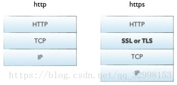
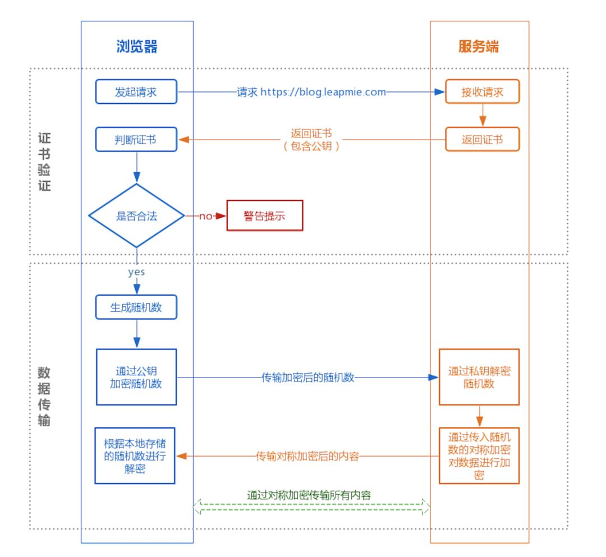

# HTTP与HTTPS

参考：https://mp.weixin.qq.com/s/J89dbAobO0tmSyIQZtWd1A

https://blog.csdn.net/qq_32998153/article/details/80022489

## 1、HTTP

超文本传输协议HTTP协议被用于在**Web浏览器和网站服务器之间传递信息**，HTTP协议以明文方式发送内容，不提供任何方式的数据加密。

## 2、HTTPS

### 对称加密

**加密和解密同用一个密钥**

### 非对称加密

公开密钥加密使用一对非对称的密钥。一把叫做**私有密钥**，一把叫做**公开密钥**。私有密钥不能让其他任何人知道，而公开密钥则可以随意发布，任何人都可以获得。使用此加密方式，发送密文的一方使用公开密钥进行加密处理，对方收到被加密的信息后，再使用自己的私有密钥进行解密。利用这种方式，不需要发送用来解密的私有密钥，也不必担心密钥被攻击者窃听盗走。

但由于公开密钥比共享密钥要慢，所以我们就需要综合一下他们两者的优缺点，使他们共同使用，而这也是HTTPS采用的加密方式。**在交换密钥阶段使用公开密钥加密方式，之后建立通信交换报文阶段则使用共享密钥加密方式。**

------

### 原理

**① 证书验证阶段**

1. 浏览器发起 HTTPS 请求
2. 服务端返回 HTTPS 证书
3. 客户端验证证书是否合法，如果不合法则提示告警

**② 数据传输阶段**

1. 当证书验证合法后，在本地生成随机数
2. 通过公钥加密随机数，并把加密后的随机数传输到服务端
3. 服务端通过私钥对随机数进行解密
4. 服务端通过客户端传入的随机数构造对称加密算法，对返回结果内容进行加密后传输

------

### 为什么数据传输是用对称加密？

- 非对称加密的加解密==效率是非常低==的，而 http 的应用场景中通常端与端之间存在大量的交互，非对称加密的效率是无法接受的；

- 在 HTTPS 的场景中只有服务端保存了私钥，==一对公私钥只能实现单向的加解密==，所以 HTTPS 中内容传输加密采取的是对称加密，而不是非对称加密。