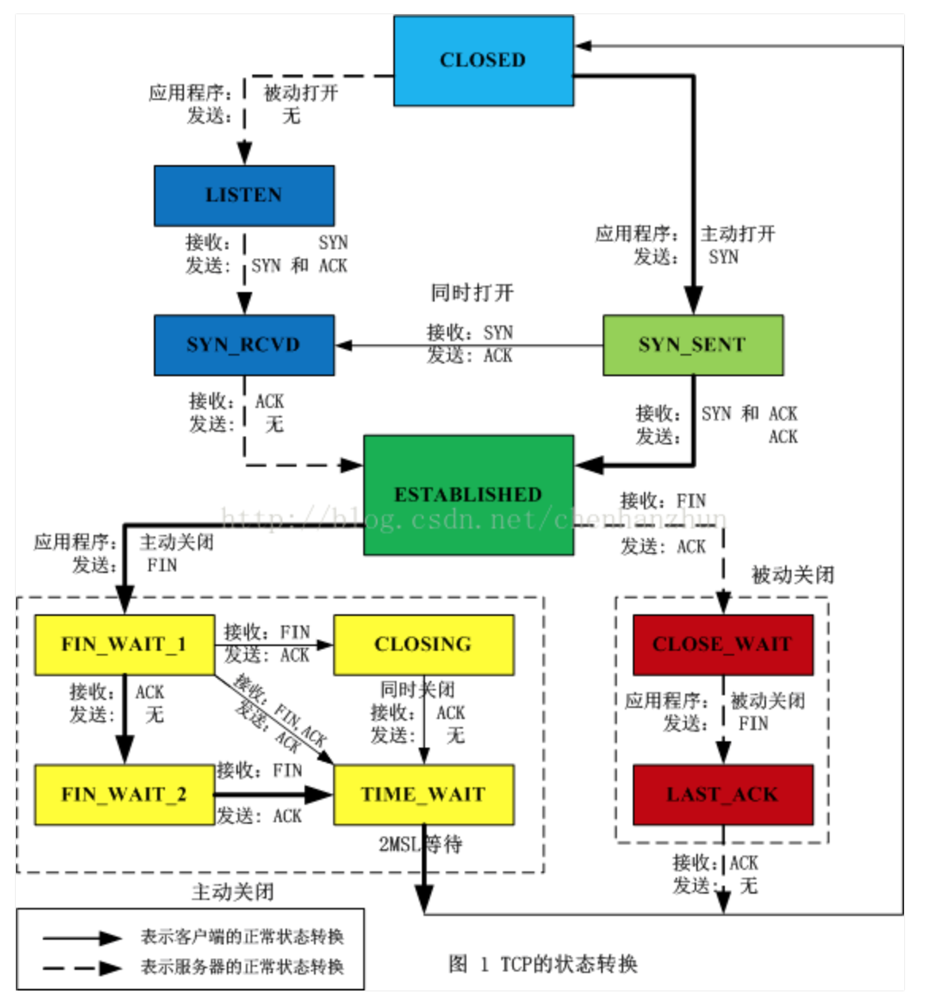
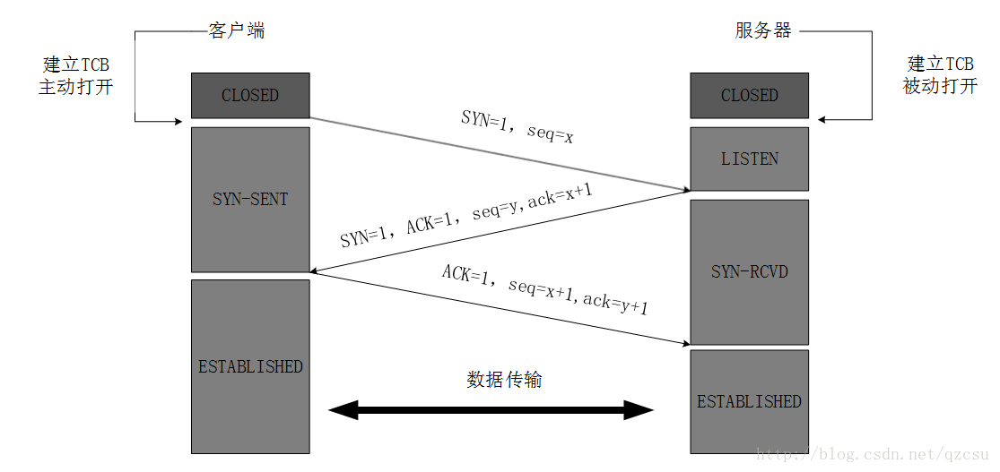
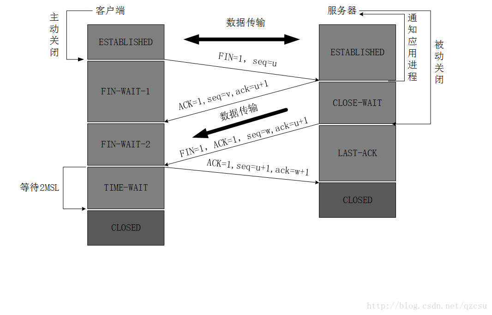

## tcp握手和挥手

参考：[https://snailclimb.gitee.io/javaguide/#/docs/network/%E8%AE%A1%E7%AE%97%E6%9C%BA%E7%BD%91%E7%BB%9C](https://snailclimb.gitee.io/javaguide/#/docs/network/计算机网络)

https://blog.csdn.net/qzcsu/article/details/72861891

## 0、TCP状态机

------

## 1、三次握手建立连接

### 为什么要三次握手？

**三次握手的目的是建立可靠的通信信道，说到通讯，简单来说就是数据的发送与接收，而三次握手最主要的目的就是双方确认自己与对方的发送与接收是正常的。**

**第一次握手：Client 什么都不能确认；Server 确认了==对方发送正常，自己接收正常==**

**第二次握手：Client 确认了：自己发送、接收正常，对方发送、接收正常；Server 确认了：==对方发送正常，自己接收正常==**

**第三次握手：Client 确认了：自己发送、接收正常，对方发送、接收正常；Server 确认了：==自己发送、接收正常，对方发送、接收正常==**

**所以三次握手就能确认双发收发功能都正常，缺一不可。**

> **若TCP三次握手第三次握手时ACK丢失怎么办？**
>
> ​	**当Client端收到Server的SYN+ACK应答后，其状态变为ESTABLISHED，并发送ACK包给Server；**
>
> ​	**如果此时ACK在网络中丢失，那么Server端该TCP连接的状态为SYN_RECV，并且依次等待3秒、6秒、12秒后重新发送SYN+ACK包，以便Client重新发送ACK包。** 	

------

## 2、四次挥手断开连接

断开一个 TCP 连接则需要“四次挥手”：

- 客户端-发送一个 FIN，用来关闭客户端到服务器的数据传送
- 服务器-收到这个 FIN，它发回一 个 ACK，确认序号为收到的序号加1 。和 SYN 一样，一个 FIN 将占用一个序号
- 服务器-关闭与客户端的连接，发送一个FIN给客户端
- 客户端-发回 ACK 报文确认，并将确认序号设置为收到序号加1

------

### 为什么需要四次挥手？

**任何一方都可以在数据传送结束后发出连接释放的通知，待对方确认后进入半关闭状态。当另一方也没有数据再发送的时候，则发出连接释放通知，对方确认后就完全关闭了TCP连接。**

------

### 为什么客户端最后还要等待2MSL？

MSL（Maximum Segment Lifetime），TCP允许不同的实现可以设置不同的MSL值。

- ***保证客户端发送的最后一个ACK报文能够到达服务器***，因为这个ACK报文可能丢失，站在服务器的角度看来，我已经发送了FIN+ACK报文请求断开了，客户端还没有给我回应，应该是我发送的请求断开报文它没有收到，于是服务器又会重新发送一次，而客户端就能在这个2MSL时间段内收到这个重传的报文，接着给出回应报文，并且会重启2MSL计时器。

- 防止类似与“三次握手”中提到了的“已经失效的连接请求报文段”出现在本连接中。客户端发送完最后一个确认报文后，在这个2MSL时间中，就可以使本连接持续的时间内所产生的所有报文段都从网络中消失。这样新的连接中不会出现旧连接的请求报文。

------

### 为什么建立连接是三次握手，关闭连接确是四次挥手呢？

建立连接的时候， 服务器在LISTEN状态下，收到建立连接请求的SYN报文后，把ACK和SYN放在一个报文里发送给客户端。
而关闭连接时，**服务器收到对方的FIN报文时，仅仅表示对方不再发送数据了但是还能接收数据，而自己也未必全部数据都发送给对方了，所以己方可以立即关闭，也可以发送一些数据给对方后，再发送FIN报文给对方来表示同意现在关闭连接，因此，己方ACK和FIN一般都会分开发送，从而导致多了一次。**