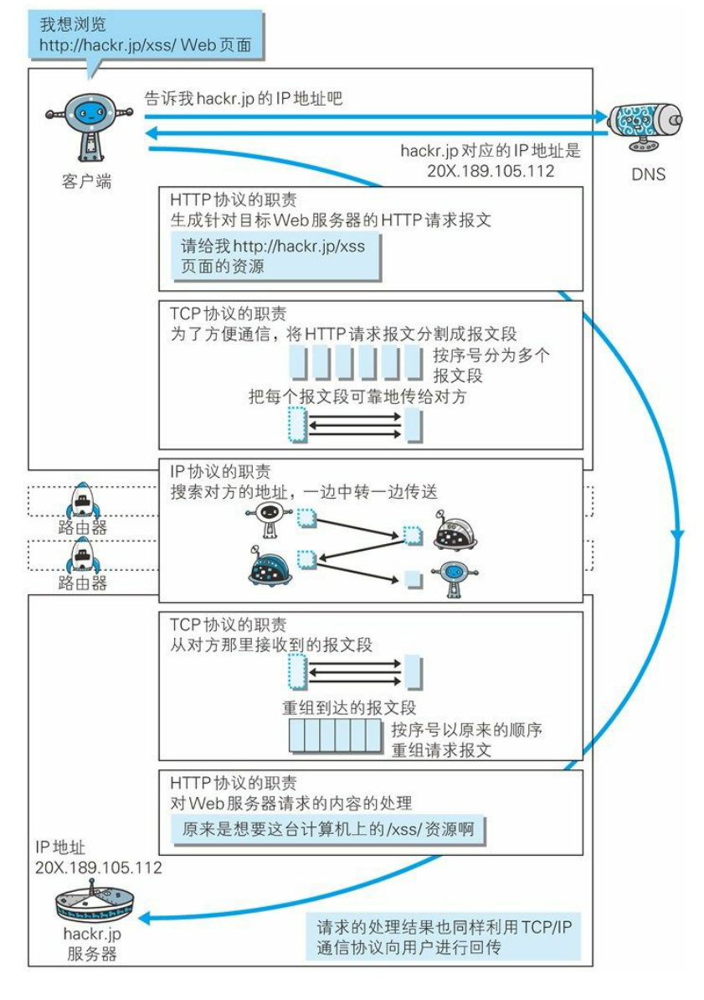

# 常见问题

## 1、在浏览器输入url到显示主页的过程

总体来说分为以下几个过程:

1. **DNS解析**
2. **TCP连接**
3. **发送HTTP请求**
4. **服务器处理请求并返回HTTP报文**
5. **浏览器解析渲染页面**
6. **连接结束**

------

## 2、HTTP 1.0 和1.1

1. **长连接** : **在HTTP/1.0中，默认使用的是短连接**，也就是说每次请求都要重新建立一次连接。HTTP 是基于TCP/IP协议的,每一次建立或者断开连接都需要三次握手四次挥手的开销，如果每次请求都要这样的话，开销会比较大。因此最好能维持一个长连接，可以用个长连接来发多个请求。**HTTP 1.1起，默认使用长连接** ,默认开启Connection： keep-alive。 **HTTP/1.1的持续连接有非流水线方式和流水线方式** 。流水线方式是客户在收到HTTP的响应报文之前就能接着发送新的请求报文。与之相对应的非流水线方式是客户在收到前一个响应后才能发送下一个请求。
2. **错误状态响应码** :在HTTP1.1中新增了24个错误状态响应码，如409（Conflict）表示请求的资源与资源的当前状态发生冲突；410（Gone）表示服务器上的某个资源被永久性的删除。
3. **缓存处理** :在HTTP1.0中主要使用header里的If-Modified-Since,Expires来做为缓存判断的标准，HTTP1.1则引入了更多的缓存控制策略例如Entity tag，If-Unmodified-Since, If-Match, If-None-Match等更多可供选择的缓存头来控制缓存策略。
4. **带宽优化及网络连接的使用** :HTTP1.0中，存在一些浪费带宽的现象，例如客户端只是需要某个对象的一部分，而服务器却将整个对象送过来了，并且不支持断点续传功能，HTTP1.1则在请求头引入了range头域，它允许只请求资源的某个部分，即返回码是206（Partial Content），这样就方便了开发者自由的选择以便于充分利用带宽和连接。

------

## 3、URI和URL区别

- URI(Uniform Resource Identifier) 是统一资源==标志符==，可以唯一标识一个资源。
- URL(Uniform Resource Location) 是统一资源==定位符==，可以提供该资源的路径。它是一种具体的 URI，即 URL 可以用来标识一个资源，而且**还指明了如何 locate 这个资源。**

URI的作用像身份证号一样，URL的作用更像家庭住址一样。URL是一种具体的URI，它不仅唯一标识资源，而且还提供了定位该资源的信息。

## 4、HTTP和HTTPS区别

1. **端口** ：HTTP的URL由“http://”起始且默认使用端口==80==，而HTTPS的URL由“https://”起始且默认使用端口==443==。

2. 安全性和资源消耗：

   **HTTP协议运行在TCP之上，所有传输的内容都是明文，客户端和服务器端都无法验证对方的身份。HTTPS是运行在SSL/TLS之上的HTTP协议，SSL/TLS 运行在TCP之上。**所有传输的内容都经过加密，加密采用对称加密，但对称加密的密钥用服务器方的证书进行了非对称加密。所以说，HTTP 安全性没有 HTTPS高，但是 HTTPS 比HTTP耗费更多服务器资源。

   - 对称加密：密钥只有一个，加密解密为同一个密码，且加解密速度快，典型的对称加密算法有DES、AES等；
   - 非对称加密：密钥成对出现（且根据公钥无法推知私钥，根据私钥也无法推知公钥），加密解密使用不同密钥（公钥加密需要私钥解密，私钥加密需要公钥解密），相对对称加密速度较慢，典型的非对称加密算法有RSA、DSA等。

------

## 5、状态码

### 常见状态码：

> - **200 - 请求成功**
> - **301 - 资源（网页等）被永久转移到其它URL**
> - **404 - 请求的资源（网页等）不存在**
> - **500 - 内部服务器错误**

------

### 状态码分类：

| 分类 | 分类描述                                       |
| :--- | :--------------------------------------------- |
| 1**  | 信息，服务器收到请求，需要请求者继续执行操作   |
| 2**  | 成功，操作被成功接收并处理                     |
| 3**  | 重定向，需要进一步的操作以完成请求             |
| 4**  | 客户端错误，请求包含语法错误或无法完成请求     |
| 5**  | 服务器错误，服务器在处理请求的过程中发生了错误 |

------

### 更多状态码：

| 状态码 | 状态码英文名称                  | 中文描述                                                     |
| :----- | :------------------------------ | :----------------------------------------------------------- |
| 100    | Continue                        | 继续。客户端应继续其请求                                     |
| 101    | Switching Protocols             | 切换协议。服务器根据客户端的请求切换协议。只能切换到更高级的协议，例如，切换到HTTP的新版本协议 |
|        |                                 |                                                              |
| 200    | OK                              | 请求成功。一般用于GET与POST请求                              |
| 201    | Created                         | 已创建。成功请求并创建了新的资源                             |
| 202    | Accepted                        | 已接受。已经接受请求，但未处理完成                           |
| 203    | Non-Authoritative Information   | 非授权信息。请求成功。但返回的meta信息不在原始的服务器，而是一个副本 |
| 204    | No Content                      | 无内容。服务器成功处理，但未返回内容。在未更新网页的情况下，可确保浏览器继续显示当前文档 |
| 205    | Reset Content                   | 重置内容。服务器处理成功，用户终端（例如：浏览器）应重置文档视图。可通过此返回码清除浏览器的表单域 |
| 206    | Partial Content                 | 部分内容。服务器成功处理了部分GET请求                        |
|        |                                 |                                                              |
| 300    | Multiple Choices                | 多种选择。请求的资源可包括多个位置，相应可返回一个资源特征与地址的列表用于用户终端（例如：浏览器）选择 |
| 301    | Moved Permanently               | 永久移动。请求的资源已被永久的移动到新URI，返回信息会包括新的URI，浏览器会自动定向到新URI。今后任何新的请求都应使用新的URI代替 |
| 302    | Found                           | 临时移动。与301类似。但资源只是临时被移动。客户端应继续使用原有URI |
| 303    | See Other                       | 查看其它地址。与301类似。使用GET和POST请求查看               |
| 304    | Not Modified                    | 未修改。所请求的资源未修改，服务器返回此状态码时，不会返回任何资源。客户端通常会缓存访问过的资源，通过提供一个头信息指出客户端希望只返回在指定日期之后修改的资源 |
| 305    | Use Proxy                       | 使用代理。所请求的资源必须通过代理访问                       |
| 306    | Unused                          | 已经被废弃的HTTP状态码                                       |
| 307    | Temporary Redirect              | 临时重定向。与302类似。使用GET请求重定向                     |
|        |                                 |                                                              |
| 400    | Bad Request                     | 客户端请求的语法错误，服务器无法理解                         |
| 401    | Unauthorized                    | 请求要求用户的身份认证                                       |
| 402    | Payment Required                | 保留，将来使用                                               |
| 403    | Forbidden                       | 服务器理解请求客户端的请求，但是拒绝执行此请求               |
| 404    | Not Found                       | 服务器无法根据客户端的请求找到资源（网页）。通过此代码，网站设计人员可设置"您所请求的资源无法找到"的个性页面 |
| 405    | Method Not Allowed              | 客户端请求中的方法被禁止                                     |
| 406    | Not Acceptable                  | 服务器无法根据客户端请求的内容特性完成请求                   |
| 407    | Proxy Authentication Required   | 请求要求代理的身份认证，与401类似，但请求者应当使用代理进行授权 |
| 408    | Request Time-out                | 服务器等待客户端发送的请求时间过长，超时                     |
| 409    | Conflict                        | 服务器完成客户端的 PUT 请求时可能返回此代码，服务器处理请求时发生了冲突 |
| 410    | Gone                            | 客户端请求的资源已经不存在。410不同于404，如果资源以前有现在被永久删除了可使用410代码，网站设计人员可通过301代码指定资源的新位置 |
| 411    | Length Required                 | 服务器无法处理客户端发送的不带Content-Length的请求信息       |
| 412    | Precondition Failed             | 客户端请求信息的先决条件错误                                 |
| 413    | Request Entity Too Large        | 由于请求的实体过大，服务器无法处理，因此拒绝请求。为防止客户端的连续请求，服务器可能会关闭连接。如果只是服务器暂时无法处理，则会包含一个Retry-After的响应信息 |
| 414    | Request-URI Too Large           | 请求的URI过长（URI通常为网址），服务器无法处理               |
| 415    | Unsupported Media Type          | 服务器无法处理请求附带的媒体格式                             |
| 416    | Requested range not satisfiable | 客户端请求的范围无效                                         |
| 417    | Expectation Failed              | 服务器无法满足Expect的请求头信息                             |
|        |                                 |                                                              |
| 500    | Internal Server Error           | 服务器内部错误，无法完成请求                                 |
| 501    | Not Implemented                 | 服务器不支持请求的功能，无法完成请求                         |
| 502    | Bad Gateway                     | 作为网关或者代理工作的服务器尝试执行请求时，从远程服务器接收到了一个无效的响应 |
| 503    | Service Unavailable             | 由于超载或系统维护，服务器暂时的无法处理客户端的请求。延时的长度可包含在服务器的Retry-After头信息中 |
| 504    | Gateway Time-out                | 充当网关或代理的服务器，未及时从远端服务器获取请求           |
| 505    | HTTP Version not supported      | 服务器不支持请求的HTTP协议的版本，无法完成处理               |