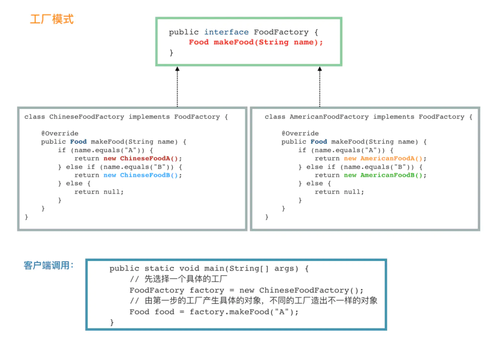
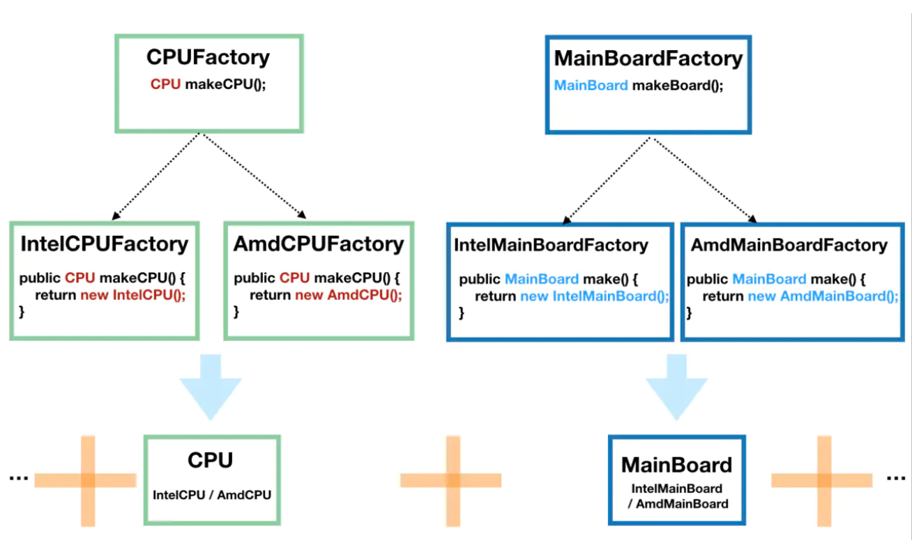
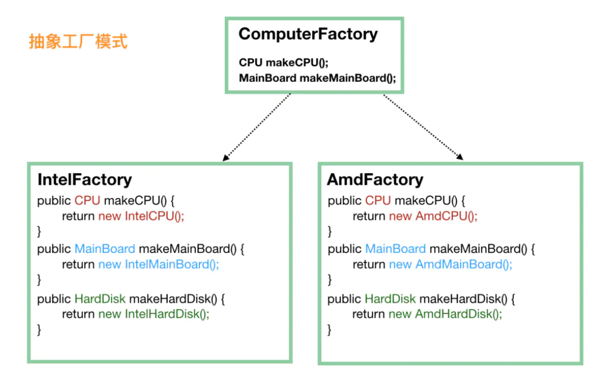
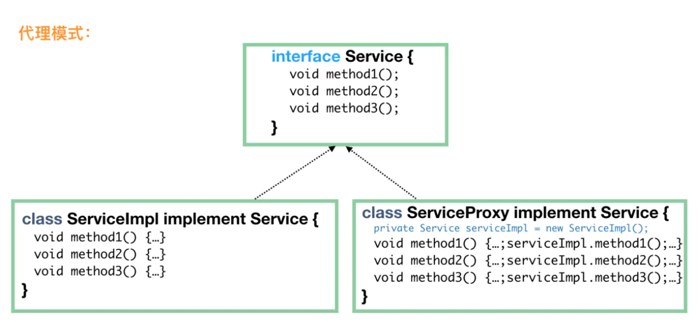
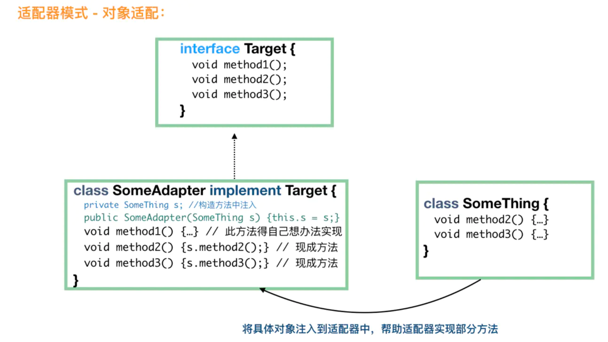
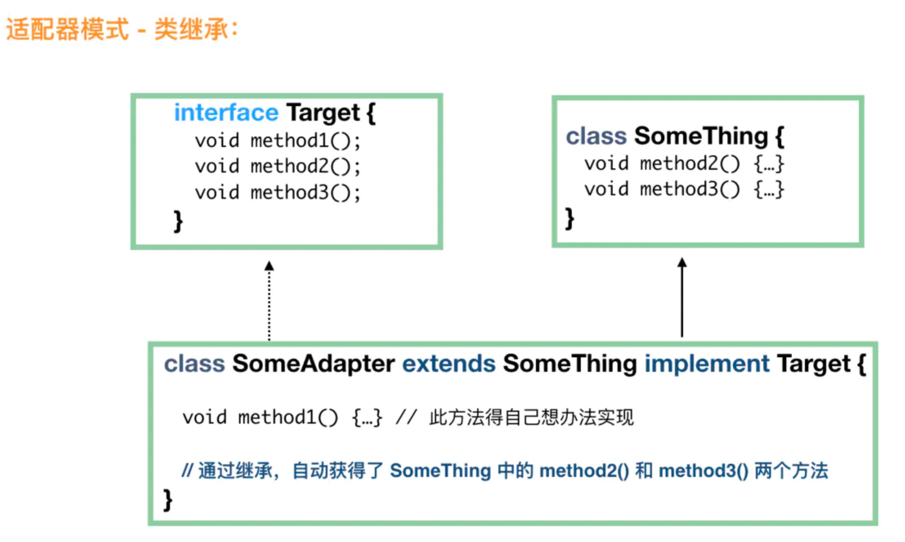
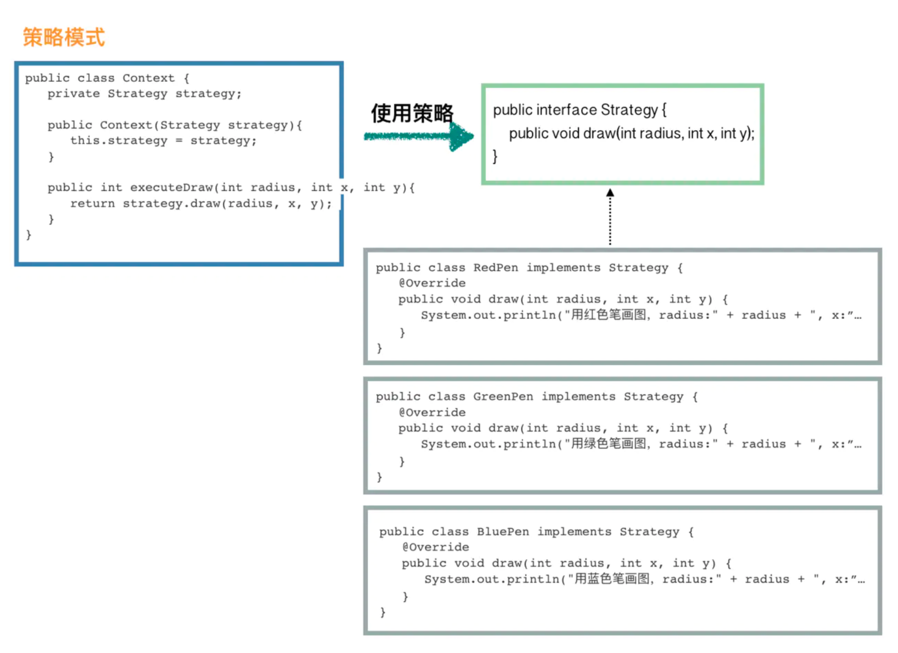

# 设计模式

参考：https://juejin.im/post/5bc96afff265da0aa94a4493#heading-20

## &sect; 创建型模式

> 给客户端提供更加友好的创建对象的方式

------


### &sect; 简单工厂模式

> ==只有一个工厂==

```java
public class FoodFactory {
  // 传入一个名称
    public static Food makeFood(String name) {
      	// 其中，LanZhouNoodle 和 HuangMenChicken 都继承自 Food。
        if (name.equals("noodle")) {
            Food noodle = new LanZhouNoodle();
            noodle.addSpicy("more");
            return noodle;
        } else if (name.equals("chicken")) {
            Food chicken = new HuangMenChicken();
            chicken.addCondiment("potato");
            return chicken;
        } else {
            return null;
        }
    }
}
```

简单地说，简单工厂模式通常就是这样，<font color='red'>***一个工厂类 XxxFactory，里面有一个静态方法，根据我们不同的参数，返回不同的派生自同一个父类（或实现同一接口）的实例对象。***</font>

> 我们强调**职责单一**原则，一个类只提供一种功能，FoodFactory 的功能就是只要负责生产各种 Food。

------

### &sect; 工厂模式

简单工厂模式很简单，如果它能满足我们的需要，我觉得就不要折腾了。之所以需要引入工厂模式，是因为我们==往往需要使用两个或两个以上的工厂。==

```java
// 接口
public interface FoodFactory {
    Food makeFood(String name);
}
public class ChineseFoodFactory implements FoodFactory {

    @Override
    public Food makeFood(String name) {
        if (name.equals("A")) {
            return new ChineseFoodA();
        } else if (name.equals("B")) {
            return new ChineseFoodB();
        } else {
            return null;
        }
    }
}
public class AmericanFoodFactory implements FoodFactory {

    @Override
    public Food makeFood(String name) {
        if (name.equals("A")) {
            return new AmericanFoodA();
        } else if (name.equals("B")) {
            return new AmericanFoodB();
        } else {
            return null;
        }
    }
}
```

客户端调用：

```java
public class APP {
    public static void main(String[] args) {
        // 先选择一个具体的工厂
        FoodFactory factory = new ChineseFoodFactory();
        // 由第一步的工厂产生具体的对象，不同的工厂造出不一样的对象
        Food food = factory.makeFood("A");
    }
}
```

> *<font color='red'>**核心在于，我们需要在第一步选好我们需要的工厂**</font>*。比如，==**我们有 LogFactory 接口，实现类有 FileLogFactory 和 KafkaLogFactory，分别对应将日志写入文件和写入 Kafka 中，显然，我们客户端第一步就需要决定到底要实例化 FileLogFactory 还是 KafkaLogFactory，这将决定之后的所有的操作。**==



------

### &sect; 抽象工厂模式

当涉及到==**产品族**==的时候，就需要引入抽象工厂模式了。

一个经典的例子是造一台电脑。我们先不引入抽象工厂模式，看看怎么实现。

因为电脑是由许多的构件组成的，我们将 CPU 和主板进行抽象，然后 CPU 由 CPUFactory 生产，主板由 MainBoardFactory 生产，然后，我们再将 CPU 和主板搭配起来组合在一起，如下图：




------

这个时候的客户端调用是这样的：

```java
// 得到 Intel 的 CPU
CPUFactory cpuFactory = new IntelCPUFactory();
CPU cpu = intelCPUFactory.makeCPU();

// 得到 AMD 的主板
MainBoardFactory mainBoardFactory = new AmdMainBoardFactory();
MainBoard mainBoard = mainBoardFactory.make();

// 组装 CPU 和主板
Computer computer = new Computer(cpu, mainBoard);
复制代码
```

> ==单独看 CPU 工厂和主板工厂，它们分别是前面我们说的**工厂模式**==。<font color='red'>***这种方式也容易扩展，因为要给电脑加硬盘的话，只需要加一个 HardDiskFactory 和相应的实现即可，不需要修改现有的工厂。***</font>

但是，这种方式有一个问题，==那就是如果 **Intel 家产的 CPU 和 AMD 产的主板不能兼容使用**，那么这代码就容易出错，因为客户端并不知道它们不兼容，也就会错误地出现随意组合。==

当涉及到这种产品族的问题的时候，就需要抽象工厂模式来支持了。我们不再定义 CPU 工厂、主板工厂、硬盘工厂、显示屏工厂等等，==我们直接定义电脑工厂，每个电脑工厂负责生产所有的设备，这样能保证肯定不存在兼容问题。==

------



------

这个时候，对于客户端来说，不再需要单独挑选 CPU厂商、主板厂商、硬盘厂商等，==直接选择一家品牌工厂，品牌工厂会负责生产所有的东西，而且能保证肯定是兼容可用的。==

```java
public static void main(String[] args) {
    // 第一步就要选定一个“大厂”
    ComputerFactory cf = new AmdFactory();
    // 从这个大厂造 CPU
    CPU cpu = cf.makeCPU();
    // 从这个大厂造主板
    MainBoard board = cf.makeMainBoard();
      // 从这个大厂造硬盘
      HardDisk hardDisk = cf.makeHardDisk();

    // 将同一个厂子出来的 CPU、主板、硬盘组装在一起
    Computer result = new Computer(cpu, board, hardDisk);
}
复制代码
```

>  当然，抽象工厂的问题也是显而易见的，<font color='red'>***比如我们要加个显示器，就需要修改所有的工厂，给所有的工厂都加上制造显示器的方法。这有点==违反了对修改关闭，对扩展开放这个设计原则。==***</font>

------


### &sect; ==单例模式==

#### &sect; 饿汉模式

```java
public class Singleton {
    // 首先，将 new Singleton() 堵死
    private Singleton() {};
    // 创建私有静态实例，意味着这个类第一次使用的时候就会进行创建
    private static Singleton instance = new Singleton();

    public static Singleton getInstance() {
        return instance;
    }
    // 瞎写一个静态方法。这里想说的是，如果我们只是要调用 Singleton.getDate(...)，
    // 本来是不想要生成 Singleton 实例的，不过没办法，已经生成了
    public static Date getDate(String mode) {return new Date();}
}
```

> <font color='red'>***缺点：提前生成了一个单例对象，但其实如果调用类中静态方法的话是无需实例化对象的，一定程度上有点浪费。***</font>

------

#### &sect; 饱汉模式

> ==***双重锁校验***==

```java
public class Singleton {
    // 首先，也是先堵死 new Singleton() 这条路
    private Singleton() {}
    // 和饿汉模式相比，这边不需要先实例化出来，注意这里的 volatile，它是必须的
    private static volatile Singleton instance = null;

    public static Singleton getInstance() {
        if (instance == null) {
            // 加锁
            synchronized (Singleton.class) {
                // 这一次判断也是必须的，不然会有并发问题
                if (instance == null) {
                    instance = new Singleton();
                }
            }
        }
        return instance;
    }
}
```

------

#### &sect; 嵌套类

```java
public class Singleton3 {

    private Singleton3() {}
    // 主要是使用了 嵌套类可以访问外部类的静态属性和静态方法的特性
    private static class Holder {
        private static Singleton3 instance = new Singleton3();
    }
    public static Singleton3 getInstance() {
        return Holder.instance;
    }
}
```

> <font color='red'>***避免了饿汉的缺点，当使用外部类的静态方法时，并不会触发实例的创建***</font>

------

#### &sect; 单例的破坏(反序列化与反射)

前文介绍过，我们实现的单例，==***把构造方法设置为私有方法来避免外部调***==用是很重要的一个前提。但是，私有的构造方法外部真的就完全不能调用了么？

> 其实不是的，<font color='red'>***我们是可以通过反射来调用类中的私有方法的***</font>，构造方法也不例外，所以，==**我们可以通过反射来破坏单例。**==

> 除了这种情况，还有一种比较容易被忽视的情况，那就是其实<font color='red'>**对象的序列化和反序列化也会破坏单例。如使用ObjectInputStream进行反序列化时，在ObjectInputStream的readObject生成对象的过程中，其实会通过反射的方式调用无参构造方法新建一个对象。**</font>
>
> 所以，在对单例对象进行序列化以及反序列化的时候，一定要考虑到这种单例可能被破坏的情况。
>
> ==**可以通过在Singleton类中定义readResolve的方式**==，解决该问题：
>
> ```java
> /**
>  * 使用双重校验锁方式实现单例
>  */
> public class Singleton implements Serializable{
>     private volatile static Singleton singleton;
>     private Singleton (){}
>     public static Singleton getSingleton() {
>         if (singleton == null) {
>             synchronized (Singleton.class) {
>                 if (singleton == null) {
>                     singleton = new Singleton();
>                 }
>             }
>         }
>         return singleton;
>     }
> 
>     private Object readResolve() {
>         return singleton;
>     }
> } 
> ```


------


#### &sect; 枚举实现

<font color='red'>**枚举可解决反序列化会破坏单例的问题**</font>

```java
public enum Singleton {  
    INSTANCE;  
    public void whateverMethod() {  
    }  
}  
```


------

### &sect; 建造者模式

经常碰见的==XxxBuilder 的类==，通常都是建造者模式的产物。建造者模式其实有很多的变种，但是对于客户端来说，我们的使用通常都是一个模式的：

```java
Food food = new FoodBuilder().a().b().c().build();
Food food = Food.builder().a().b().c().build();
```

<font color='red'>**套路就是先 new 一个 Builder，然后可以链式地调用一堆方法，最后再调用一次 build() 方法，我们需要的对象就有了。**</font>

来一个中规中矩的建造者模式：

```java
class User {
    // 下面是“一堆”的属性
    private String name;
    private String password;
    private String nickName;
    private int age;

    // 构造方法私有化，不然客户端就会直接调用构造方法了
    private User(String name, String password, String nickName, int age) {
        this.name = name;
        this.password = password;
        this.nickName = nickName;
        this.age = age;
    }
    // 静态方法，用于生成一个 Builder，这个不一定要有，不过写这个方法是一个很好的习惯，
    // 有些代码要求别人写 new User.UserBuilder().a()...build() 看上去就没那么好
    public static UserBuilder builder() {
        return new UserBuilder();
    }

    public static class UserBuilder {
        // 下面是和 User 一模一样的一堆属性
        private String  name;
        private String password;
        private String nickName;
        private int age;

        private UserBuilder() {
        }

        // 链式调用设置各个属性值，返回 this，即 UserBuilder
        public UserBuilder name(String name) {
            this.name = name;
            return this;
        }

        public UserBuilder password(String password) {
            this.password = password;
            return this;
        }

        public UserBuilder nickName(String nickName) {
            this.nickName = nickName;
            return this;
        }

        public UserBuilder age(int age) {
            this.age = age;
            return this;
        }

        // build() 方法负责将 UserBuilder 中设置好的属性“复制”到 User 中。
        // 当然，可以在 “复制” 之前做点检验
        public User build() {
            if (name == null || password == null) {
                throw new RuntimeException("用户名和密码必填");
            }
            if (age <= 0 || age >= 150) {
                throw new RuntimeException("年龄不合法");
            }
            // 还可以做赋予”默认值“的功能
              if (nickName == null) {
                nickName = name;
            }
            return new User(name, password, nickName, age);
        }
    }
}
```

------

核心是：<font color='red'>**先把所有的属性都设置给 Builder，然后 build() 方法的时候，将这些属性复制给实际产生的对象。**</font>

看看客户端的调用：

```java
public class APP {
    public static void main(String[] args) {
        User d = User.builder()
                .name("foo")
                .password("pAss12345")
                .age(25)
                .build();
    }
}
复制代码
```

说实话，建造者模式的**链式**写法很吸引人，但是，多写了很多“无用”的 builder 的代码，感觉这个模式没什么用。不过，当属性很多，而且有些必填，有些选填的时候，这个模式会使代码清晰很多。我们可以在 **Builder 的构造方法**中强制让调用者提供必填字段，还有，在 build() 方法中校验各个参数比在 User 的构造方法中校验，代码要优雅一些。

> 题外话，强烈建议读者使用 lombok，用了 lombok 以后，上面的一大堆代码会变成如下这样:

```java
@Builder
class User {
    private String  name;
    private String password;
    private String nickName;
    private int age;
}
复制代码
```

------

### &sect; 原型模式

> 原型模式很简单：有一个原型**实例**，基于这个原型实例产生新的实例，也就是“克隆”了。

------

### &sect; 创建型模式总结

> - 简单工厂模式最简单；
>
> - 工厂模式在简单工厂模式的基础上增加了选择工厂的维度，==需要第一步选择合适的工厂==；
> - 抽象工厂模式有==产品族==的概念，如果各个产品是存在==兼容性问题==的，就要用抽象工厂模式。
> - 单例模式就不说了，为了保证全局使用的是同一对象，==一方面是安全性考虑，一方面是为了节省资源；==
> - 建造者模式专门对付==属性很多的那种类==，为了让代码更优美；
> - 原型模式用得最少，了解和 ==Object 类中的 clone()== 方法相关的知识即可。

------

## &sect; 结构型模式

### &sect; 代理模式



------

> <font color='red'>***核心代码是真实实现类做的，代理只是在核心代码前后做些“无足轻重”的事情***</font>

> 代理模式说白了就是做==**“方法包装”** 或做 **“方法增强”**==。在面向切面编程中，算了还是不要吹捧这个名词了，在 AOP 中，其实就是动态代理的过程。==比如 Spring 中，我们自己不定义代理类，但是 Spring 会帮我们动态来定义代理，然后把我们定义在 @Before、@After、@Around 中的代码逻辑动态添加到代理中。==


------

### &sect; 适配器模式

#### &sect; 默认适配器模式

> - 场景：==**当某接口A的方法太多，而我们只想实现其中少数方法。**==
>
> - 我们需要下面的一个**适配器**的类B，它用于实现上面的接口，但是**所有的方法都是空方法**。
>
> - 这样，我们就可以转而定义自己的类C来继承这个类B，然后重写自己需要实现的方法即可。

------

#### &sect; 对象适配器模式(FutureTask整合Callable和Runnable使用)

> - FutureTask整合Callable和Runnable使用，其中：
>
> - FutureTask实现了Runnable接口，并包含Callable属性；
>
> - FutureTask有两个构造器分别入参对应Runnable和Callable
>
>   - 入参为Callable，直接赋给Callable属性
>
>   - 入参为Runnable，执行
>
>     ```java
>     this.callable = Executors.callable(runnable, result);
>     ```
>
>     <font color='red'>**把 runnable 适配成 RunnableAdapter，RunnableAdapter 实现了 callable，所以也就是把 runnable 直接适配成了 callable。**</font>
>
>     ```java
>     // 转化 Runnable 成 Callable 的工具类
>     static final class RunnableAdapter<T> implements Callable<T> {
>       	// 实现Callable接口，并含有Runnable属性
>         final Runnable task;
>         final T result;
>         RunnableAdapter(Runnable task, T result) {
>             this.task = task;
>             this.result = result;
>         }
>       	// !!!
>         public T call() {
>             task.run(); // 实则调用的是Runnable的run方法
>             return result;
>         }
>     }
>     ```
>
> - FutureTask 两种构造器，最终都转化成了 Callable，所以在 run 方法执行的时候，==***只需要执行 Callable 的 call 方法即可，在执行 c.call() 代码时，如果入参是 Runnable 的话， 调用路径为 c.call() -> RunnableAdapter.call() -> Runnable.run()，如果入参是 Callable 的话，直接调用。***==

------

怎么将鸡适配成鸭，这样鸡也能当鸭来用。因为，现在鸭这个接口，我们没有合适的实现类可以用，所以需要适配器。

```java
public interface Duck {
    public void quack(); // 鸭的呱呱叫
      public void fly(); // 飞
}

public interface Cock {
    public void gobble(); // 鸡的咕咕叫
      public void fly(); // 飞
}

public class WildCock implements Cock {
    public void gobble() {
        System.out.println("咕咕叫");
    }
      public void fly() {
        System.out.println("鸡也会飞哦");
    }
}
```

> 鸭接口有 fly() 和 quare() 两个方法，==鸡 Cock 如果要冒充鸭，fly() 方法是现成的，但是鸡不会鸭的呱呱叫，没有 quack() 方法。这个时候就需要适配了==：

```java
// 毫无疑问，首先，这个适配器肯定需要 implements Duck，这样才能当做鸭来用
public class CockAdapter implements Duck {
    Cock cock;
    // 构造方法中需要一个鸡的实例，此类就是将这只鸡适配成鸭来用
      public CockAdapter(Cock cock) {
        this.cock = cock;
    }
    // 实现鸭的呱呱叫方法
      @Override
      public void quack() {
        // 内部其实是一只鸡的咕咕叫
        cock.gobble();
    }
      @Override
      public void fly() {
        cock.fly();
    }
}
```

客户端调用很简单了：

```java
public static void main(String[] args) {
    // 有一只野鸡
      Cock wildCock = new WildCock();
      // 成功将野鸡适配成鸭
      Duck duck = new CockAdapter(wildCock);
      ...
}
```

> 到这里，大家也就知道了适配器模式是怎么回事了。<font color='red'>***无非是我们需要一只鸭，但是我们只有一只鸡，这个时候就需要定义一个适配器，由这个适配器来充当鸭，==但适配器里面的方法还是由鸡来实现的。==***</font>

------



------

#### &sect; 类适配器模式



> 看到这个图，大家应该很容易理解的吧，==通过继承的方法，适配器自动获得了所需要的大部分方法。这个时候，客户端使用更加简单，直接 `Target t = new SomeAdapter();` 就可以了。==

------

#### &sect; 适配器模式总结

类适配和对象适配的异同

> 一个采用继承，一个采用组合；
>
> 类适配属于静态实现，对象适配属于组合的动态实现，对象适配需要多实例化一个对象。
>
> 总体来说，==对象适配用得比较多。==

------

适配器模式和代理模式的异同

<font color='red'>***比较这两种模式，其实是比较对象适配器模式和代理模式，在代码结构上，它们很相似，都需要一个具体的实现类的实例。但是它们的目的不一样，代理模式做的是增强原方法的活；适配器做的是适配的活，为的是提供“把鸡包装成鸭，然后当做鸭来使用”，而鸡和鸭它们之间原本没有继承关系。***</font>

------

### &sect; 结构型模式总结

> - 代理模式是做方法增强的
> - 适配器模式是把鸡包装成鸭这种用来适配接口的，
> - 桥梁模式做到了很好的解耦，
> - 装饰模式从名字上就看得出来，适合于装饰类或者说是增强类的场景，
> - 门面模式的优点是客户端不需要关心==实例化过程==，只要调用需要的方法即可，
> - 组合模式用于描述具有层次结构的数据，
> - 享元模式是为了在特定的场景中缓存已经创建的对象，用于提高性能。

------


## &sect; 行为型模式

### &sect; 策略模式

> 类似桥梁模式



------

### &sect; 观察者模式

观察者模式对于我们来说，真是再简单不过了。无外乎两个操作，

> ==**观察者订阅自己关心的主题和主题有数据变化后通知观察者们。**==

首先，==需要定义主题，每个主题需要持有观察者列表的引用，用于在数据变更的时候通知各个观察者：==

```java
public class Subject {

   // 观察者列表
   private List<Observer> observers = new ArrayList<Observer>();
   private int state;

   public int getState() {
      return state;
   }

   public void setState(int state) {
      this.state = state;
      // 数据已变更，通知观察者们
      notifyAllObservers();
   }

   public void attach(Observer observer){
      observers.add(observer);        
   }

   // 通知观察者们
   public void notifyAllObservers(){
      for (Observer observer : observers) {
         observer.update();
      }
   }     
}
```

定义观察者接口：

```java
public abstract class Observer {
   protected Subject subject;
   public abstract void update();
}
```

> ==其实如果只有一个观察者类的话，接口都不用定义了，不过，通常场景下，既然用到了观察者模式，我们就是希望一个事件出来了，会有多个不同的类需要处理相应的信息。比如，订单修改成功事件，我们希望发短信的类得到通知、发邮件的类得到通知、处理物流信息的类得到通知等。==

我们来定义具体的几个观察者类：

```java
public class BinaryObserver extends Observer {

      // 在构造方法中进行订阅主题
    public BinaryObserver(Subject subject) {
        this.subject = subject;
        // 通常在构造方法中将 this 发布出去的操作一定要小心
        this.subject.attach(this);
    }

      // 该方法由主题类在数据变更的时候进行调用
    @Override
    public void update() {
        String result = Integer.toBinaryString(subject.getState());
        System.out.println("订阅的数据发生变化，新的数据处理为二进制值为：" + result);
    }
}

public class HexaObserver extends Observer {

    public HexaObserver(Subject subject) {
        this.subject = subject;
        this.subject.attach(this);
    }

    @Override
    public void update() {
          String result = Integer.toHexString(subject.getState()).toUpperCase();
        System.out.println("订阅的数据发生变化，新的数据处理为十六进制值为：" + result);
    }
}
```

客户端使用也非常简单：

```java
public static void main(String[] args) {
    // 先定义一个主题
      Subject subject1 = new Subject();
      // 定义观察者
      new BinaryObserver(subject1);
      new HexaObserver(subject1);

      // 模拟数据变更，这个时候，观察者们的 update 方法将会被调用
      subject.setState(11);
}
```

output:

```
订阅的数据发生变化，新的数据处理为二进制值为：1011
订阅的数据发生变化，新的数据处理为十六进制值为：B
```

> ==实际生产过程中，观察者模式往往用消息中间件来实现==，如果要实现单机观察者模式，笔者建议读者使用 Guava 中的 EventBus，它有同步实现也有异步实现，本文主要介绍设计模式，就不展开说了。

------

### &sect; 责任链模式

> <font color='red'>***责任链通常需要先建立一个单向链表，然后调用方只需要调用头部节点就可以了，后面会自动流转下去。***</font>比如流程审批就是一个很好的例子，只要终端用户提交申请，根据申请的内容信息，自动建立一条责任链，然后就可以开始流转了。

有这么一个场景，用户参加一个活动可以领取奖品，但是活动需要进行很多的规则校验然后才能放行，比如首先需要校验用户是否是新用户、今日参与人数是否有限额、全场参与人数是否有限额等等。设定的规则都通过后，才能让用户领走奖品。

首先，我们要定义流程上节点的基类：

```java
public abstract class RuleHandler {
      // 后继节点
    protected RuleHandler successor;

    public abstract void apply(Context context);

    public void setSuccessor(RuleHandler successor) {
        this.successor = successor;
    }
    public RuleHandler getSuccessor() {
        return successor;
    }
}
```

接下来，我们需要定义具体的每个节点了。

校验用户是否是新用户：

```java
public class NewUserRuleHandler extends RuleHandler {
    public void apply(Context context) {
        if (context.isNewUser()) {
              // 如果有后继节点的话，传递下去
            if (this.getSuccessor() != null) {
                this.getSuccessor().apply(context);
            }
        } else {
            throw new RuntimeException("该活动仅限新用户参与");
        }
    }
}
```

校验用户所在地区是否可以参与：

```java
public class LocationRuleHandler extends RuleHandler {
    public void apply(Context context) {
        boolean allowed = activityService.isSupportedLocation(context.getLocation);
          if (allowed) {
            if (this.getSuccessor() != null) {
                this.getSuccessor().apply(context);
            }
        } else  {
            throw new RuntimeException("非常抱歉，您所在的地区无法参与本次活动");
        }
    }
}
```

校验奖品是否已领完：

```java
public class LimitRuleHandler extends RuleHandler {
    public void apply(Context context) {
          int remainedTimes = activityService.queryRemainedTimes(context); // 查询剩余奖品
        if (remainedTimes > 0) {
            if (this.getSuccessor() != null) {
                this.getSuccessor().apply(userInfo);
            }
        } else {
            throw new RuntimeException("您来得太晚了，奖品被领完了");
        }
    }
}
```

客户端：

```java
public static void main(String[] args) {
    RuleHandler newUserHandler = new NewUserRuleHandler();
      RuleHandler locationHandler = new LocationRuleHandler();
      RuleHandler limitHandler = new LimitRuleHandler();

      // 假设本次活动仅校验地区和奖品数量，不校验新老用户
  		// 将责任链连起来
      locationHandler.setSuccessor(limitHandler);
      locationHandler.apply(context);
}
```

代码其实很简单，就是先定义好一个链表，然后在通过任意一节点后，如果此节点有后继节点，那么传递下去。

------

### &sect; 模版方法模式

在含有继承结构的代码中，模板方法模式是非常常用的，这也是在开源代码中大量被使用的。

通常会有一个抽象类：

```java
public abstract class AbstractTemplate {
    // 这就是模板方法
      public void templateMethod(){
        init();
        apply(); // 这个是重点
        end(); // 可以作为钩子方法
    }
    protected void init() {
        System.out.println("init 抽象层已经实现，子类也可以选择覆写");
    }
      // 留给子类实现
    protected abstract void apply();
    protected void end() {
    }
}
```

模板方法中调用了 3 个方法，其中 apply() 是抽象方法，子类必须实现它，其实模板方法中有几个抽象方法完全是自由的，我们也可以将三个方法都设置为抽象方法，让子类来实现。也就是说，<font color='red' size=4>***模板方法只负责定义第一步应该要做什么，第二步应该做什么，第三步应该做什么，至于怎么做，由子类来实现。***</font>

我们写一个实现类：

```java
public class ConcreteTemplate extends AbstractTemplate {
    public void apply() {
        System.out.println("子类实现抽象方法 apply");
    }
      public void end() {
        System.out.println("我们可以把 method3 当做钩子方法来使用，需要的时候覆写就可以了");
    }
}
```

客户端调用演示：

```java
public static void main(String[] args) {
    AbstractTemplate t = new ConcreteTemplate();
      // 调用模板方法
      t.templateMethod();
}
```

------


