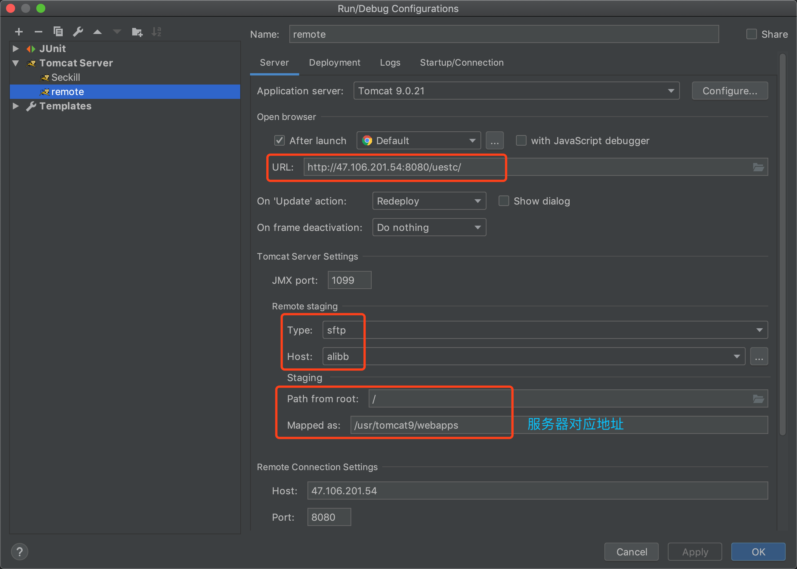
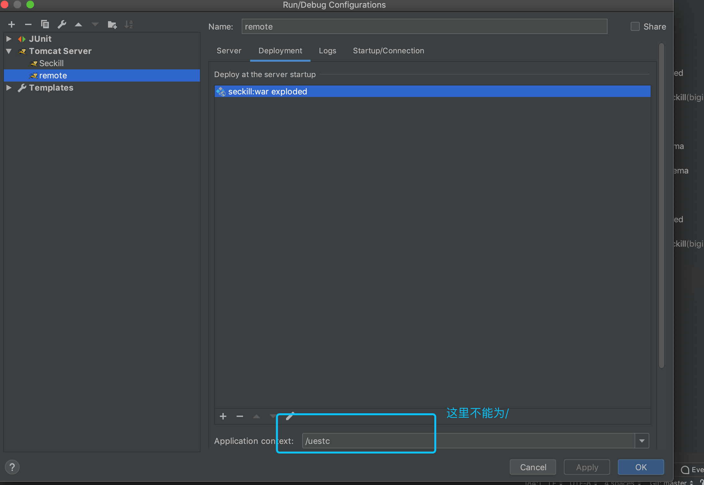
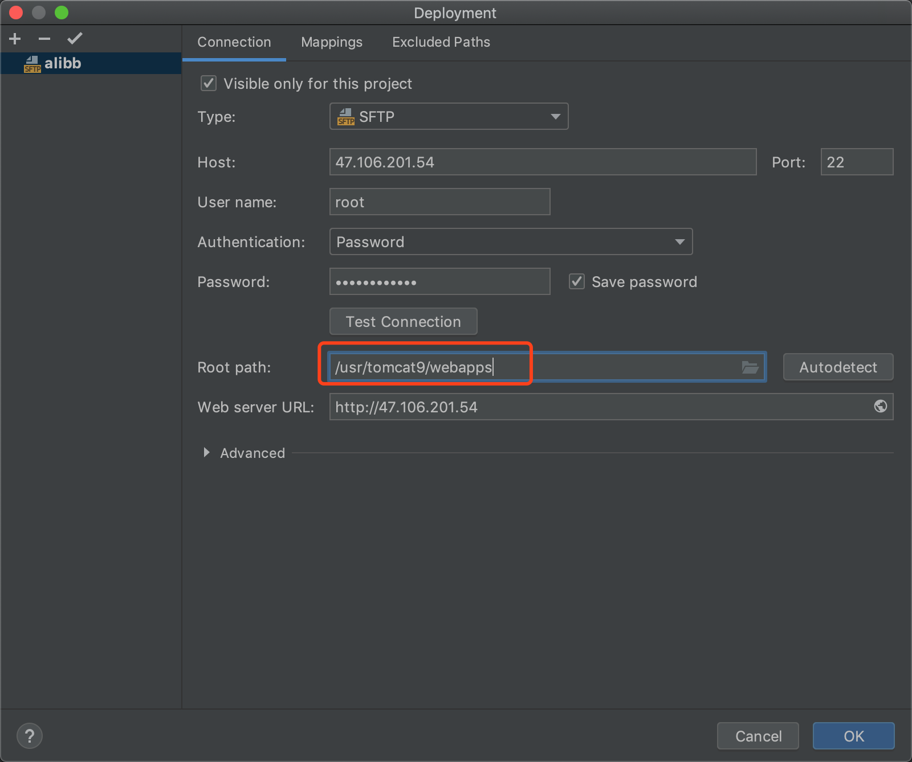

# idea部署maven项目到远程tomcat


## 1、配置服务器端

### 1.1 安装配置java环境

```shell
# 安装java
sudo add-apt-repository ppa:openjdk-r/ppa
sudo apt-get update
sudo apt-get install openjdk-8-jdk

# 给出java路径
sudo update-alternatives --config java  

# 配置java环境变量
vim /etc/profile
# 加入三行
export JAVA_HOME=/usr/local/jdk1.8.0_92  # jdk路径
export CLASSPATH=.:$JAVA_HOME/lib:$CLASSPATH
export PATH=$JAVA_HOME/bin:$PATH
#profile生效
source /etc/profile

#查看环境变量是否配置成功
echo $PATH
```


### 1.2 安装配置mysql8


```shell
# 下载apt存储库软件包
wget -c https://dev.mysql.com/get/mysql-apt-config_0.8.6-1_all.deb
# 将软件包安装到apt存储库
sudo dpkg -i mysql-apt-config_0.8.6-1_all.deb

# 更新apt存储库
sudo apt update
# 【问题】更新apt存储库出现GPG错误时任选一行执行即可，然后重新更新apt存储库
sudo apt-key adv --keyserver keyserver.ubuntu.com --recv-keys 8C718D3B5072E1F5
sudo apt-key adv --keyserver keyserver.ubuntu.com --recv-keys 58712A2291FA4AD5

# 安装mysql8
sudo apt-get install mysql-server

```


### 1.3 mysql8远程连接

进入mysql

执行：

```sql
use mysql;
ALTER USER 'root'@'%' IDENTIFIED BY 'password' ;
```

若无法修改，则直接修改mysql数据库user表中root 的host字段为%


至此，可在idea中配置数据库连接到服务器的mysql了。具体配置方法很简单。


### 1.4 安装配置tomcat9.0.21

```shell
# 进入想要安装tomcat的目录
cd /usr/tomcat
# 下载 路径可从官网复制
sudo wget http://www-us.apache.org/dist/tomcat/tomcat-9/v9.0.12/bin/apache-tomcat-9.0.12.tar.gz
# 解压后即可用
sudo tar xzf apache-tomcat-9.0.12.tar.gz

# 配置环境变量
vim /etc/profile
# 加入三行
export CATALINA_HOME=你的tomcat路径
export CLASSPATH=.:${JAVA_HOME}/lib:${JRE_HOME}/lib:${CATALINA_HOME}/lib
export PATH=${CATALINA_HOME}/bin:$PATH
#生效
source /etc/profile

# 修改tomcat的bin/catalina.sh,写入
JAVA_OPTS="-Dcom.sun.management.jmxremote=  
-Dcom.sun.management.jmxremote.port=1099  
-Dcom.sun.management.jmxremote.rmi.port=1099  
-Dcom.sun.management.jmxremote.ssl=false  
-Dcom.sun.management.jmxremote.authenticate=false  
-Djava.rmi.server.hostname=你的服务器ip地址"    
JAVA_OPTS="$JAVA_OPTS -Xdebug -Xrunjdwp:transport=dt_socket,server=y,suspend=n,address=5005"    
export JAVA_OPTS

# 启动tomcat
catalina start  # 单纯的启动
# 或者 catalina run,该命令可有实时服务器运行日志输出
```


## 2、本地idea配置











## 3、maven配置

要将这段加入pom.xml

```xml
<build>
        <resources>
            <!-- maven项目中src源代码下的xml等资源文件编译进classes文件夹， 注意：如果没有这个，它会自动搜索resources下是否有mapper.xml文件， 
                如果没有就会报org.apache.ibatis.binding.BindingException: Invalid bound statement 
                (not found): com.pet.mapper.PetMapper.selectByPrimaryKey -->                          
                        <!--将java目录下的配置文件编译进classes文件 -->
            <resource>
                <directory>src/main/java</directory>
                <includes>
                    <include>**/*.xml</include>
                    <include>**/*.properties</include>
                </includes>
            </resource>

            <!--将resources目录下的配置文件编译进classes文件 -->
            <resource>
                <directory>src/main/resources</directory>
                <includes>
                    <include>**/*.xml</include>
                    <include>**/*.properties</include>
                </includes>
            </resource>
        </resources>
    </build>
<!--上面的两个resource代表把对应的directory里面的目录设置成源码目录,编译时,这两个目录下的.xml和.properties文件都会被安排到classes目录下-->
```


否则mybatis会报错：

mybatis：org.apache.ibatis.binding.BindingException: Invalid bound statement (not found)

