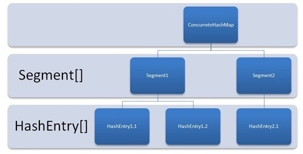
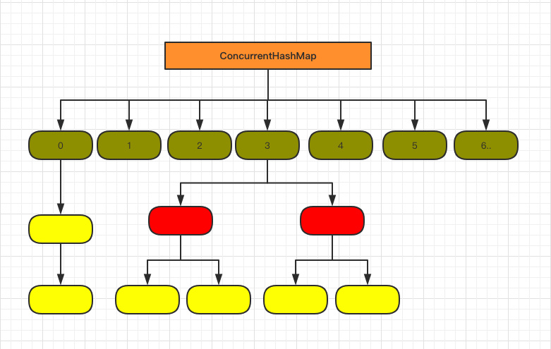

# ConcurrentHashMap

## jdk1.7:



> - **元素封装为HashEntry，同jdk1.7的HashMap**
> - **分段锁+链表**


## jdk1.8

主要有两方面的优化：

> - **<font color='red'>底层由链表 --> 链表 + 红黑树</font>**
>
> - ***<font color='yellow' size=4.5>自旋(while) + CAS + synchronized 实现锁链表头/根节点（不是segment锁了）</font>***
>
> - **元素封装为Node<K,V>，同jdk1.8的HashMap**
>
>   ```java
>   static class Node<K,V> implements Map.Entry<K,V> {
>       final int hash;
>       final K key;
>       volatile V val;
>       volatile Node<K,V> next;
>   ```
>
> - 注意：
>
>   https://mp.weixin.qq.com/s/muiJ2vKK6a68_yCW6XWsVg
>   
>   - **<font color='red'>哈希表是volatile Node<K,V>[]类型，这里的volatile保证的是扩容时对整张哈希表的可见性。</font>**
>   - **<font color='red'>Node<K,V>中的val和next是volatile的，用来保证数组元素的可见性。</font>**

------

保证线程安全的手段：

1. 储存 Map 数据的数组被 volatile 关键字修饰，一旦被修改，立马就能通知其他线程，因为是数组，所以需要改变其内存值，才能真正的发挥出 volatile 的可见特性；
2. put 时，如果计算出来的数组下标索引没有值的话，采用无限 for 循环 + CAS 算法，来保证一定可以新增成功，又不会覆盖其他线程 put 进去的值；
3. 如果 put 的节点正好在扩容，会等待扩容完成之后，再进行 put ，保证了在扩容时，老数组的值不会发生变化；
4. 对数组的槽点进行操作时，会先锁住槽点，保证只有当前线程才能对槽点上的链表或红黑树进行操作；
5. 红黑树旋转时，会锁住根节点，保证旋转时的线程安全。

------




**以下源码以jdk1.8为例**

------


## &sect; put时的线程安全

```java
public V put(K key, V value) {
    return putVal(key, value, false);
}

/** Implementation for put and putIfAbsent */
final V putVal(K key, V value, boolean onlyIfAbsent) {
    if (key == null || value == null) throw new NullPointerException();
    int hash = spread(key.hashCode()); // 计算key的hash值
    int binCount = 0;
    for (Node<K,V>[] tab = table;;) {
        Node<K,V> f; int n, i, fh;
        if (tab == null || (n = tab.length) == 0) // 是否需要初始化哈希表
            tab = initTable();
        else if ((f = tabAt(tab, i = (n - 1) & hash)) == null) {// 查看对应hash位置是否有数据
          // 若当前桶为空，则直接使用CAS自旋写入，直至成功。  
          if (casTabAt(tab, i, null,
                         new Node<K,V>(hash, key, value, null)))
                break;                   // no lock when adding to empty bin
        }
      	// 如果定位出的位置为-1（MOVED == -1）,则等待扩容扩容完成
        else if ((fh = f.hash) == MOVED)
            tab = helpTransfer(tab, f);
      
      // 利用synchronized锁写入数据，类似于hashmap，只是hashmap没有加锁  
      else {
            V oldVal = null;
            synchronized (f) { // 锁住当前桶
                if (tabAt(tab, i) == f) {
                    if (fh >= 0) {
                        binCount = 1;
                        for (Node<K,V> e = f;; ++binCount) {
                            K ek;
                            if (e.hash == hash &&
                                ((ek = e.key) == key ||
                                 (ek != null && key.equals(ek)))) {
                                oldVal = e.val;
                                if (!onlyIfAbsent)
                                    e.val = value;
                                break;
                            }
                            Node<K,V> pred = e;
                            if ((e = e.next) == null) {
                                pred.next = new Node<K,V>(hash, key,
                                                          value, null);
                                break;
                            }
                        }
                    }
                    else if (f instanceof TreeBin) {
                        Node<K,V> p;
                        binCount = 2;
                        if ((p = ((TreeBin<K,V>)f).putTreeVal(hash, key,
                                                       value)) != null) {
                            oldVal = p.val;
                            if (!onlyIfAbsent)
                                p.val = value;
                        }
                    }
                }
            }
            if (binCount != 0) {
                if (binCount >= TREEIFY_THRESHOLD)
                    treeifyBin(tab, i);
                if (oldVal != null)
                    return oldVal;
                break;
            }
        }
    }
    addCount(1L, binCount);
    return null;
}
```


------


## &sect; 初始化时的线程安全：

> ```java
> private final Node<K,V>[] initTable() {
>     Node<K,V>[] tab; int sc;
>    // 通过自旋保证初始化成功
>     while ((tab = table) == null || tab.length == 0) {
>         if ((sc = sizeCtl) < 0)
>           	// 有线程正在初始化，释放当前 CPU 的调度权，重新发起锁的竞争
>             Thread.yield();
>         else if (U.compareAndSwapInt(this, SIZECTL, sc, -1)) { // 设置为-1说明本线程正在初始化。
>             try {
>               	// 很有可能执行到这里的时候，table 已经不为空了，这里是双重 check
>                 if ((tab = table) == null || tab.length == 0) {
>                     int n = (sc > 0) ? sc : DEFAULT_CAPACITY;
>                     @SuppressWarnings("unchecked")
>                     Node<K,V>[] nt = (Node<K,V>[])new Node<?,?>[n];
>                     table = tab = nt;
>                     sc = n - (n >>> 2);
>                 }
>             } finally {
>                 sizeCtl = sc;
>             }
>             break;
>         }
>     }
>     return tab;
> }
> ```
>
> > ***<font color='red' size = 5>注意这里4、11双重check</font>***

------


## &sect; get方法

```java
public V get(Object key) {
    Node<K,V>[] tab; Node<K,V> e, p; int n, eh; K ek;
    int h = spread(key.hashCode());
    if ((tab = table) != null && (n = tab.length) > 0 &&
        (e = tabAt(tab, (n - 1) & h)) != null) {
        if ((eh = e.hash) == h) {
          	// 如果对应位置的桶上元素直接是目标值，则返回
            if ((ek = e.key) == key || (ek != null && key.equals(ek)))
                return e.val;
        }
        else if (eh < 0) // 在树形结构上
            return (p = e.find(h, key)) != null ? p.val : null;
      	// 在链表上
        while ((e = e.next) != null) {
            if (e.hash == h &&
                ((ek = e.key) == key || (ek != null && key.equals(ek))))
                return e.val;
        }
    }
    return null;
}
```


------


## &sect; 扩容时的线程安全(transfer)

***重点就是新老数组间数据的拷贝***

***<font color='red' size=4>核心，拷贝时锁住(保证其他put无法put)，拷贝完一个槽点后设为转移节点(令put自旋等待整个拷贝的完成)</font>***

> 1. 首先需要==把老数组的值全部拷贝到扩容之后的新数组==上，先从数组的队尾开始拷贝；
> 2. 拷贝数组的槽点时，==先把原数组槽点锁住==，保证原数组槽点不能操作，==成功拷贝到新数组时，把原数组槽点赋值为转移节点；==
> 3. 这时如果有新数据正好需要 put 到此槽点时，==发现槽点为转移节点，就会一直自旋==，所以在扩容完成之前，该槽点对应的数据是不会发生变化的；
> 4. 从数组的尾部拷贝到头部，每拷贝成功一次，就把原数组中的节点设置成转移节点；
> 5. ==直到所有数组数据都拷贝到新数组时，直接把新数组整个赋值给数组容器，拷贝完成。==

源码如下：

```java
// 扩容主要分 2 步，第一新建新的空数组，第二移动拷贝每个元素到新数组中去
// tab：原数组，nextTab：新数组
private final void transfer(Node<K,V>[] tab, Node<K,V>[] nextTab) {
    // 老数组的长度
    int n = tab.length, stride;
    if ((stride = (NCPU > 1) ? (n >>> 3) / NCPU : n) < MIN_TRANSFER_STRIDE)
        stride = MIN_TRANSFER_STRIDE; // subdivide range
    // 如果新数组为空，初始化，大小为原数组的两倍，n << 1
    if (nextTab == null) {            // initiating
        try {
            @SuppressWarnings("unchecked")
            Node<K,V>[] nt = (Node<K,V>[])new Node<?,?>[n << 1];
            nextTab = nt;
        } catch (Throwable ex) {      // try to cope with OOME
            sizeCtl = Integer.MAX_VALUE;
            return;
        }
        nextTable = nextTab;
        transferIndex = n;
    }
    // 新数组的长度
    int nextn = nextTab.length;
    // 代表转移节点，如果原数组上是转移节点，说明该节点正在被扩容
    ForwardingNode<K,V> fwd = new ForwardingNode<K,V>(nextTab);
    boolean advance = true;
    boolean finishing = false; // to ensure sweep before committing nextTab
    // 无限自旋，i 的值会从原数组的最大值开始，慢慢递减到 0
    for (int i = 0, bound = 0;;) {
        Node<K,V> f; int fh;
        while (advance) {
            int nextIndex, nextBound;
            // 结束循环的标志
            if (--i >= bound || finishing)
                advance = false;
            // 已经拷贝完成
            else if ((nextIndex = transferIndex) <= 0) {
                i = -1;
                advance = false;
            }
            // 每次减少 i 的值
            else if (U.compareAndSwapInt
                     (this, TRANSFERINDEX, nextIndex,
                      nextBound = (nextIndex > stride ?
                                   nextIndex - stride : 0))) {
                bound = nextBound;
                i = nextIndex - 1;
                advance = false;
            }
        }
        // if 任意条件满足说明拷贝结束了
        if (i < 0 || i >= n || i + n >= nextn) {
            int sc;
            // 拷贝结束，直接赋值，因为每次拷贝完一个节点，都在原数组上放转移节点，所以拷贝完成的节点的数据一定不会再发生变化。
            // 原数组发现是转移节点，是不会操作的，会一直等待转移节点消失之后在进行操作。
            // 也就是说数组节点一旦被标记为转移节点，是不会再发生任何变动的，所以不会有任何线程安全的问题
            // 所以此处直接赋值，没有任何问题。
            if (finishing) {
                nextTable = null;
                table = nextTab;
                sizeCtl = (n << 1) - (n >>> 1);
                return;
            }
            if (U.compareAndSwapInt(this, SIZECTL, sc = sizeCtl, sc - 1)) {
                if ((sc - 2) != resizeStamp(n) << RESIZE_STAMP_SHIFT)
                    return;
                finishing = advance = true;
                i = n; // recheck before commit
            }
        }
        else if ((f = tabAt(tab, i)) == null)
            advance = casTabAt(tab, i, null, fwd);
        else if ((fh = f.hash) == MOVED)
            advance = true; // already processed
        else {
            synchronized (f) {
                // 进行节点的拷贝
                if (tabAt(tab, i) == f) {
                    Node<K,V> ln, hn;
                    if (fh >= 0) {
                        int runBit = fh & n;
                        Node<K,V> lastRun = f;
                        for (Node<K,V> p = f.next; p != null; p = p.next) {
                            int b = p.hash & n;
                            if (b != runBit) {
                                runBit = b;
                                lastRun = p;
                            }
                        }
                        if (runBit == 0) {
                            ln = lastRun;
                            hn = null;
                        }
                        else {
                            hn = lastRun;
                            ln = null;
                        }
                        // 如果节点只有单个数据，直接拷贝，如果是链表，循环多次组成链表拷贝
                        for (Node<K,V> p = f; p != lastRun; p = p.next) {
                            int ph = p.hash; K pk = p.key; V pv = p.val;
                            if ((ph & n) == 0)
                                ln = new Node<K,V>(ph, pk, pv, ln);
                            else
                                hn = new Node<K,V>(ph, pk, pv, hn);
                        }
                        // 在新数组位置上放置拷贝的值
                        setTabAt(nextTab, i, ln);
                        setTabAt(nextTab, i + n, hn);
                        // 在老数组位置上放上 ForwardingNode 节点
                        // put 时，发现是 ForwardingNode 节点，就不会再动这个节点的数据了
                        setTabAt(tab, i, fwd);
                        advance = true;
                    }
                    // 红黑树的拷贝
                    else if (f instanceof TreeBin) {
                        // 红黑树的拷贝工作，同 HashMap 的内容，代码忽略
                        …………
                        // 在老数组位置上放上 ForwardingNode 节点
                        setTabAt(tab, i, fwd);
                        advance = true;
                    }
                }
            }
        }
    }
}
```

------


## &sect; 关于操作volatile数组(哈希表)：

> ```java
> static final <K,V> Node<K,V> tabAt(Node<K,V>[] tab, int i) {
>     return (Node<K,V>)U.getObjectVolatile(tab, ((long)i << ASHIFT) + ABASE);
> }
> ```
>
> **<font color='red'>tab是一个volatile的`Node<K,V>[]`类型数组，ConcurrentHashMap中获取和设置该数组元素都是通过类似方法(`getObjectVolatile`)实现的，而不是直接访问数组元素。可能是因为volatile数组对数组内元素的可见性保证有待商榷，所以需要特殊的操作方法来保证其内部元素的可见性。</font>**

------


## 注意：

**key和value都不能为null**


参考：

https://crossoverjie.top/2018/07/23/java-senior/ConcurrentHashMap/

https://mp.weixin.qq.com/s/r1ErR7EroJt4b83Pm7Xk6g