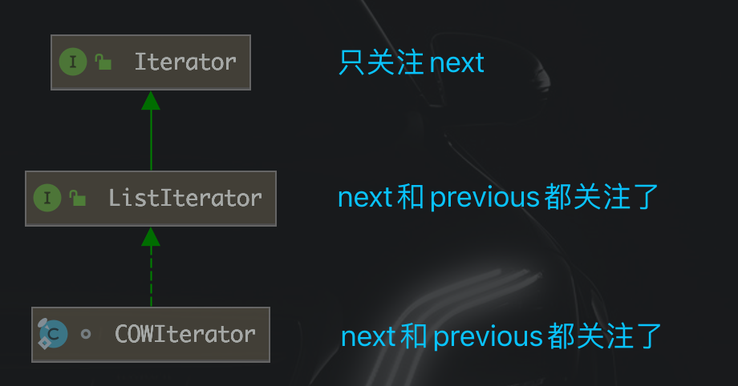

# CopyOnWriteArrayList/Set

参考：https://mp.weixin.qq.com/s/Evw9Ikm83l_6M5x1i-K3Mw


## 0、前言

**新老线程安全类，总结起来就是==粒度==的问题**

- **线程不安全 &rArr; synchronized(大粒度线程安全) &rArr; 优化后(细粒度)线程安全**
- HashMap &rArr; HashTable/==Collections.synchronized==.. &rArr; ConcurrentHashMap
- ArrayList &rArr; Vector/==Collections.synchronized.==. &rArr; CopyOnWriteArrayList

------


- Hashtable、Vector加锁的粒度大(直接在方法声明处使用synchronized)
- ConcurrentHashMap、CopyOnWriteArrayList加锁粒度小(用各种的方式来实现线程安全，比如我们知道的ConcurrentHashMap用了cas锁、volatile等方式来实现线程安全..)
- <font color='red'>**JUC下的线程安全容器在==遍历==的时候不会抛出`ConcurrentModificationException`异常,这里涉及到fail-fast**</font>

------


## 1、CopyOnWrite原理

> 如果有多个调用者（callers）同时请求相同资源（如内存或磁盘上的数据存储），他们会共同获取**相同的指针指向相同的资源**，直到某个调用者**试图修改**资源的内容时，系统才会**真正复制一份专用副本**（private copy）给该调用者，而其他调用者所见到的最初的资源仍然保持不变。**优点**是如果调用者**没有修改该资源，就不会有副本**（private copy）被建立，因此多个调用者只是读取操作时可以**共享同一份资源**。

------


## 2、CopyOnWriteArrayList介绍

### &sect; 特性

> - CopyOnWriteArrayList是线程安全容器(相对于ArrayList)，底层通过<font color='red'>**复制数组**</font>的方式来实现。
> - **<font color='red'>CopyOnWriteArrayList在遍历的使用不会抛出`ConcurrentModificationException`异常，并且遍历的时候就不用额外加锁。而Vector/Collections.synchronizedList遍历时若有其他线程修改了数据，则会报错，因此使用遍历时要额外自己手动加锁。</font>**
> - **元素可以为null**

------


### &sect; 基本结构

> **<font color='#02C874' size=4.5>*Object数组 拷贝 + ReentrantLock + volatile*</font>**

```java
public class CopyOnWriteArrayList<E>
    implements List<E>, RandomAccess, Cloneable, java.io.Serializable {
    private static final long serialVersionUID = 8673264195747942595L;

    /** 由ReentrantLock实现锁 */
    final transient ReentrantLock lock = new ReentrantLock();

    /** 底层由数组实现，volatile修饰，只能通过getArray/setArray操作 */
    private transient volatile Object[] array;

    final Object[] getArray() {
        return array;
    }

    final void setArray(Object[] a) {
        array = a;
    }

    /**
     * 初始化CopyOnWriteArrayList
     */
    public CopyOnWriteArrayList() {
        // 相当于初始化了底层数组
        setArray(new Object[0]);
    }
```


### &sect; 常用方法

#### add

```java
public boolean add(E e) {
    final ReentrantLock lock = this.lock;
    lock.lock();
    try {
        Object[] elements = getArray();
        int len = elements.length;
      	// copy数组，生成副本newElements
        Object[] newElements = Arrays.copyOf(elements, len + 1);
        newElements[len] = e; // 在数组末尾插入元素
        setArray(newElements); // 将array指向新数组newElements
        return true;
    } finally {
        lock.unlock(); // 解锁一定要在finally里，这样无论什么情况都会执行
    }
}
```

> ***<font color='red'>其中10行改变了array，又因为array是volatile的，所以，保证了可见性。所以这一步将array指向新数组是同步的关键。</font>***

------


#### get

```java
public E get(int index) {
  	// 直接return array 不加锁，这里是return的是旧的
    return get(getArray(), index);
}
```


#### set

```java
public E set(int index, E element) {
    final ReentrantLock lock = this.lock;
    lock.lock();
    try {
        Object[] elements = getArray();
        E oldValue = get(elements, index);

        if (oldValue != element) {
          	
            int len = elements.length;
          	// 类似add，只是数组长度不变
            Object[] newElements = Arrays.copyOf(elements, len);
            newElements[index] = element;
            setArray(newElements);
        } else {
            // Not quite a no-op; ensures volatile write semantics
            setArray(elements);
        }
        return oldValue;
    } finally {
        lock.unlock();
    }
}
```


#### Iterator

```java
// 迭代器构造方法
public Iterator<E> iterator() {
    return new COWIterator<E>(getArray(), 0); // 利用静态内部类构造
}
```

```java
static final class COWIterator<E> implements ListIterator<E> {
    /** array的快照版 */
    private final Object[] snapshot;
    /** 迭代器下标 */
    private int cursor;

    private COWIterator(Object[] elements, int initialCursor) {
        cursor = initialCursor;
        snapshot = elements;
    }
  
  	public boolean hasNext() {return cursor < snapshot.length;}
  	public boolean hasPrevious() {return cursor > 0;}
  
  	// 获取上一个元素
    public E previous() {
              if (! hasPrevious())
                  throw new NoSuchElementException();
              return (E) snapshot[--cursor];
          }
  
  	// 获取下一个元素
    public E next() {
      if (! hasNext())
        throw new NoSuchElementException();
      return (E) snapshot[cursor++];
    }
```

> 注意：
>
> 


#### **为什么使用iterator遍历不用额外加锁？**

> ​	<font color='#02C874'>**因为构造迭代器时，将array传了进去，相当于把旧array传了进去，所以遍历的是旧的array，期间其他线程若要对数组进行修改，要额外复制副本，不影响旧array的遍历。故不会抛出任何异常，==但缺点是，遍历的数据是非实时的，即读的实效性不保障。==**</font>


### &sect; 缺点

> - <font color='red'>**内存占用**</font>：如果`CopyOnWriteArrayList`经常要增删改里面的数据，经常要执行`add()、set()、remove()`的话，那是比较耗费内存的。
>
> - - 因为我们知道每次`add()、set()、remove()`这些增删改操作都要<font color='red'>**复制一个数组**</font>出来。
>
> - <font color='red'>**数据一致性**</font>：CopyOnWrite容器<font color='red'>**只能保证数据的最终一致性，不能保证数据的实时一致性**</font>。
>
> - - 从上面的例子也可以看出来，比如线程A在迭代CopyOnWriteArrayList容器的数据。线程B在线程A迭代的间隙中将CopyOnWriteArrayList部分的数据修改了(已经调用`setArray()`了)。但是线程A迭代出来的是原有的数据。


## 3、CopyOnWriteArraySet

<font color='red'>`CopyOnWriteArraySet`的原理就是`CopyOnWriteArrayList`。</font>

```java
private final CopyOnWriteArrayList<E> al;

public CopyOnWriteArraySet() {
  al = new CopyOnWriteArrayList<E>();
}
```