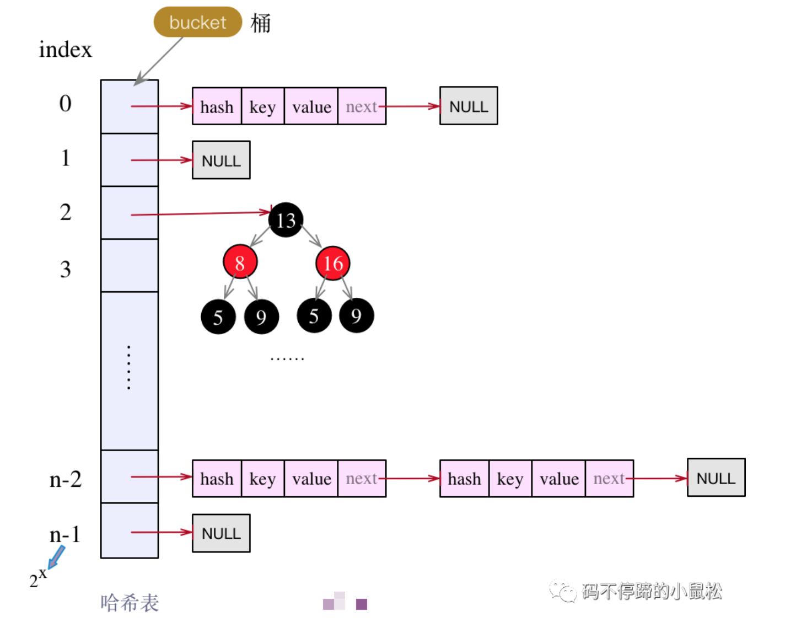
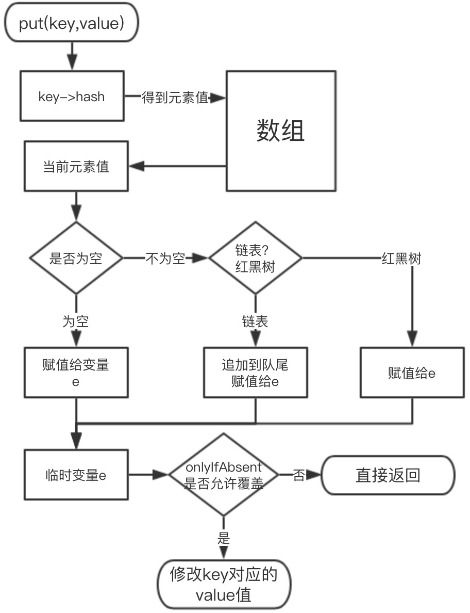
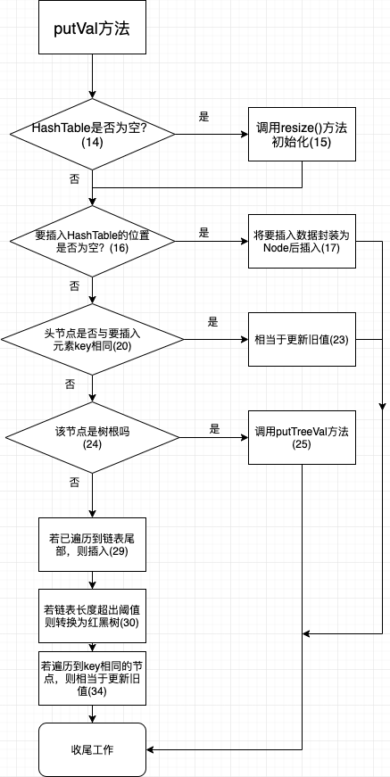

# HashMap源码解析

jdk版本：1.8


前置约定：



>- 哈希表table。
>- table[index]为解决hash冲突的数据结构（链表，红黑树）的头节点引用。
>- 根据链表长短选择是否要转换为红黑树。


## 1、存储对象封装为节点Node<K,V>

```java
/**
 * Basic hash bin node, used for most entries.  (See below for
 * TreeNode subclass, and in LinkedHashMap for its Entry subclass.)
 */
static class Node<K,V> implements Map.Entry<K,V> {
    final int hash;
    final K key;
    V value;
    Node<K,V> next;

    Node(int hash, K key, V value, Node<K,V> next) {
        this.hash = hash;
        this.key = key;
        this.value = value;
        this.next = next;
    }

    public final K getKey()        { return key; }
    public final V getValue()      { return value; }
    public final String toString() { return key + "=" + value; }

    public final int hashCode() {
        return Objects.hashCode(key) ^ Objects.hashCode(value);
    }

    public final V setValue(V newValue) {
        V oldValue = value;
        value = newValue;
        return oldValue;
    }

    public final boolean equals(Object o) {
        if (o == this)
            return true;
        if (o instanceof Map.Entry) {
            Map.Entry<?,?> e = (Map.Entry<?,?>)o;
            if (Objects.equals(key, e.getKey()) &&
                Objects.equals(value, e.getValue()))
                return true;
        }
        return false;
    }
}
```

> 包含：**<font color='red'>key的hash值</font>，key，value，next引用**


## 2、put及相关函数


```java
public V put(K key, V value) {
    return putVal(hash(key), key, value, false, true);
}
```

### 2.1、putVal函数

由于jdk1.8引入了红黑树作为存储结构，所以这里调用新封装的putVal函数，具体如下：

**<font color='red'>注意代码中的“边判断边赋值的写法”</font>**

```java
/**
 * Implements Map.put and related methods
 *
 * @param hash hash for key
 * @param key the key
 * @param value the value to put
 * @param onlyIfAbsent if true, don't change existing value
 * @param evict if false, the table is in creation mode.
 * @return previous value, or null if none
 */
final V putVal(int hash, K key, V value, boolean onlyIfAbsent,
               boolean evict) {
    Node<K,V>[] tab; Node<K,V> p; int n, i;
    if ((tab = table) == null || (n = tab.length) == 0)
        n = (tab = resize()).length;
    if ((p = tab[i = (n - 1) & hash]) == null)
        tab[i] = newNode(hash, key, value, null);
    else {
        Node<K,V> e; K k;
        if (p.hash == hash &&
            ((k = p.key) == key || (key != null && key.equals(k))))
          // key有可能为不同类型，所以这里用||
            e = p;
        else if (p instanceof TreeNode)
            e = ((TreeNode<K,V>)p).putTreeVal(this, tab, hash, key, value);
        else {
            for (int binCount = 0; ; ++binCount) {
                if ((e = p.next) == null) { 
                    p.next = newNode(hash, key, value, null); 
                    if (binCount >= TREEIFY_THRESHOLD - 1) // -1 for 1st
                        treeifyBin(tab, hash);
                    break;
                }
                if (e.hash == hash &&
                    ((k = e.key) == key || (key != null && key.equals(k))))
                    break;
                p = e; // 让for继续
            }
        }
        if (e != null) { // existing mapping for key
            V oldValue = e.value;
            if (!onlyIfAbsent || oldValue == null)
                e.value = value;
            afterNodeAccess(e);
            return oldValue;
        }
    }
    ++modCount;
    if (++size > threshold)
        resize();
    afterNodeInsertion(evict);
    return null;
}
```


#### hash方法：

```java
static final int hash(Object key) {
    int h;
    return (key == null) ? 0 : (h = key.hashCode()) ^ (h >>> 16);
  	// >>>是无符号右移，>>是带符号右移(不改变正负)，^是异或
}
```

> 再其中的hashCode()方法已是native方法，不予追究了。
>
> **<font color='red'>注意：key为null时，hash值为0。</font>**


流程图解析：





> 注意：
>
> 所说的相当于，是结合最后的收尾部分代码，达到了更新旧值的目的。


### 2.2、putTreeVal函数


```java
/**
 * Tree version of putVal.
 */
final TreeNode<K,V> putTreeVal(HashMap<K,V> map, Node<K,V>[] tab,
                               int h, K k, V v) {
    Class<?> kc = null;
    boolean searched = false;
    TreeNode<K,V> root = (parent != null) ? root() : this;
    for (TreeNode<K,V> p = root;;) {
        int dir, ph; K pk;
        if ((ph = p.hash) > h)
            dir = -1;
        else if (ph < h)
            dir = 1;
        else if ((pk = p.key) == k || (k != null && k.equals(pk)))
            return p;
        else if ((kc == null &&
                  (kc = comparableClassFor(k)) == null) ||
                 (dir = compareComparables(kc, k, pk)) == 0) {
            if (!searched) {
                TreeNode<K,V> q, ch;
                searched = true;
                if (((ch = p.left) != null &&
                     (q = ch.find(h, k, kc)) != null) ||
                    ((ch = p.right) != null &&
                     (q = ch.find(h, k, kc)) != null))
                    return q;
            }
            dir = tieBreakOrder(k, pk);
        }

        TreeNode<K,V> xp = p;
        if ((p = (dir <= 0) ? p.left : p.right) == null) {
            Node<K,V> xpn = xp.next;
            TreeNode<K,V> x = map.newTreeNode(h, k, v, xpn);
            if (dir <= 0)
                xp.left = x;
            else
                xp.right = x;
            xp.next = x;
            x.parent = x.prev = xp;
            if (xpn != null)
                ((TreeNode<K,V>)xpn).prev = x;
            moveRootToFront(tab, balanceInsertion(root, x));
            return null;
        }
    }
}
```


### 2.3、treeifyBin函数

将链表转换为红黑树

```java
/**
 * Replaces all linked nodes in bin at index for given hash unless
 * table is too small, in which case resizes instead.
 */
final void treeifyBin(Node<K,V>[] tab, int hash) {
    int n, index; Node<K,V> e;
    // 树化时有个最小容量要求，没达到要扩容！！！！
    if (tab == null || (n = tab.length) < MIN_TREEIFY_CAPACITY)
        resize();
    else if ((e = tab[index = (n - 1) & hash]) != null) {
        TreeNode<K,V> hd = null, tl = null;
        do {
            TreeNode<K,V> p = replacementTreeNode(e, null);
            if (tl == null)
                hd = p;
            else {
                p.prev = tl;
                tl.next = p;
            }
            tl = p;
        } while ((e = e.next) != null);
        if ((tab[index] = hd) != null)
            hd.treeify(tab);
    }
}
```


### 2.4、resize函数

> **<font color='red'>触发resize的场景：</font>**
>
> 1. 哈希表为null或长度为0
> 2. 哈希表中Node<K,V>数目超过阈值threshold
> 3. 哈希表长度小于`MIN_TREEIFY_CAPACITY`，即64，发生在初始化时
>
> 注意，==扩容是扩哈希表，与链表和红黑树无关==

```java
/**
 * Initializes or doubles table size.  If null, allocates in
 * accord with initial capacity target held in field threshold.
 * Otherwise, because we are using power-of-two expansion, the
 * elements from each bin must either stay at same index, or move
 * with a power of two offset in the new table.
 *
 * @return the table
 */
final Node<K,V>[] resize() {
  // 1. 扩容
    Node<K,V>[] oldTab = table;
    int oldCap = (oldTab == null) ? 0 : oldTab.length;
    int oldThr = threshold;
    int newCap, newThr = 0;
    if (oldCap > 0) {
        if (oldCap >= MAXIMUM_CAPACITY) {
            threshold = Integer.MAX_VALUE;
            return oldTab;
        }
        else if ((newCap = oldCap << 1) < MAXIMUM_CAPACITY &&
                 oldCap >= DEFAULT_INITIAL_CAPACITY)// 容量扩2倍
            newThr = oldThr << 1; // 阈值也扩大2倍
    }
    else if (oldThr > 0) // 将哈希表长度初始化为阈值大小
        newCap = oldThr;
    else {               // 使用默认值初始化哈希表
        newCap = DEFAULT_INITIAL_CAPACITY;
        newThr = (int)(DEFAULT_LOAD_FACTOR * DEFAULT_INITIAL_CAPACITY);
    }
    if (newThr == 0) {
        float ft = (float)newCap * loadFactor;
        newThr = (newCap < MAXIMUM_CAPACITY && ft < (float)MAXIMUM_CAPACITY ?
                  (int)ft : Integer.MAX_VALUE);
    }
    threshold = newThr;
    @SuppressWarnings({"rawtypes","unchecked"})
        Node<K,V>[] newTab = (Node<K,V>[])new Node[newCap];
    table = newTab;
  
  // 2. 数据迁移
    if (oldTab != null) {
        for (int j = 0; j < oldCap; ++j) {
            Node<K,V> e;
            if ((e = oldTab[j]) != null) {
              // 只找非空的bucket
                oldTab[j] = null; // 在旧表中清除
                if (e.next == null) // 旧表中只剩一个非空节点了
                  // 插入新表
                    newTab[e.hash & (newCap - 1)] = e;
                else if (e instanceof TreeNode)
                    ((TreeNode<K,V>)e).split(this, newTab, j, oldCap);
                else { // preserve order 迁移是按序的
                    Node<K,V> loHead = null, loTail = null;
                    Node<K,V> hiHead = null, hiTail = null;
                    Node<K,V> next;
                    do {
                        next = e.next;
                        if ((e.hash & oldCap) == 0) {
                          // 不需要搬移的节点
                            if (loTail == null)
                              // 初始化
                                loHead = e;
                            else
                              // 尾部插入
                                loTail.next = e;
                            loTail = e;
                        }
                        else {
                          // 需要搬移的节点
                            if (hiTail == null)
                                hiHead = e;
                            else
                                hiTail.next = e;
                            hiTail = e;
                        }
                    } while ((e = next) != null);
                    if (loTail != null) {
                        loTail.next = null;
                        newTab[j] = loHead;
                    }
                    if (hiTail != null) {
                        hiTail.next = null;
                      // 搬移+oldCap个距离
                        newTab[j + oldCap] = hiHead;
                    }
                }
            }
        }
    }
    return newTab;
}
```


## 3、get函数

```java
public V get(Object key) {
    Node<K,V> e;
    return (e = getNode(hash(key), key)) == null ? null : e.value;
}
```


```java
/**
 * Implements Map.get and related methods
 *
 * @param hash hash for key
 * @param key the key
 * @return the node, or null if none
 */
final Node<K,V> getNode(int hash, Object key) {
    Node<K,V>[] tab; Node<K,V> first, e; int n; K k;
    if ((tab = table) != null && (n = tab.length) > 0 &&
        (first = tab[(n - 1) & hash]) != null) {
        if (first.hash == hash && // always check first node
            ((k = first.key) == key || (key != null && key.equals(k))))
            return first;
        if ((e = first.next) != null) {
            if (first instanceof TreeNode)
                return ((TreeNode<K,V>)first).getTreeNode(hash, key);
            do {
                if (e.hash == hash &&
                    ((k = e.key) == key || (key != null && key.equals(k))))
                    return e;
            } while ((e = e.next) != null);
        }
    }
    return null;
}
```


## 4、HashMap线程不安全

### 4.1、多线程put元素丢失

假设有两个线程t1,t2，它们都执行完了2.1中putVal函数的28行，此时t1挂起，t2执行29行，t2执行完后t1再执行。这样会导致t2所插入的节点被抹掉了。


### 4.2、put和get并发，可能导致get到null

当put中执行resize时，由resize的实现可见，在完成扩容后，==还未转移元素之前，就将新哈希表赋值给了旧表==，即旧表为空了。所以，若这个时候get，则为null。***<font color='red'>所以在ConcurrentHashMap中的put操作中对数组是否正在进行扩容进行了判断从而保证线程安全。</font>***


### 4.3、put并发导致循环链表，进而导致get死循环（JDK1.7）

**<font color='red'>因为jdk1.7使用头插入法插入链表，jdk1.8改为尾插入了</font>**

具体可参考：https://juejin.im/post/5a66a08d5188253dc3321da0，图示非常清晰。


参考：https://juejin.im/post/5c8910286fb9a049ad77e9a3

​	

## 5、HashMap 容量为什么总是为 2 的次幂？

https://mp.weixin.qq.com/s/GsUlZdRWE7FLfzkTyij2Bg