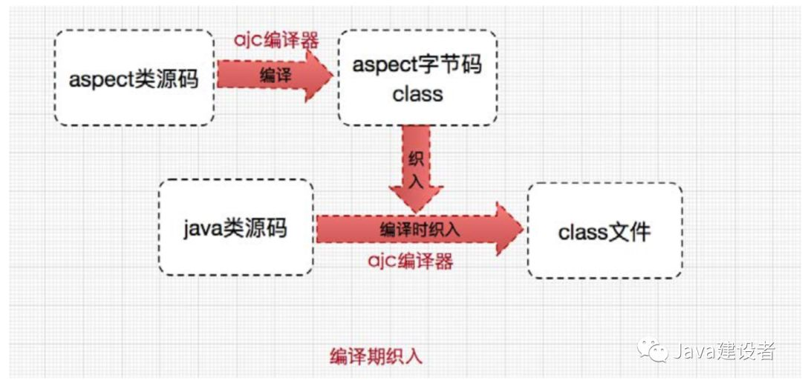
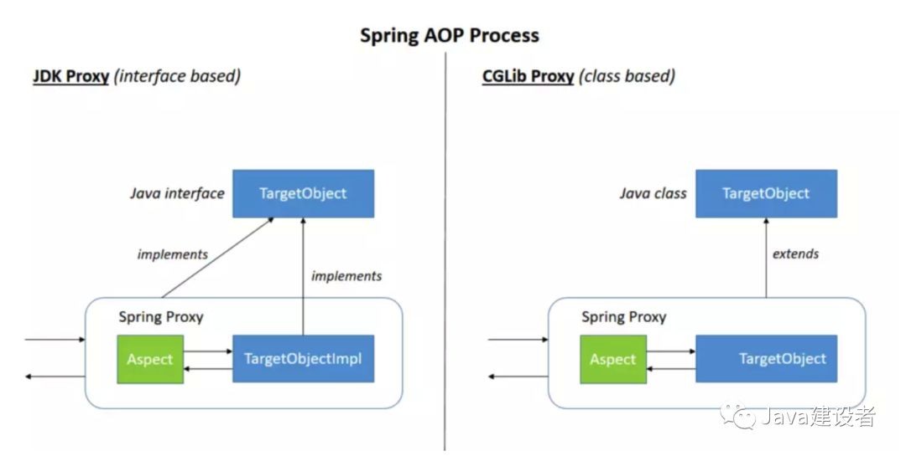

# AOP 基本概念

***将业务逻辑和系统处理的代码(关闭连接、事务管理、操作日志记录)解耦。***

------

- `切面(Aspect)`：Aspect 声明类似于 Java 中的类声明，事务管理是AOP一个最典型的应用。在AOP中，切面一般使用 `@Aspect` 注解来使用，在XML 中，可以使用 **``** 来定义一个切面。***是切入点`pointcut`和通知`advice`的结合***
- `连接点(Join Point)`: 一个在程序执行期间的某一个操作，就像是执行一个方法或者处理一个异常。在Spring AOP中，一个连接点就代表了一个方法的执行。
- `通知(Advice):`在切面中(类)的某个连接点(方法出)采取的动作，会有四种不同的通知方式：**around(环绕通知)，before(前置通知)，after(后置通知)， exception(异常通知)，return(返回通知)**。许多AOP框架（包括Spring）将建议把通知作为为拦截器，并在连接点周围维护一系列拦截器。
- `切入点(Pointcut):`表示一组连接点，通知与切入点表达式有关，并在切入点匹配的任何连接点处运行(例如执行具有特定名称的方法)。**由切入点表达式匹配的连接点的概念是AOP的核心，Spring默认使用AspectJ切入点表达式语言。**
- `介绍(Introduction):` introduction可以为原有的对象增加新的属性和方法。例如，你可以使用introduction使bean实现IsModified接口，以简化缓存。
- `目标对象(Target Object):` 由一个或者多个切面代理的对象。也被称为"切面对象"。由于Spring AOP是使用运行时代理实现的，因此该对象始终是代理对象。
- `AOP代理(AOP proxy):` 由AOP框架创建的对象，在Spring框架中，AOP代理对象有两种：**JDK动态代理和CGLIB代理**
- `织入(Weaving):` 是指把增强应用到目标对象来创建新的代理对象的过程，它(例如 AspectJ 编译器)可以在编译时期，加载时期或者运行时期完成。与其他纯Java AOP框架一样，Spring AOP在运行时进行织入。

------

## Spring AOP 中通知的分类

- 前置通知(Before Advice): 在目标方法被调用前调用通知功能；相关的类`org.springframework.aop.MethodBeforeAdvice`
- 后置通知(After Advice): 在目标方法被调用之后调用通知功能；相关的类`org.springframework.aop.AfterReturningAdvice`
- 返回通知(After-returning): 在目标方法成功执行之后调用通知功能；
- 异常通知(After-throwing): 在目标方法抛出异常之后调用通知功能；相关的类`org.springframework.aop.ThrowsAdvice`
- 环绕通知(Around): 把整个目标方法包裹起来，在**被调用前和调用之后分别调用通知功能**相关的类`org.aopalliance.intercept.MethodInterceptor`

------

## Spring AOP 中织入的三种时期

- `编译期:` 切面在目标类编译时被织入，这种方式需要特殊的编译器。**AspectJ 的织入编译器就是以这种方式织入切面的。**
- `类加载期:` 切面在目标类加载到 JVM 时被织入，这种方式需要特殊的类加载器( ClassLoader )，它可以在目标类引入应用之前增强目标类的字节码。
- `运行期:` 切面在应用运行的某个时期被织入。一般情况下，在织入切面时，AOP容器会为目标对象动态创建一个代理对象，**Spring AOP 采用的就是这种织入方式。**

------

## AOP 的两种实现方式

AOP 采用了两种实现方式：==静态织入(AspectJ 实现)和动态代理(Spring AOP实现)==

### AspectJ

AspectJ 是一个采用Java 实现的AOP框架，它能够对代码进行编译(一般在编译期进行)，让代码具有AspectJ 的 AOP 功能，AspectJ 是目前实现 AOP 框架中最成熟，功能最丰富的语言。***ApectJ 主要采用的是编译期静态织入的方式。在这个期间使用 AspectJ 的 acj 编译器(类似 javac)把 aspect 类编译成 class 字节码后，在 java 目标类编译时织入，即先编译 aspect 类再编译目标类。***

------

### Spring AOP 实现

Spring AOP 是通过动态代理技术实现的，而动态代理是基于反射设计的。Spring AOP 采用了两种混合的实现方式：JDK 动态代理和 CGLib 动态代理，分别来理解一下

------

- JDK动态代理：Spring AOP的首选方法。每当目标对象实现一个接口时，就会使用JDK动态代理。**目标对象必须实现接口**
- CGLIB代理：如果目标对象没有实现接口，则可以使用CGLIB代理。