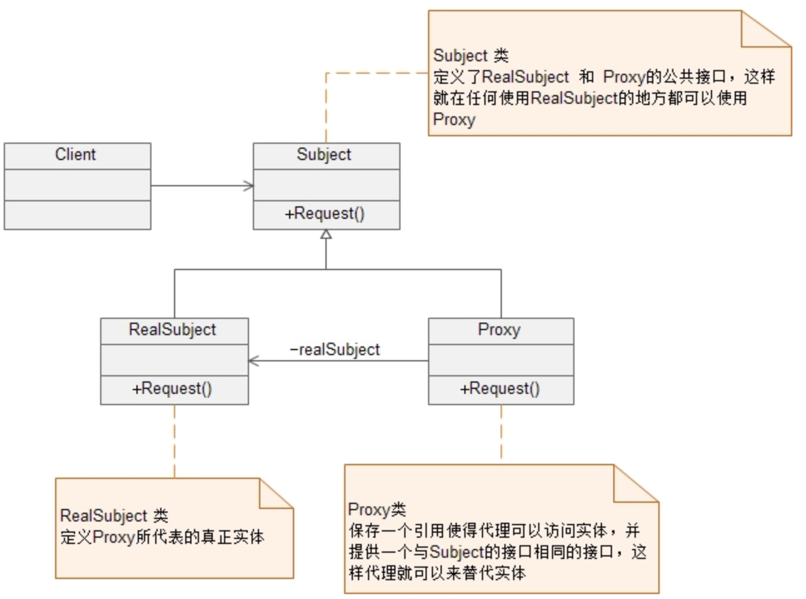
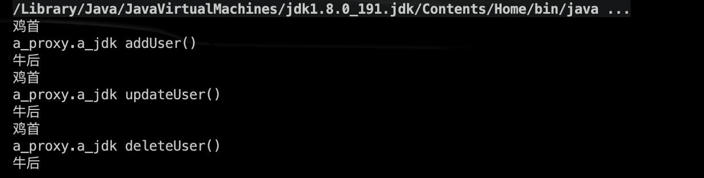

# Spring AOP 代理总结：静态代理和动态代理

参考：https://mp.weixin.qq.com/s/dLOn23waK4gv-Rp9dC0Kfg

## 0、作用

> <font color='red' size=4>***将业务逻辑和系统处理的代码(关闭连接、事务管理、操作日志记录)解耦。***</font>

------


## 1、静态代理 

自己手动创建`Proxy`类，并将`RealSubject`类注入。




------


## 2、动态代理 - JDK、Cglib

**<font color='red'>==运行时增强==：动态代理就是说AOP框架==不会去修改字节码==，而是在==内存中临时为方法生成一个AOP对象==，这个AOP对象包含了目标对象的全部方法，并且在特定的切点做了增强处理，并回调原对象的方法。</font>**

动态代理主要包含：

> JDK动态代理：利用==反射==接收被代理的类，从而生成代理类Proxy类。被代理的类必须实现一个接口
>
> Cglib动态代理：生成被代理类的==子类==作为代理类。（所以==**被代理类不能被`final`修饰**==）
>
> spring aop会根据被代理类是否实现了某个接口来自动选择动态代理方式

------


### 1）JDK动态代理

> <font color='red' size = 4>***目标类实现了一个接口，这样目标类的代理类可以通过也实现该接口将自己“伪装”成目标类***</font>

目标类接口：

```java
package a_proxy.a_jdk;
public interface UserService {
    public void addUser();
    public void updateUser();
    public void deleteUser();
}

```

实现类：

```java
package a_proxy.a_jdk;
public class UserServiceImpl implements UserService {
    @Override
    public void addUser() {
        System.out.println("a_proxy.a_jdk addUser()");
    }

    @Override
    public void updateUser() {
        System.out.println("a_proxy.a_jdk updateUser()");

    }

    @Override
    public void deleteUser() {
        System.out.println("a_proxy.a_jdk deleteUser()");

    }
}

```


<font color="red">切面类:
</font>

```java
package a_proxy.b_cglib;
public class MyAspect {
    public void before() {
        System.out.println("鸡首");
    }

    public void after() {
        System.out.println("牛后");
    }
}

```


<font color="red">工厂类(生成代理类):</font>

```java
package a_proxy.a_jdk;

import java.lang.reflect.InvocationHandler;
import java.lang.reflect.Method;
import java.lang.reflect.Proxy;

public class MyBeanFactory {

    public static UserService createService() {
        //1目标类
        UserService userService = new UserServiceImpl();
        //2切面类
        MyAspect myAspect = new MyAspect();
        /*
        *3代理类：将目标类（切入点）和切面类（通知）结合--->切面
        *
        * Proxy.newProxyInstance
        *   参数1：loader：类加载器，动态代理类运行时创建，任何类都需要类加载器将其加载到内存。
        *       一般情况：采用当前类.class.getClassLoader();
        *                目标类实例.getClass().getClassLoader();
        *   参数2：interfaces：代理类要实现的所有接口
        *       方式1：目标实例.getClass().getInterfaces() ,注意：只能获得自己的接口，不能获得父元素接口
        *       方式2：new Class[]{UserService.class}
        *   参数3：InvocationHandler：处理类，是一个接口，必须进行实现类，一般采用匿名内部方式.表示的是当我这个动态代理对象在调用方法的时候，会关联到哪一个 InvocationHandler 对象上
        *       提供invoke方法，代理类的每一个方法执行时，都将调用一次invoke
        *           参数1:Object proxy：代理对象
        *           参数2：Method method：代理对象当前执行的方法的描述对象（反射）
        *                   执行方法名：method.getName()
        *                   执行方法：method.invoke(对象，实际参数)
        *           参数3：Object[] args：方法的实际参数
        * */
        UserService proxyService = (UserService) Proxy.newProxyInstance(
                MyBeanFactory.class.getClassLoader(),
                userService.getClass().getInterfaces(),
                new InvocationHandler() {
                    @Override
                    public Object invoke(Object proxy, Method method, Object[] args) throws Throwable {

                        //前执行
                        myAspect.before();

                        //执行目标类方法
                        Object obj = method.invoke(userService, args);

                        //后执行
                        myAspect.after();
                        return obj;
                    }
                }
        );

        return proxyService;
    }

}

```


==`Proxy.newProxyInstance`内部通过反射创建代理对象（实现了某接口）。==

**<font color='red'>每一个动态代理类都必须要实现 `InvocationHandler` 这个接口，并且==每个代理类的实例都关联到了一个 `Handler`==，当我们通过代理对象调用一个方法的时候，这个方法的调用就会被转发为由 `InvocationHandler` 这个接口的 `invoke` 方法来进行调用。</font>**

测试类：

```java
package a_proxy.a_jdk;

import org.junit.Test;

public class TestJDK {
    @Test
    public void demo1() {
        UserService userService = MyBeanFactory.createService();
        userService.addUser();
        userService.updateUser();
        userService.deleteUser();
    }
}
```


结果：




==注意：==

> **通过 Proxy.newProxyInstance 创建的代理对象是在 jvm 运行时动态生成的一个对象，它并不是我们的 InvocationHandler 类型，==也不是我们定义的那组接口的类型==，而是在运行是动态生成的一个对象，并且命名方式都是这样的形式，以\$开头，proxy 为中，最后一个数字表示对象的标号，如`com.sun.proxy.$Proxy0`。**

------


### 2）Cglib动态代理（字节码增强）

> <font color="red" size = 4>***目标类没有实现任何接口，代理类为了伪装，只能以目标类的子类作为代理类***</font>

工厂类：

```java
package a_proxy.b_cglib;
public class MyBeanFactory {

    public static UserServiceImpl createService() {
        //1目标类
        UserServiceImpl userService = new UserServiceImpl();
        //2切面类
        MyAspect myAspect = new MyAspect();

        /*
        * 3 代理类，采用cglib，底层创建目标的子类
        * */
        //3.1核心类
        Enhancer enhancer = new Enhancer();
        //3.2确定父类
        enhancer.setSuperclass(userService.getClass());
        //3.3设置回调 MethodInterceptor接口等效于jdk中的InvocationHandler
        /*
        * intercept()等效于jdk的invoke()
        *       参数1，2，3与invoke的一样
        *       参数4：methodProxy方法的代理，通常不用
        * */
        enhancer.setCallback(new MethodInterceptor() {
            @Override
            public Object intercept(Object o, Method method, Object[] objects, MethodProxy methodProxy) throws Throwable {
                //前
                myAspect.before();
                //执行目标类的方法
                Object obj = method.invoke(userService, objects);
                //执行代理类的父类，即目标类（目标类和代理类是父子关系）
                //methodProxy.invokeSuper(o, objects);

                //后
                myAspect.after();
                return obj;
            }
        });

        //3.4创建代理
        UserServiceImpl proxyService = (UserServiceImpl)enhancer.create();
        return proxyService;
    }

}
```


测试类：

```java
package a_proxy.b_cglib;

import org.junit.Test;

public class TestCglib {
    @Test
    public void demo1() {
        UserServiceImpl userService = MyBeanFactory.createService();
        userService.addUser();
        userService.updateUser();
        userService.deleteUser();
    }
}
```

结果与jdk动态代理相同

------

## 3、底层流程

<font color='red'>**Spring AOP 需要做的是生成这么一个代理类，然后==替换掉==真实实现类来对外提供服务。替换的过程怎么理解呢？在 Spring IOC 容器中非常容易实现，就是在 getBean(…) 的时候返回的实际上是代理类的实例，而这个代理类我们自己没写代码，它是 Spring 采用 JDK Proxy 或 CGLIB 动态生成的。**</font>

> getBean(…) 方法用于查找或实例化容器中的 bean，这也是为什么 ==**Spring AOP 只能作用于 Spring 容器中的 bean 的原因，对于不是使用 IOC 容器管理的对象，Spring AOP 是无能为力的。**==

------

### 时机

> <font color="red" size = 4>***执行每一个 BeanPostProcessor 的 postProcessAfterInitialization 方法***</font>

所以，代理的生成，即上述的jdk以及cglib动态代理都是在postProcessAfterInitialization中

