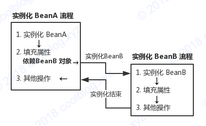
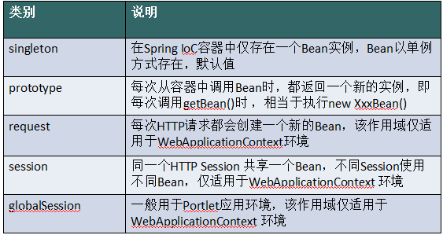

# Spring Bean的生命周期

参考：https://www.cnblogs.com/zrtqsk/p/3735273.html

https://yemengying.com/2016/07/14/spring-bean-life-cycle/

## &sect; 生命周期过程

从开始执行Bean构造器开始才算是bean的生命周期开始：

### 1、实例化Bean

> - **BeanFactory容器**，当客户向容器请求一个尚未初始化的bean时，或初始化bean的时候需要注入另一个尚未初始化的依赖时，容器就会调用`createBean`进行实例化。 
> - **ApplicationContext容器**，**当容器启动结束后，便实例化所有的bean。** 容器通过获取BeanDefinition对象中的信息进行实例化。==***并且这一步仅仅是简单的实例化，并未进行依赖注入(对象属性的设置)***==。 
> - **实例化对象被包装在==BeanWrapper==对象中**，**BeanWrapper提供了设置对象属性的接口，从而避免了使用反射机制设置属性。**

------

### 2、设置对象属性(依赖注入)

> 实例化后的对象被封装在BeanWrapper对象中，并且此时对象仍然是一个原生的状态，并没有进行依赖注入。紧接着，***Spring根据BeanDefinition中的信息进行依赖注入。并且通过BeanWrapper提供的设置属性的接口完成依赖注入。***

------

### 3、注入Aware接口

> 紧接着，Spring会检测该对象是否实现了**xxxAware**接口，并将相关的xxxAware实例注入给bean。

### 4、BeanPostProcessor(可处理bean对象)

当经过上述几个步骤后，bean对象已经被正确构造，**但如果你想要对象被使用前再进行一些自定义的处理，就可以通过BeanPostProcessor接口实现。** 
该接口提供了两个函数：

- `postProcessBeforeInitialzation( Object bean, String beanName ) `
  当前正在初始化的bean对象会被传递进来，我们就可以对这个bean作任何处理。 
  这个函数会先于InitialzationBean执行，因此称为**==前置处理==**。 
  **==所有Aware接口的注入就是在这一步完成的。==**
- `postProcessAfterInitialzation( Object bean, String beanName ) `
  当前正在初始化的bean对象会被传递进来，我们就可以对这个bean作任何处理。 
  这个函数会在InitialzationBean完成后执行，因此称为**==后置处理==**。

------

### 5、InitializingBean接口与init-method（不可处理bean对象）

当**==BeanPostProcessor的前置处理完成后==**就会进入本阶段。 
`InitializingBean`**接口**只有一个函数：

- **`afterPropertiesSet()`**

这一阶段也可以在bean正式构造完成前增加我们自定义的逻辑，**但它与前置处理不同，由于该函数并不会把当前bean对象传进来，因此在这一步==没办法处理对象本身==，只能增加一些额外的逻辑。==(通常通过bean的init-method属性指定函数)==** 
若要使用它，我们需要让bean实现该接口，并把要增加的逻辑写在该函数中。然后Spring会在前置处理完成后检测当前bean是否实现了该接口，并执行afterPropertiesSet函数。

**当然，Spring为了降低对客户代码的侵入性，给bean的配置提供了init-method属性，该属性指定了在这一阶段需要执行的函数名。Spring便会在初始化阶段执行我们设置的函数。init-method本质上仍然使用了InitializingBean接口。**

------

### 6、DisposableBean接口和destroy-method

>  **与InitializingBean和init-method一样，通过给destroy-method指定函数，就可以在bean销毁前执行指定的逻辑。**

------

------

**实例化A时需要依赖B，则进入实例化B的流程**

**setter注入可解决循环依赖，构造器注入不可以**

------

## &sect; Bean的作用域

------

## &sect; ApplicationContext 和 BeanFactory

> ***ApplicationContext 继承自 BeanFactory，但是它不应该被理解为 BeanFactory 的实现类，而是说其内部持有一个实例化的 BeanFactory（==DefaultListableBeanFactory，由下图可知，为最全==）。以后所有的 BeanFactory 相关的操作其实是委托给这个实例来处理的。***

