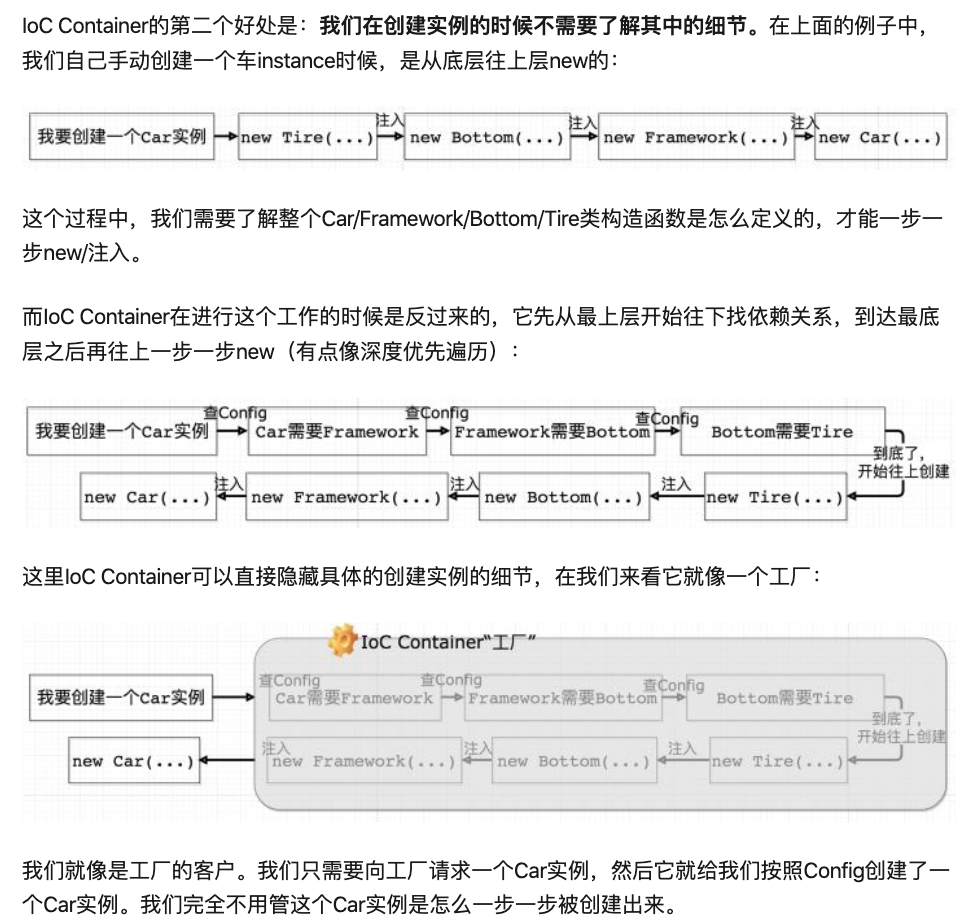

# Spring IoC和DI

最初没有依赖注入时，底层类的构造函数若增加参数，则需修改所有上层类的构造函数。有了依赖注入后，因为上层只接收底层类的==实例对象==作为参数，所以屏蔽了底层类构造函数的修改。但是有了新问题：初始化一个顶层类的实例时，要先从底层类的实例一个个初始化，令人崩溃。而IoC就是解决这个问题的一种将层间解耦的一种思想。

**DI(Dependecy Inject,依赖注入)是实现控制反转的一种设计模式，依赖注入就是将==实例变量==传入到一个对象中去。**

