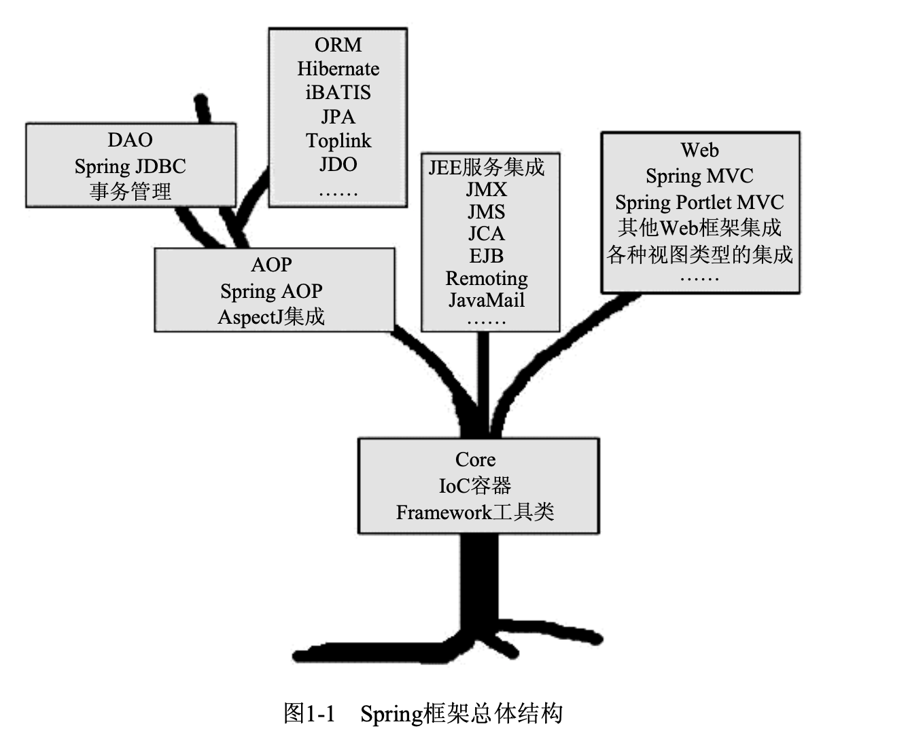
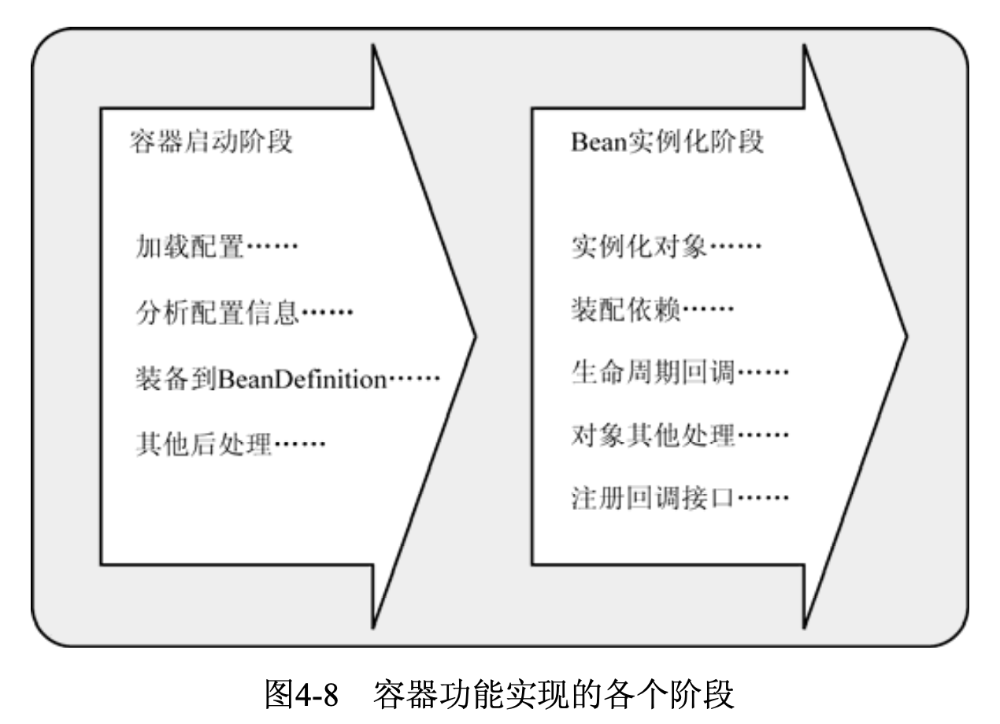
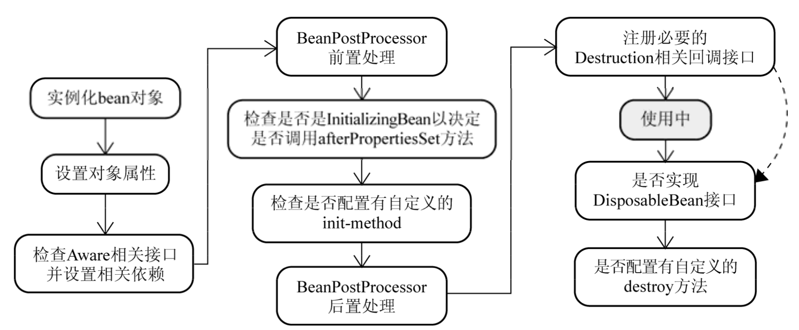

# Spring IoC流程（Bean的生命周期）

https://blog.csdn.net/qq_18433441/article/details/81866142




------

## &sect; IoC流程

> IoC的功能按流程划分主要分为两个阶段：<font color='#02C874' size = 4.1>**容器启动阶段和Bean实例化阶段**</font>
>
> 

------


### &sect; 容器启动阶段

> <font color='#02C874' size = 4.1>**XML配置信息到BeanDefinition的映射**</font>
>
> Spring提供了一种叫做<font color='red'>***BeanFactoryPostProcessor的容器扩展机制。该机制允许我们在容器实 例化相应对象之前，==对注册到容器的BeanDefinition所保存的信息做相应的修改==。这就相当于在容 器实现的第一阶段最后加入一道工序，让我们对最终的BeanDefinition做一些额外的操作，比如修 改其中bean定义的某些属性，为bean定义增加其他信息等。***</font>

------

### &sect; Bean实例化阶段

> 经过第一阶段，现在所有的bean定义信息都通过BeanDefinition的方式注册到了BeanDefini- tionRegistry中。<font color='red'>**当某个请求方通过容器的getBean方法明确地请求某个对象，或者==因依赖关系容器 需要隐式地调用getBean方法时==，就会触发第二阶段的活动。**</font>
>
> 该阶段，容器会首先检查所请求的对象之前是否已经初始化。如果没有，则会根据注册的 BeanDefinition所提供的信息实例化被请求对象，并为其注入依赖。如果该对象实现了某些回调接 口，也会根据回调接口的要求来装配它。当该对象装配完毕之后，容器会立即将其返回请求方使用。

------

## &sect; Bean的生命周期

> - <font color='#02C874'>**getBean()：若getBean()发现bean已经存在，则直接返回（prototype除外），否则进入Bean的生命周期。**</font>
>
> - createBean()：当 getBean()方法内部发现该bean定义之前还没有被实例化之后，会通过createBean()方法来进行具体 的对象实例化，实例化过程如图所示。
>
>   

------

### 1、Bean的实例化

> - <font color='#02C874'>***容器在内部实现的时候，采用“==策略模式(Strategy Pattern)==”来决定采用何种方式初始化bean实例。 通常，可以通过==反射或者CGLIB动态字节码生==成来初始化相应的bean实例或者动态生成其子类。***</font>
>
> - **<font color='red'>`InstantiationStrategy`</font>**定义是实例化策略 的抽象接口
>   - 其直接子类**<font color='red'>`SimpleInstantiationStrategy`</font>**实现了简单的对象实例化功能，可以通过 反射来实例化对象实例，但不支持方法注入方式的对象实例化。
>   - **<font color='red'>`CglibSubclassingInstantiation`</font>**- Strategy继承了`SimpleInstantiationStrategy`的以反射方式实例化对象的功能，并且通过CGLIB 的动态字节码生成功能，该策略实现类可以动态生成某个类的子类，进而满足了方法注入所需的对象 实例化需求。***默认情况下***，容器内部采用的是`CglibSubclassingInstantiationStrategy`。
> - <font color='#02C874'>**容器只要根据相应bean定义的BeanDefintion取得实例化信息，结合CglibSubclassingIns- tantiationStrategy以及不同的bean定义类型，就可以返回实例化完成的对象实例。但是，返回方 式上有些“点缀”。不是直接返回构造完成的对象实例，==而是以BeanWrapper对构造完成的对象实例 进行包裹，返回相应的BeanWrapper实例==。**</font>
> - <font color='red'>**BeanWrapper就是方便了后续“设置bean的属性”，免去了直接使用反射api去设置属性的繁琐。**</font>

------

### 2、各色的**Aware**接口

> **当对象实例化完成并且相关属性以及依赖设置完成之后，Spring容器会检查当前对象实例是否实**
>
> **现了一系列的以Aware命名结尾的接口定义。如果是，则将这些Aware接口定义中规定的依赖注入给当前对象实例。**

------

### 3、BeanPostProcessor

> BeanPostProcessor会处理容器内所有符合条件的实例化后的对象实例。可用来生成代理对象

------

### 4、InitializingBean和init-method


org.springframework.beans.factory.InitializingBean是容器内部广泛使用的一个对象生命周期标识接口，其定义如下:

```java
public interface InitializingBean {
 void afterPropertiesSet() throws Exception;
}
```

该接口定义很简单，其作用在于，在对象实例化过程调用过“BeanPostProcessor的前置处理” 之后，会接着检测当前对象是否实现了InitializingBean接口，如果是，则会调用其afterPropertiesSet()方法进一步调整对象实例的状态。比如，在有些情况下，某个业务对象实例化完成后，还 不能处于可以使用状态。这个时候就可以让该业务对象实现该接口，并在方法afterPropertiesSet() 中完成对该业务对象的后续处理。

<font color='#02C874'>**虽然该接口在Spring容器内部广泛使用，但如果真的让我们的业务对象实现这个接口，则显得 Spring容器比较具有侵入性。所以，Spring还提供了另一种方式来指定自定义的对象初始化操作，那就 是在XML配置的时候，使用\<bean>的init-method属性。**</font>

通过init-method，系统中业务对象的自定义初始化操作可以以任何方式命名，而不再受制于 InitializingBean的afterPropertiesSet()。如果系统开发过程中规定:所有业务对象的自定义初 始化操作都必须以init()命名，为了省去挨个\<bean>的设置init-method这样的烦琐，我们还可以通 过最顶层的\<beans>的default-init-method统一指定这一init()方法名。

------

### 5、**DisposableBean**与**destroy-method**

> 当所有的一切，该设置的设置，该注入的注入，该调用的调用完成之后，容器将检查singleton类 型的bean实例，看其是否实现了org.springframework.beans.factory.DisposableBean接口。或 者其对应的bean定义是否通过\<bean>的destroy-method属性指定了自定义的对象销毁方法。<font color='#02C874'>**如果是， 就会为该实例注册一个用于对象销毁的回调(Callback)，以便在这些singleton类型的对象实例销毁之 前，执行销毁逻辑。**</font>
>
> <font color='#02C874'>**与InitializingBean和init-method用于对象的自定义初始化相对应，DisposableBean和 destroy-method为对象提供了执行自定义销毁逻辑的机会。**</font>
>
> 最常见到的该功能的使用场景就是在Spring容器中<font color='red'>**注册数据库连接池，在系统退出后，连接池应 该关闭，以释放相应资源。**</font>

------


## &sect; Bean的作用域


------

## &sect; ApplicationContext 和 BeanFactory

> <font color='red' size = 4>***ApplicationContext 继承自 BeanFactory，但是它不应该被理解为 BeanFactory 的实现类，而是说其内部持有一个实例化的 BeanFactory（==DefaultListableBeanFactory，由下图可知，为最全==）。以后所有的 BeanFactory 相关的操作其实是委托给这个实例来处理的。***</font>


------

### 区别

> - **BeanFactory：延迟初始化**
>
>   <font color='#02C874' >**是因为只有在实例化A（getBean）时，其依赖于B但B还未实例化，故进行B的初始化(getBean)，所以为“延迟”**</font>
>
> - **ApplicationContext：容器启动后实例已全部实例化**
>
>   <font color='#02C874' size = 4.1>**因为容器启动阶段完成后，自动调用了所有bean的getBean方法。**</font>

