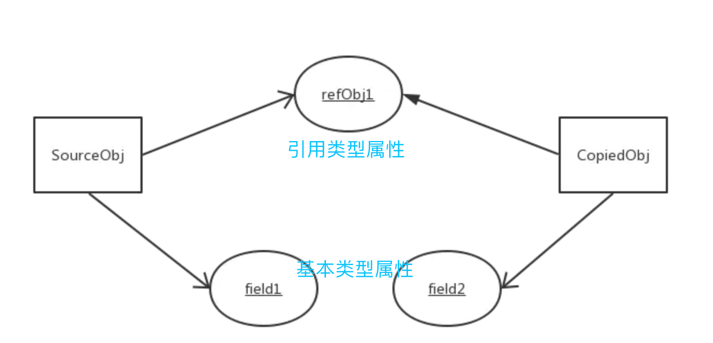
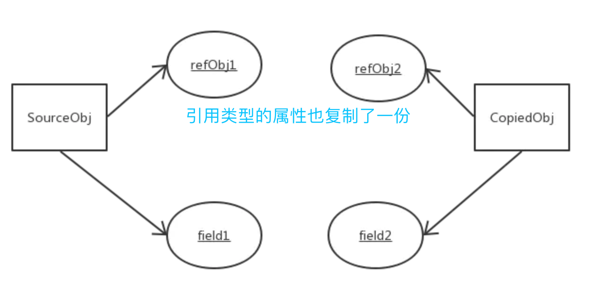

# Java浅拷贝和深拷贝

参考：https://www.jianshu.com/p/94dbef2de298


> ***<font color='green' size=4>注意：无论浅拷贝还是深拷贝，都会拷贝出一个新对象（即内存地址与原对象不同），而对象拷贝（直接将对象引用赋值给另一个引用那种）是不会生成新对象的，只是引用的指来指去</font>***

------


## &sect; 浅拷贝

### &sect; 特点

浅拷贝是按位拷贝对象，它会创建一个新对象，这个对象有着原始对象属性值的一份精确拷贝。如果属性是基本类型，拷贝的就是基本类型的值；如果**属性是内存地址**（引用类型），拷贝的就是内存地址 ，**<font color='red'>因此如果其中一个对象改变了这个地址，就会影响到另一个对象</font>**。即只复制对象空间而不复制资源。



------

### **&sect; 实现**

实现对象拷贝的类，需要实现 `Cloneable` 接口，并覆写 `clone()` 方法。

```java
public class Subject {

    private String name;

    public Subject(String name) {
        this.name = name;
    }

   	// getter/setter/toString...
}
```

```java
public class Student implements Cloneable {

    //引用类型
    private Subject subject;
    //基础数据类型
    private String name;
    private int age;
  
		// getter/setter/toString...
		
    /**
     *  重写clone()方法
     * @return
     */
    @Override
    public Object clone() {
        //浅拷贝
        try {
            // 直接调用父类的clone()方法
            return super.clone();
        } catch (CloneNotSupportedException e) {
            return null;
        }
    }
```

```java
public class ShallowCopy {
    public static void main(String[] args) {
        Subject subject = new Subject("yuwen");
        Student studentA = new Student();
        studentA.setSubject(subject);
        studentA.setName("Lynn");
        studentA.setAge(20);
        Student studentB = (Student) studentA.clone();
        studentB.setName("Lily");
        studentB.setAge(18);
        Subject subjectB = studentB.getSubject();
        subjectB.setName("lishi");
        System.out.println("studentA:" + studentA.toString());
        System.out.println("studentB:" + studentB.toString());
    }
}
```

输出：

```css
studentA:[Student: 460141958,subject:[Subject: 1163157884,name:lishi],name:Lynn,age:20]
studentB:[Student: 1956725890,subject:[Subject: 1163157884,name:lishi],name:Lily,age:18]
```

**由输出的结果可见，通过 `studentA.clone()` 拷贝对象后得到的 `studentB`，和 `studentA`  是两个不同的对象。`studentA` 和 `studentB` 的基础数据类型的修改互不影响，而<font color='red'>引用类型 `subject` 修改后是会有影响的。</font>**

------

### &sect; 浅拷贝和对象拷贝的区别

这里把 `Student studentB = (Student) studentA.clone()` (浅拷贝)换成了 **<font color='red'>`Student studentB = studentA`(对象拷贝)。</font>**
 输出的结果：

```css
studentA:[Student: 460141958,subject:[Subject: 1163157884,name:lishi],name:Lily,age:18]
studentB:[Student: 460141958,subject:[Subject: 1163157884,name:lishi],name:Lily,age:18]
```

可见，***<font color='blue'>对象拷贝后没有生成新的对象，二者的对象地址是一样的；而浅拷贝的对象地址是不一样的。</font>***

------


## &sect; 深拷贝

> 深拷贝，在拷贝引用类型成员变量时，**为引用类型的数据成员另辟了一个独立的内存空间，实现==真正内容上的拷贝。==**

------

### &sect; 特点

> - 对于基本数据类型的成员对象，因为基础数据类型是值传递的，所以是直接将属性值赋值给新的对象。基础类型的拷贝，其中一个对象修改该值，不会影响另外一个（和浅拷贝一样）。
> - 对于引用类型，比如数组或者类对象，深拷贝会新建一个对象空间，然后拷贝里面的内容，所以它们指向了不同的内存空间。***改变其中一个，不会对另外一个也产生影响。***
> -  **<font color='blue'>对于有多层对象的，每个对象都需要实现 `Cloneable` 并重写 `clone()` 方法，进而实现了对象的串行层层拷贝。</font>**
> - **<font color='blue'>深拷贝相比于浅拷贝速度较慢并且花销较大。</font>**

------



------


### &sect; 实现

**1、<font color='red'>对于 `Student` 的引用类型的成员变量 `Subject` ，需要实现 `Cloneable` 并重写 `clone()` 方法。</font>**

```java
public class Subject implements Cloneable {

    private String name;

    public Subject(String name) {
        this.name = name;
    }

    @Override
    protected Object clone() throws CloneNotSupportedException {
        //Subject 如果也有引用类型的成员属性，也应该和 Student 类一样实现
        return super.clone();
    }
  	
  	// getter/setter/toString...
}
```

**2、<font color='red'>在 `Student` 的 `clone()` 方法中，需要拿到拷贝自己后产生的新的对象，然后对新的对象的引用类型再调用拷贝操作，实现对引用类型成员变量的深拷贝。</font>**

```java
public class Student implements Cloneable {

    //引用类型
    private Subject subject;
    //基础数据类型
    private String name;
    private int age;

    /**
     *  重写clone()方法
     * @return
     */
    @Override
    public Object clone() {
        //深拷贝
        try {
            // 直接调用父类的clone()方法
            Student student = (Student) super.clone();
            student.subject = (Subject) subject.clone(); // ！！！！核心
            return student;
        } catch (CloneNotSupportedException e) {
            return null;
        }
    }

		// getter/setter/toString...
}
```

**核心是第19行将subject属性设置重新设置一下**

输出：

```css
studentA:[Student: 460141958,subject:[Subject: 1163157884,name:yuwen],name:Lynn,age:20]
studentB:[Student: 1956725890,subject:[Subject: 356573597,name:lishi],name:Lily,age:18]
```

由输出结果可见，深拷贝后，不管是基础数据类型还是引用类型的成员变量，修改其值都不会相互造成影响。